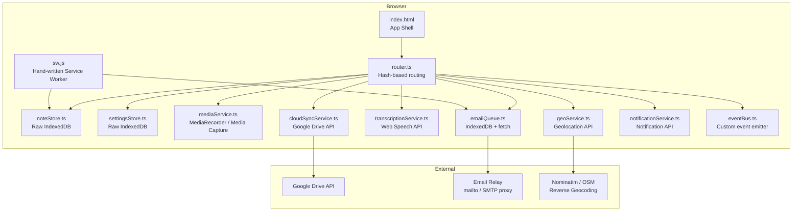

# Design Document

## Overview

e-Handkerchief is a mobile-first Progressive Web App that lets users capture location-aware notes — via voice recording, photo/video, or text — with minimal friction. Every note is timestamped and geo-tagged automatically. The app stores all data locally in IndexedDB and works fully offline after first load. Optional features (voice transcription, email summary, cloud backup) are additive and never block the core capture flow.

The implementation uses vanilla HTML, CSS, and TypeScript compiled to plain ES module JavaScript. There is no framework runtime, no bundler, and no npm install step required by the end user. `tsc` (the TypeScript compiler, available via Kiro's Node.js) is the only build tool.

---

## Architecture

### High-Level Architecture



The architecture is intentionally flat: a thin vanilla-JS UI layer built from TypeScript screen modules calls service modules directly. There is no backend; all persistence is local. The Service Worker is hand-written (~100–150 lines) and handles asset caching, offline fallback, and background sync without Workbox. External network calls (Google Drive, reverse geocoding, email relay) are all optional and degrade gracefully.

### Component Breakdown

| Component | Responsibility |
|---|---|
| **index.html** | App shell; loads `src/app.js` as an ES module, links `app.css` and `manifest.webmanifest`. |
| **router.ts** | Hash-based single-page routing (`#/`, `#/journal`, `#/note/:id`, `#/settings`). Calls screen `render`/cleanup functions. |
| **NoteStore** | CRUD on Notes in IndexedDB using hand-written Promise wrappers from `db.ts`. |
| **SettingsStore** | Reads/writes app settings to IndexedDB with an in-memory reactive cache using a custom event-emitter pattern. |
| **MediaService** | Wraps MediaRecorder API (audio) and HTML Media Capture (photo/video). Returns Blobs. |
| **GeoService** | Wraps `navigator.geolocation`, enforces 10-second timeout, resolves reverse-geocoding via Nominatim. |
| **TranscriptionService** | Wraps Web Speech API with a 30-second timeout guard; fires-and-forgets, returns `Promise<string \| null>`. |
| **EmailQueue** | Persists outbound email jobs in IndexedDB; retries up to 3× via Background Sync or polling on reconnect. |
| **CloudSyncService** | Authenticates with Google Drive OAuth2 PKCE flow; uploads/downloads Note blobs. |
| **NotificationService** | Requests permission, creates persistent notification, manages lifecycle. |
| **EventBus** | Lightweight publish/subscribe module; decouples service events (e.g. `note:saved`) from screen renders. |
| **Service Worker** | Hand-written `sw.ts` compiled to `sw.js`; precaches all static assets; handles Background Sync queues. |

---

## Data Models

### Note

```typescript
interface Note {
  id: string;                  // UUID v4
  timestamp: NoteTimestamp;
  location: NoteLocation | null;
  mediaItems: MediaItem[];
  transcription?: string;      // attached if transcription succeeded
  createdAt: number;           // Unix ms — used for Journal sort order
  updatedAt: number;
}

interface NoteTimestamp {
  localISO: string;            // "2024-07-04T14:30:00+01:00"
  utcOffset: string;           // "+01:00"
}

interface NoteLocation {
  latitude: number;
  longitude: number;
  accuracyMeters: number | null;
  resolvedAddress?: string;    // up to 100 characters; omitted if reverse-geocoding failed
}
```

### MediaItem

```typescript
type MediaItemType = "audio" | "photo" | "video" | "text";

interface MediaItemBase {
  id: string;                  // UUID v4
  type: MediaItemType;
  createdAt: number;
}

interface AudioMediaItem extends MediaItemBase {
  type: "audio";
  blob: Blob;                  // audio/webm or audio/ogg
  durationSeconds: number;
}

interface PhotoMediaItem extends MediaItemBase {
  type: "photo";
  blob: Blob;                  // image/jpeg | image/png | image/gif | image/webp
  widthPx: number;
  heightPx: number;
  thumbnailBlob: Blob;         // 80×80 JPEG
}

interface VideoMediaItem extends MediaItemBase {
  type: "video";
  blob: Blob;                  // video/mp4 | video/quicktime
  durationSeconds: number;
  thumbnailBlob: Blob;         // first-frame JPEG, min 80×80
}

interface TextMediaItem extends MediaItemBase {
  type: "text";
  content: string;             // 1–2000 characters
}

type MediaItem = AudioMediaItem | PhotoMediaItem | VideoMediaItem | TextMediaItem;
```

### Settings

```typescript
interface AppSettings {
  transcriptionEnabled: boolean;          // default: false
  emailSummaryEnabled: boolean;           // default: false
  emailSummaryRecipient: string | null;   // null if not configured
  cloudBackupProvider: "google-drive" | null;
  cloudBackupToken: OAuthToken | null;
  notificationPermissionRequested: boolean;
}

interface OAuthToken {
  accessToken: string;
  refreshToken: string;
  expiresAt: number;           // Unix ms
}
```

### EmailJob

```typescript
type EmailJobStatus = "pending" | "in-flight" | "failed";

interface EmailJob {
  id: string;                  // UUID v4
  noteId: string;
  recipient: string;
  subject: string;
  bodyText: string;
  attachmentRefs: string[];    // Note media item IDs
  createdAt: number;
  attempts: number;            // 0–3
  lastAttemptAt: number | null;
  status: EmailJobStatus;
}
```

### CloudUploadJob

```typescript
type UploadJobStatus = "pending" | "in-flight" | "failed";

interface CloudUploadJob {
  id: string;
  noteId: string;
  provider: "google-drive";
  createdAt: number;
  attempts: number;            // 0–3
  lastAttemptAt: number | null;
  status: UploadJobStatus;
}
```

---

## API Design

### NoteStore API

```typescript
interface NoteStoreAPI {
  /** Save a new note. Resolves within 1 second. */
  save(note: Note): Promise<void>;

  /** Retrieve a single note by ID. */
  get(id: string): Promise<Note | undefined>;

  /** Return all notes sorted by createdAt descending (newest first). */
  listAll(): Promise<Note[]>;

  /** Permanently delete a note and all its media blobs. */
  delete(id: string): Promise<void>;
}
```

Implemented using hand-written Promise wrappers around the raw `indexedDB` API in `db.ts`. Four object stores are created at DB open time:

- `notes` — keyed on `id`, indexed on `createdAt` for efficient reverse-chronological queries.
- `emailJobs` — keyed on `id`, indexed on `status`.
- `cloudUploadJobs` — keyed on `id`, indexed on `status`.
- `settings` — single-record store keyed on the fixed constant `"app"`.

### SettingsStore API

```typescript
interface SettingsStoreAPI {
  /** Load settings; must be called once on app launch before any screen renders. */
  load(): Promise<AppSettings>;

  /** Persist a partial settings update within 500 ms. */
  save(patch: Partial<AppSettings>): Promise<void>;

  /**
   * In-memory cache — always reflects latest persisted state.
   * Listeners are registered via onChange(); callbacks fire after every successful save.
   */
  getCurrent(): AppSettings;
  onChange(listener: (settings: AppSettings) => void): () => void;
}
```

The reactive cache is a plain TypeScript object updated in-memory on every successful `save`. Screen modules call `onChange` to subscribe and receive the returned unsubscribe function; they call it in their cleanup function.

### MediaService API

```typescript
interface MediaServiceAPI {
  /** Start a microphone recording. Returns a handle to stop it. */
  startAudioRecording(): Promise<AudioRecordingHandle>;

  /** Invoke device camera for photo capture. Returns a Blob or throws. */
  capturePhoto(): Promise<Blob>;

  /** Invoke device camera for video capture (max 60 s). Returns a Blob or throws. */
  captureVideo(): Promise<Blob>;

  /** Open file picker for existing photo/video from media library. */
  pickFromLibrary(): Promise<Blob>;

  /** Generate an 80×80 JPEG thumbnail from an image or video Blob. */
  generateThumbnail(source: Blob): Promise<Blob>;
}

interface AudioRecordingHandle {
  /** Resolves with the recorded Blob when recording stops. */
  readonly result: Promise<Blob>;
  /** Elapsed seconds — updated via onElapsed callback at most every 1 second. */
  onElapsed(cb: (seconds: number) => void): void;
  stop(): void;
}
```

### GeoService API

```typescript
interface GeoServiceAPI {
  /**
   * Request current position. Resolves within 10 seconds.
   * Returns best-available fix; returns null on failure.
   */
  getCurrentPosition(): Promise<NoteLocation | null>;

  /** Attempt reverse geocoding. Returns address string (≤ 100 chars) or null. */
  reverseGeocode(lat: number, lng: number): Promise<string | null>;
}
```

### TranscriptionService API

```typescript
interface TranscriptionServiceAPI {
  /** Returns transcribed text or null (timeout/error/unsupported). */
  transcribe(audioBlob: Blob): Promise<string | null>;

  /** True if Web Speech API is available in the current browser. */
  readonly isSupported: boolean;
}
```

### EmailQueue API

```typescript
interface EmailQueueAPI {
  /** Enqueue an email job for the given note. */
  enqueue(note: Note, recipient: string): Promise<void>;

  /** Manually trigger delivery of all pending jobs (called on connectivity restore). */
  flush(): Promise<void>;
}
```

### CloudSyncService API

```typescript
interface CloudSyncServiceAPI {
  /** Initiate OAuth2 PKCE flow; stores token in SettingsStore on success. */
  connect(): Promise<void>;

  /** Revoke token and clear stored credentials. */
  disconnect(): Promise<void>;

  /** Upload a single note. Throws on unrecoverable error. */
  uploadNote(note: Note): Promise<void>;

  /**
   * Download all notes from cloud backup into Local Storage.
   * Skips notes where id + createdAt already exist locally.
   */
  importAll(): Promise<{ imported: number; skipped: number }>;

  /**
   * Connection status — read via getConnectionStatus().
   * Listeners registered via onStatusChange(); returns unsubscribe function.
   */
  getConnectionStatus(): "connected" | "disconnected";
  onStatusChange(cb: (status: "connected" | "disconnected") => void): () => void;
}
```

### Browser APIs Used

| API | Usage |
|---|---|
| `navigator.geolocation.getCurrentPosition` | GPS location on note creation |
| `MediaRecorder` | Audio recording |
| `<input type="file" accept="..." capture="...">` | Photo/video capture and library pick |
| `SpeechRecognition` / `webkitSpeechRecognition` | Voice transcription |
| `indexedDB` (raw, wrapped in Promise helpers) | All local persistence |
| `ServiceWorker` + `BackgroundSync` | Offline queuing |
| `Notification` | Persistent Android shortcut notification |
| `navigator.onLine` + `online` event | Connectivity detection |
| Web App Manifest `shortcuts` | Home-screen quick-launch |
| Google Identity Services (PKCE) | Drive OAuth2 |

---

## File Structure

```
e-Handkerchief/
├── index.html                  # App shell; <script type="module" src="src/app.js">
├── manifest.webmanifest        # PWA manifest
├── app.css                     # All styles (mobile-first, custom properties)
├── src/
│   ├── types.ts                # All TypeScript interfaces
│   ├── db.ts                   # Raw IndexedDB Promise helpers
│   ├── noteStore.ts            # Note CRUD
│   ├── settingsStore.ts        # Settings load/save/cache
│   ├── router.ts               # Hash-based router
│   ├── eventBus.ts             # Lightweight pub/sub
│   ├── geoService.ts           # Geolocation + reverse geocoding
│   ├── mediaService.ts         # Audio/photo/video capture
│   ├── transcriptionService.ts # Web Speech API wrapper
│   ├── emailQueue.ts           # Email job queue
│   ├── notificationService.ts  # Notification permission + registration
│   ├── cloudSyncService.ts     # Google Drive OAuth2 PKCE
│   ├── toastService.ts         # Global toast UI (DOM-based)
│   ├── app.ts                  # Entry point: init, SW registration, routing
│   └── screens/
│       ├── captureScreen.ts    # Capture screen render + logic
│       ├── journalScreen.ts    # Journal screen render + logic
│       ├── noteDetailScreen.ts # Note detail screen render + logic
│       └── settingsScreen.ts   # Settings screen render + logic
├── sw.ts                       # Service Worker source (~100–150 lines)
└── tsconfig.json               # TypeScript config (ES2020, strict)
```

After `tsc` compilation every `.ts` file produces a `.js` sibling at the same path. `index.html` references `<script type="module" src="src/app.js">`. The Service Worker is registered from `sw.js` at the root.

---

## Build System

The only build step is:

```sh
tsc
```

`tsc` reads `tsconfig.json`, compiles all `.ts` sources (including `sw.ts`) to `.js` ES modules in-place, and writes `.js.map` source maps. No bundling, no tree-shaking, no npm install step. The output is deployable as static files served from any HTTP server.

### tsconfig.json

```json
{
  "compilerOptions": {
    "target": "ES2020",
    "module": "ES2020",
    "moduleResolution": "bundler",
    "lib": ["ES2020", "DOM", "DOM.Iterable"],
    "outDir": ".",
    "rootDir": ".",
    "strict": true,
    "noUnusedLocals": true,
    "noUnusedParameters": true,
    "esModuleInterop": true,
    "skipLibCheck": true,
    "declaration": false,
    "sourceMap": true
  },
  "include": ["src/**/*.ts", "sw.ts"],
  "exclude": ["node_modules"]
}
```

`outDir: "."` means compiled `.js` files are emitted next to their `.ts` sources. `index.html` loads `src/app.js`; the Service Worker is registered as `/sw.js`.

---

## Component Design

### Architecture Principles

- Each screen module exports a single `render(container: HTMLElement): () => void` function that builds and inserts the screen's DOM into `container` and returns a cleanup function.
- The router calls the current screen's cleanup function, clears the container, then calls the new screen's `render`.
- All DOM manipulation uses `document.createElement`, `element.textContent`, or template literals that assign to `element.innerHTML` only with sanitized/escaped content — never with raw user data.
- No virtual DOM, no reactive framework — the DOM is updated imperatively when state changes (e.g. a counter element's `textContent` is set directly on input events).
- The `eventBus.ts` module is a lightweight typed pub/sub; services emit named events (e.g. `note:saved`, `settings:changed`) that screens subscribe to and unsubscribe from in their cleanup functions.

### IndexedDB Implementation (`db.ts`)

Replaces the `idb` library with a small set of hand-written Promise helpers:

```typescript
function openDB(): Promise<IDBDatabase>
function dbGet<T>(db: IDBDatabase, store: string, key: string): Promise<T | undefined>
function dbPut<T>(db: IDBDatabase, store: string, value: T): Promise<void>
function dbDelete(db: IDBDatabase, store: string, key: string): Promise<void>
function dbGetAll<T>(
  db: IDBDatabase,
  store: string,
  indexName?: string,
  direction?: IDBCursorDirection
): Promise<T[]>
function dbGetAllByIndex<T>(
  db: IDBDatabase,
  store: string,
  indexName: string,
  query: IDBValidKey | IDBKeyRange
): Promise<T[]>
```

`openDB` opens the database at version 1, creating all four object stores (`notes`, `emailJobs`, `cloudUploadJobs`, `settings`) with their indexes in the `onupgradeneeded` handler. Every helper wraps `IDBRequest.onsuccess`/`onerror` in a `new Promise` and resolves/rejects accordingly.

### Router (`router.ts`)

Manages a single `<main id="app">` container element. On `hashchange` and initial load:
1. Calls the current cleanup function (if any) and clears the container's children.
2. Parses `window.location.hash` against the known routes (`#/`, `#/journal`, `#/note/:id`, `#/settings`); unknown hashes fall back to `#/`.
3. Calls the matching screen's `render(container)` and stores the returned cleanup function.

```typescript
type Route = "capture" | "journal" | "note" | "settings";
interface RouteMatch { route: Route; params: Record<string, string>; }

function parseHash(hash: string): RouteMatch
function navigate(path: string): void
function initRouter(container: HTMLElement): void
```

### CaptureScreen (`src/screens/captureScreen.ts`)

Default landing view rendered at route `#/`.

**State (plain TypeScript object, local to the render closure):**
```typescript
interface CaptureState {
  timestamp: NoteTimestamp;
  location: NoteLocation | null;
  locationStatus: "loading" | "ok" | "timeout" | "denied" | "unavailable";
  mediaItems: DraftMediaItem[];
  isRecording: boolean;
  recordingElapsed: number;
  isSaving: boolean;
  validationError: string | null;
}
```

**Lifecycle:**
1. On `render`, record `timestamp` immediately (local ISO string + UTC offset) and call `GeoService.getCurrentPosition()` with a 10-second deadline; display a spinner in the location field while `locationStatus === "loading"`.
2. Each media capture control (mic button, camera button, text area) delegates to the appropriate service and appends the resulting `DraftMediaItem` to the local state list, then re-renders the preview list imperatively.
3. The audio recording control shows elapsed time (updated via `onElapsed` callback) and auto-stops at 600 seconds.
4. On save: validate at least one `mediaItem` is present; call `NoteStore.save()`; if `transcriptionEnabled`, fire `TranscriptionService.transcribe()` and patch the note asynchronously; if `emailSummaryEnabled`, call `EmailQueue.enqueue()`; if cloud backup connected, call `CloudSyncService.uploadNote()`; navigate to `#/journal`.

**Validation:**
- No media items → show "Please add at least one item before saving."
- Text > 2 000 chars → input stops accepting characters; counter shown.
- File > 100 MB or unsupported format → inline error, item not added.

**Cleanup function:** removes all event listeners, stops any active `AudioRecordingHandle`, revokes any object URLs created for previews.

### JournalScreen (`src/screens/journalScreen.ts`)

Route `#/journal`. Displays all notes as an inline, scrollable feed.

**Data loading:** Calls `NoteStore.listAll()` on every `render`. Subscribes to the `note:saved` event via `eventBus` to reload without a full re-route. Cleans up the subscription in the cleanup function.

**Each NoteEntry renders (via `createElement` / DOM manipulation):**
- Timestamp: `"Wed Jul 04, 2024 02:30 PM"` — formatted with `Intl.DateTimeFormat` or a manual format function.
- Location: resolved address (≤ 100 chars) or `±DD.DDDDD, ±DDD.DDDDD`.
- Text content with `element.style.whiteSpace = "pre-wrap"` (set via `element.textContent`, never `innerHTML`).
- Audio: `<audio controls>` with `src` set to an object URL created from the Blob.
- Photo: `` with `src` set to an object URL of the thumbnail; tap reveals full image.
- Video: `<video controls>` with `poster` set to an object URL of the thumbnail.
- On any `error` event on a media element: replace with a grey `<div>` containing "Media unavailable".
- Each entry wrapped in an `<a href="#/note/{note.id}">` link.

**Empty state:** Centred copy and "No notes yet — tap + to capture your first."

**Cleanup function:** revokes all object URLs created for this render.

### NoteDetailScreen (`src/screens/noteDetailScreen.ts`)

Route `#/note/:id`. Loads a single `Note` from `NoteStore` by UUID on mount.

**State:**
```typescript
interface NoteDetailState {
  note: Note | null;
  status: "loading" | "found" | "not-found";
}
```

**Lifecycle:**
1. On `render`, extract `id` from route params passed in by the router.
2. Call `NoteStore.get(id)` and set `status` to `"found"` or `"not-found"` accordingly; update the DOM imperatively.
3. Render the full Note: Timestamp, Location (resolved address or coordinates), all Media Items, and Transcription if present.

**Media rendering:**
- Audio: `<audio controls>` with `src` set to an object URL from the Blob.
- Photo: `` at full displayable resolution (not thumbnail).
- Video: `<video controls>` with `poster` set to an object URL of the thumbnail.
- Text: `element.textContent = content` with `white-space: pre-wrap`.
- On any `error` event: grey placeholder with "Media unavailable".

**Navigation:**
- "Back to Journal" button calls `navigate("#/journal")`.
- "Note not found" state shows a "Go to Journal" button.

**Cleanup function:** revokes all object URLs.

### SettingsScreen (`src/screens/settingsScreen.ts`)

Route `#/settings`. All controls read from and write to `SettingsStore`.

**Controls:**
- Voice Transcription `<input type="checkbox">` bound to `transcriptionEnabled`.
- Email Summary `<input type="checkbox">` bound to `emailSummaryEnabled`.
- Email recipient `<input type="email" maxlength="254">` — disabled when `emailSummaryEnabled` is `false`; validated on `blur` using an RFC 5321-compatible regex.
- Cloud Backup section with status text and a connect/disconnect `<button>` calling `CloudSyncService.connect()` or `disconnect()`.
- "Import from Cloud" `<button>` calling `CloudSyncService.importAll()` and showing a result toast.

**Save behaviour:** Every `change` event on a control immediately calls `SettingsStore.save(patch)`. On failure, the control reverts to its previous value and `ToastService.show` is called with an error message.

**Cleanup function:** removes all event listeners.

### Service Worker (`sw.ts` → `sw.js`)

Hand-written (~100–150 lines), no Workbox dependency.

```typescript
const CACHE_NAME = "e-hk-v1";
const PRECACHE_URLS: string[] = [
  "/",
  "/index.html",
  "/app.css",
  "/manifest.webmanifest",
  "/src/app.js",
  "/src/router.js",
  "/src/db.js",
  "/src/noteStore.js",
  "/src/settingsStore.js",
  "/src/eventBus.js",
  "/src/toastService.js",
  "/src/geoService.js",
  "/src/mediaService.js",
  "/src/transcriptionService.js",
  "/src/emailQueue.js",
  "/src/notificationService.js",
  "/src/cloudSyncService.js",
  "/src/screens/captureScreen.js",
  "/src/screens/journalScreen.js",
  "/src/screens/noteDetailScreen.js",
  "/src/screens/settingsScreen.js",
  // icons
  "/icons/icon-192.png",
  "/icons/icon-512.png",
  "/icons/shortcut-capture.png"
];
```

**Install handler:** Opens the cache, calls `cache.addAll(PRECACHE_URLS)`, calls `self.skipWaiting()`.

**Activate handler:** Deletes any cache whose name is not `CACHE_NAME`, calls `self.clients.claim()`.

**Fetch handler:**
1. For requests whose URL matches a Nominatim hostname: network-first with a 5-second timeout; cache successful responses with a 7-day max-age (manually managed, 50-entry LRU eviction).
2. For requests in `PRECACHE_URLS`: cache-first; serve from cache immediately.
3. For any other request: attempt network; on failure return `new Response("Offline – resource unavailable", { status: 503 })`.

**Sync handler:** Listens for `sync` events with tags `"email-sync"` and `"cloud-sync"`. Calls the corresponding flush/upload functions by messaging the active client page via `postMessage`.

**Update banner:** When a new SW installs while an old one is active, posts `{ type: "SW_WAITING" }` to all clients. `app.ts` listens for this message and renders a "New version available — tap to reload" banner. Tapping the banner posts `{ type: "SKIP_WAITING" }` back to the SW, which calls `self.skipWaiting()`; then `app.ts` calls `location.reload()`.

`PRECACHE_URLS` must be kept in sync manually with the compiled JS file list (a small maintenance cost that replaces Workbox's build-time manifest injection).

### ToastService (`src/toastService.ts`)

A DOM-based global toast system. Maintains a `<div id="toast-container">` appended to `<body>`. Exposes:

```typescript
function show(message: string, durationMs?: number): void
function showPersistent(message: string, onDismiss?: () => void): () => void
```

`show` creates a `<div class="toast">` with the message text set via `textContent`, appends it to the container, and removes it after `durationMs` (default 5 000 ms). `showPersistent` returns a dismiss function; the toast remains until the dismiss function is called or the user taps it.

---

## Components and Interfaces

### NoteStore (`src/noteStore.ts`)

Persists and retrieves `Note` objects in IndexedDB using the helpers from `db.ts`. Single source of truth for all captured notes.

```typescript
interface NoteStoreAPI {
  save(note: Note): Promise<void>;
  get(id: string): Promise<Note | undefined>;
  listAll(): Promise<Note[]>;
  delete(id: string): Promise<void>;
}
```

**Contracts:**
- `save` must resolve within 1 second under normal storage conditions.
- `listAll` returns notes in non-increasing `createdAt` order (via the `createdAt` index, `"prev"` direction).
- `delete` removes both the note record and all associated media blobs.
- All methods must work identically whether `navigator.onLine` is `true` or `false`.

---

### SettingsStore (`src/settingsStore.ts`)

Reads and writes `AppSettings` to the single-record `settings` IndexedDB store. Exposes a synchronous in-memory cache via `getCurrent()` and a subscription model via `onChange()`.

```typescript
interface SettingsStoreAPI {
  load(): Promise<AppSettings>;
  save(patch: Partial<AppSettings>): Promise<void>;
  getCurrent(): AppSettings;
  onChange(listener: (settings: AppSettings) => void): () => void;
}
```

**Contracts:**
- `load` must be called exactly once before any screen renders.
- `save` must persist within 500 ms.
- Any key absent from IndexedDB is filled with its documented default on `load`.
- On write failure, the caller is responsible for reverting the in-memory state and calling `onChange` listeners with the reverted value.

---

### MediaService (`src/mediaService.ts`)

Wraps `MediaRecorder` and the HTML Media Capture API. Returns raw `Blob` values; does not persist to IndexedDB.

```typescript
interface MediaServiceAPI {
  startAudioRecording(): Promise<AudioRecordingHandle>;
  capturePhoto(): Promise<Blob>;
  captureVideo(): Promise<Blob>;
  pickFromLibrary(): Promise<Blob>;
  generateThumbnail(source: Blob): Promise<Blob>;
}

interface AudioRecordingHandle {
  readonly result: Promise<Blob>;
  onElapsed(cb: (seconds: number) => void): void;
  stop(): void;
}
```

**Contracts:**
- Files larger than 100 MB or of unsupported MIME type are rejected before any blob is written to IndexedDB.
- `generateThumbnail` always returns an 80×80 JPEG blob (rendered via an offscreen `<canvas>`).
- If `MediaRecorder` is unsupported, `startAudioRecording` throws `MediaUnsupportedError`.
- `elapsedSeconds` callbacks fire at most every 1 second (set via `setInterval(cb, 1000)`).

---

### GeoService (`src/geoService.ts`)

Wraps `navigator.geolocation.getCurrentPosition` with a 10-second deadline. Optionally resolves coordinates to a human-readable address via Nominatim.

```typescript
interface GeoServiceAPI {
  getCurrentPosition(): Promise<NoteLocation | null>;
  reverseGeocode(lat: number, lng: number): Promise<string | null>;
}
```

**Contracts:**
- Must resolve (not reject) within 10 seconds regardless of GPS availability.
- Returns `null` on permission denial, timeout, or unavailability — never throws to callers.
- `resolvedAddress` is capped at 100 characters.
- No background location tracking.

---

### TranscriptionService (`src/transcriptionService.ts`)

Wraps `SpeechRecognition` / `webkitSpeechRecognition` with a 30-second timeout guard.

```typescript
interface TranscriptionServiceAPI {
  transcribe(audioBlob: Blob): Promise<string | null>;
  readonly isSupported: boolean;
}
```

**Contracts:**
- Must resolve within 30 seconds; returns `null` on timeout.
- Returns `null` (never throws) when the API is unsupported or the recognition fails.
- Only invoked when `transcriptionEnabled` is `true` in settings.

---

### EmailQueue (`src/emailQueue.ts`)

Persists outbound email jobs in IndexedDB and delivers them via Background Sync or on-reconnect polling. Retries up to 3 times before marking a job `"failed"`.

```typescript
interface EmailQueueAPI {
  enqueue(note: Note, recipient: string): Promise<void>;
  flush(): Promise<void>;
}
```

**Contracts:**
- A job must never exceed 3 delivery attempts.
- After 3 failed attempts the job status transitions to `"failed"` and `ToastService.showPersistent` is called.
- `flush` is idempotent — calling it with no pending jobs is a no-op.

---

### CloudSyncService (`src/cloudSyncService.ts`)

Authenticates with Google Drive via OAuth2 PKCE and uploads/downloads `Note` blobs. Connection state is available via `getConnectionStatus()` / `onStatusChange()`.

```typescript
interface CloudSyncServiceAPI {
  connect(): Promise<void>;
  disconnect(): Promise<void>;
  uploadNote(note: Note): Promise<void>;
  importAll(): Promise<{ imported: number; skipped: number }>;
  getConnectionStatus(): "connected" | "disconnected";
  onStatusChange(cb: (status: "connected" | "disconnected") => void): () => void;
}
```

**Contracts:**
- `connect` uses PKCE; no client secret is embedded in the bundle.
- `importAll` is idempotent: a note with a matching `id` and `createdAt` is silently skipped.
- Failed uploads are queued in `cloudUploadJobs` and retried up to 3 times.
- Tokens are never logged or included in error reports.

---

### NotificationService (`src/notificationService.ts`)

Requests permission once (on first post-install launch on Android) and registers a persistent notification.

**Contracts:**
- Permission is requested at most once; if denied, `notificationPermissionRequested` is set to `true` and the prompt never appears again.
- The notification uses `tag: "capture-shortcut"` and `requireInteraction: true`.
- `notificationclick` in `sw.ts` opens `/#/` via `clients.openWindow`.

---

### EventBus (`src/eventBus.ts`)

Typed publish/subscribe module used to decouple service events from screen renders.

```typescript
type EventMap = {
  "note:saved": Note;
  "settings:changed": AppSettings;
  "sw:waiting": void;
};

function emit<K extends keyof EventMap>(event: K, data: EventMap[K]): void
function on<K extends keyof EventMap>(event: K, cb: (data: EventMap[K]) => void): () => void
```

All screen `render` functions that subscribe to events store the returned unsubscribe function and call it in their cleanup function.

---

### UI Screens

#### CaptureScreen (`src/screens/captureScreen.ts`)

Default landing view. Records a `NoteTimestamp` on render and asynchronously resolves GPS location within 10 seconds. Each capture control delegates to the appropriate service and appends a `DraftMediaItem` to local state. On save, validates at least one media item before calling `NoteStore.save`. The cleanup function removes listeners, stops active recordings, and revokes object URLs.

#### JournalScreen (`src/screens/journalScreen.ts`)

Displays all notes in reverse-chronological order. Calls `NoteStore.listAll()` on render and subscribes to `note:saved` via `eventBus` to refresh without re-routing. Renders audio, photo, and video with object URLs; revokes them on cleanup.

#### NoteDetailScreen (`src/screens/noteDetailScreen.ts`)

Loads a single `Note` from `NoteStore` by UUID on render. Renders the full note content with error placeholders for failed media. Provides "Back to Journal" navigation. Fully offline-capable; no network request is made. Revokes object URLs on cleanup.

#### SettingsScreen (`src/screens/settingsScreen.ts`)

All controls read from `SettingsStore.getCurrent()` and write via `SettingsStore.save(patch)`. Subscribes to `settings:changed` via `onChange` to keep controls in sync if settings change from another source. On failure the control reverts and a toast is shown. Cleanup removes all listeners.

---

## Correctness Properties

The following properties are verified by the property-based test suite (fast-check). They must hold for all valid inputs.

---

### Property 1: Round-trip fidelity

For any valid `Note` value, saving it and immediately retrieving it by ID must yield a deep-equal copy. No fields may be dropped, mutated, or coerced during serialization to or deserialization from IndexedDB.

```
∀ note: Note → save(note) ∘ get(note.id) ≡ note
```

**Validates: Requirements 5.1** — NoteStore `save` + `get`

---

### Property 2: Journal order invariant

For any set of notes with distinct `createdAt` values, `NoteStore.listAll()` must return them sorted in non-increasing order of `createdAt` (newest first). The invariant must hold regardless of insertion order.

```
∀ notes: Note[] → listAll().map(n => n.createdAt) is non-increasing
```

**Validates: Requirements 6.2** — NoteStore `listAll`

---

### Property 3: Offline save always succeeds

Saving a note must never reject solely because `navigator.onLine === false`. Offline persistence is a core guarantee; the note must be retrievable after save even with no network connectivity.

```
∀ note: Note, onLine: false → save(note) resolves (does not reject)
```

**Validates: Requirements 5.1** — NoteStore `save` under offline conditions

---

### Property 4: Email queue delivery convergence

For any sequence of `enqueue` calls, after at most 3 invocations of `flush`, every job must have reached a terminal state (`"failed"` or delivered). No job may remain stuck in `"pending"` indefinitely.

```
∀ jobs: EmailJob[] → after ≤ 3 flush() calls, no job has status "pending"
```

**Validates: Requirements 8.4** — EmailQueue `enqueue` + `flush` retry logic

---

### Property 5: Settings defaults

For any subset of settings keys that are absent from IndexedDB, `SettingsStore.load()` must return the documented default value for each missing key. Partial stored state must be merged with defaults rather than returned as-is.

```
∀ stored: Partial<AppSettings> → load() fills missing keys with defaults
```

**Documented defaults:**

| Key | Default |
|---|---|
| `transcriptionEnabled` | `false` |
| `emailSummaryEnabled` | `false` |
| `emailSummaryRecipient` | `null` |
| `cloudBackupProvider` | `null` |
| `cloudBackupToken` | `null` |
| `notificationPermissionRequested` | `false` |

**Validates: Requirements 12.10** — SettingsStore `load`

---

### Property 6: Text truncation

For any string input supplied as the `content` of a `TextMediaItem`, the stored `content` length must be at most 2 000 characters. The truncation must occur before the item is written to IndexedDB, not after retrieval.

```
∀ input: string → save({type:"text", content: input}).content.length ≤ 2000
```

**Validates: Requirements 4.1** — TextMediaItem content enforcement in CaptureScreen / MediaService

---

### Property 7: Cloud import idempotency

Importing the same set of notes twice must produce the same local store state as importing once. Any note whose `id` and `createdAt` already exist locally must be silently skipped; no duplicate records may be created.

```
∀ note: Note → importAll() ∘ importAll() yields the same local store state as one importAll()
```

**Validates: Requirements 11.6** — CloudSyncService `importAll`

---

## Error Handling

| Failure Scenario | Handling |
|---|---|
| Geolocation denied | Show "Location access required — enable in device settings." Note saves without location. |
| Geolocation timeout (10 s) | Save best-available fix; if none, location field marked unavailable. |
| Microphone denied | Error toast; mic button disabled for remainder of session. |
| Camera / MediaRecorder unsupported | Error toast; camera/mic button hidden. |
| File > 100 MB or wrong format | Inline error under the control; file not attached; existing content preserved. |
| IndexedDB save failure | Modal error "Could not save note — storage may be full." Note content not discarded. |
| IndexedDB settings save failure | Toast; control reverts to previous value. |
| Transcription timeout / failure | Non-blocking 5-second auto-dismissing toast "Transcription unavailable." Audio saved normally. |
| Email delivery failure (3× attempts) | Non-blocking persistent toast "Email could not be sent — tap to retry." Job retained in queue. |
| Cloud upload failure (3× retries) | Toast "Upload failed — will retry when online." Job retained in upload queue. |
| Google Drive auth failure | Toast "Could not connect to Google Drive." Status remains disconnected. |
| Service Worker asset not cached | SW returns a synthetic `503` response; app shows its own offline banner, not the browser error page. |
| SW update available | Non-blocking banner "New version available — tap to reload" appears; user taps to `location.reload()`. |

All errors are surfaced through `ToastService` (`src/toastService.ts`), a DOM-managed singleton that components call directly. Blocking errors (save failure, validation) use inline messages or modal `<dialog>` elements; non-blocking errors use auto-dismissing toasts.

---

## Security Considerations

### Data at Rest
- All note content — including audio, photo, and video blobs — is stored in IndexedDB, which is origin-scoped and not accessible by other origins. No additional encryption is applied at the app layer; device-level full-disk encryption is the expected defence.
- The Google Drive OAuth2 access token and refresh token are stored in IndexedDB. They must never be logged or included in error reports.

### OAuth2 PKCE Flow
- The Google Drive integration uses the PKCE extension to the OAuth2 authorization code flow. No client secret is embedded in the app bundle. The `code_verifier` is generated using `crypto.getRandomValues` and discarded after use.
- The `redirect_uri` is the app's own origin, preventing token interception by other installed apps.

### Content Security Policy
The app sets a strict CSP via a `<meta>` tag in `index.html`:
```
default-src 'self';
script-src 'self';
style-src 'self' 'unsafe-inline';
img-src 'self' blob: data:;
media-src 'self' blob:;
connect-src 'self' https://nominatim.openstreetmap.org https://www.googleapis.com https://accounts.google.com;
worker-src 'self';
```
`'unsafe-eval'` is explicitly excluded. TypeScript compiled to plain ES modules does not require it.

### Email Relay
- The app does not directly connect to an SMTP server from the browser. Two delivery options are supported:
  1. **`mailto:` link** — opens the device's default mail client pre-populated with note content. Simple, zero infrastructure.
  2. **Lightweight serverless relay** (optional, self-hosted) — a single Cloud Function / Cloudflare Worker that accepts a POST with a bearer token and relays to an SMTP provider. The bearer token is stored in Settings (IndexedDB); the relay endpoint is configured at build time via an environment variable baked into `app.ts` during a pre-processing step (e.g. `sed` substitution or a one-line Node script).
- All communication with the relay is over HTTPS.

### Geolocation
- GPS coordinates are only captured when the user actively opens the Capture Screen; no background location tracking occurs.
- Reverse geocoding requests are sent to Nominatim (OpenStreetMap) over HTTPS. The request contains only the lat/lng pair; no user identity is transmitted.

### Input Validation
- Text input is bounded at 2 000 characters client-side; the raw string is stored as-is (no HTML interpretation). The Journal and Note Detail screens set text via `element.textContent`, not `innerHTML`, preventing XSS.
- File type and size limits (100 MB, JPEG/PNG/GIF/WEBP/MP4/MOV) are enforced before any blob is written to IndexedDB.
- Email addresses are validated against a standard RFC 5321 format regex before being stored or used.

### Service Worker Scope
- The Service Worker is registered at the root scope (`/`). It intercepts only same-origin requests. Third-party scripts are not proxied through the SW.
- SW update checks occur on every navigation; the SW itself is fetched with `Cache-Control: no-cache` to ensure prompt delivery of security patches.

---

## Technology Stack

| Concern | Choice | Justification |
|---|---|---|
| **UI** | **Vanilla HTML + CSS + TypeScript (ES modules)** | No framework runtime; output works directly in browser after `tsc` compilation. No npm install required by end users. |
| **Build** | **`tsc` only** | Ships with Node.js (available via Kiro). A single `tsc` invocation compiles all source files. No bundler configuration to maintain. |
| **Module system** | **ES modules (`type="module"`)** | Native browser support on all modern mobile browsers; no runtime module loader needed. |
| **State management** | **Plain TypeScript objects + EventBus** | No reactive framework overhead. Sufficient for this app's complexity level. |
| **IndexedDB** | **Hand-written Promise wrappers (`db.ts`)** | Removes the `idb` library dependency. The wrapper is ~60 lines and covers all required operations. |
| **Service Worker** | **Hand-written `sw.ts` (~120 lines)** | No Workbox dependency; the precache list is small and static, making manual maintenance tractable. |
| **CSS** | **Single `app.css` with custom properties** | Zero runtime, mobile-first media queries, dark mode via `prefers-color-scheme`. No preprocessor needed. |
| **Icons / Illustrations** | **SVG sprites inlined at build** | No icon font dependencies; full control over contrast and sizing for accessibility. |
| **Reverse Geocoding** | **Nominatim (OpenStreetMap)** | Free, no API key required, HTTPS. Rate-limited to 1 req/s — acceptable for the app's usage pattern. |
| **Testing** | **Not required** | App is verified by running directly in the browser. Property-based tests (if desired) can be run with `npx fast-check` or a minimal Vitest setup without framework dependencies. |
