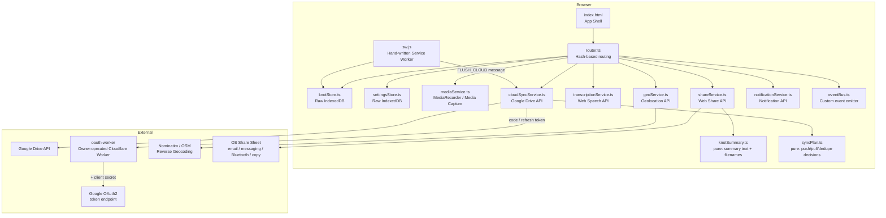

# Design Document

## Overview

e-Handkerchief is a mobile-first Progressive Web App that lets users capture location-aware knots — via voice recording, photo/video, or text — with minimal friction. Every knot is timestamped and geo-tagged automatically. The app stores all data locally in IndexedDB and works fully offline after first load. Voice transcription is optional and additive; it never blocks the core capture flow. Cloud backup (Google Drive) is always available on a deployed site and, once connected, runs an automatic two-way sync — newest edit wins — so the same knots appear on every device signed into that account. A single knot can also be sent elsewhere at any time through the platform's own Share sheet. A Daily Email Summary is planned but not yet implemented; the Settings screen keeps its toggle and recipient address for when it ships.

The implementation uses vanilla HTML, CSS, and TypeScript compiled to plain ES module JavaScript. There is no framework runtime, no bundler, and no npm install step required by the end user. `tsc` (the TypeScript compiler) is the only build tool.

---

## Architecture

### High-Level Architecture



The architecture is intentionally flat: a thin vanilla-JS UI layer built from TypeScript screen modules calls service modules directly. There is no application backend; all persistence is local. The one server-side piece the app itself depends on is `oauth-worker/`, a tiny Cloudflare Worker operated by the site owner. It completes Google's OAuth token exchange and refresh, because Google requires a client secret that must not ship in the static bundle. The optional transcription Worker (`transcribe-worker/`) is configured per user and is separate. The Service Worker is hand-written and handles asset caching, offline fallback, and background sync (a single `cloud-sync` tag) without Workbox. External network calls (Google Drive and its OAuth broker, reverse geocoding, the user's own transcription Worker) never block capture and degrade gracefully when unavailable. Reverse geocoding and deferred transcription are optional features. Google Drive backup is always offered, although each user decides whether to connect.

### Component Breakdown

| Component | Responsibility |
|---|---|
| **index.html** | App shell; loads `src/app.js` as an ES module, links `app.css` and `manifest.webmanifest`. |
| **router.ts** | Hash-based single-page routing (`#/`, `#/knots`, `#/calendar`, `#/knot/:id`, `#/settings`). Calls screen `render`/cleanup functions. An unrecognised hash falls back to `#/`. |
| **KnotStore** | CRUD on Knots in IndexedDB using hand-written Promise wrappers from `db.ts`. `delete()` also writes a local delete tombstone; `saveFromSync()` is a plain save used by sync pulls that deliberately does not emit events. |
| **SettingsStore** | Reads/writes app settings to IndexedDB with an in-memory reactive cache using a custom event-emitter pattern. |
| **MediaService** | Wraps MediaRecorder API (audio) and HTML Media Capture (photo/video). Returns Blobs. |
| **GeoService** | Wraps `navigator.geolocation`, enforces 10-second timeout, resolves reverse-geocoding via Nominatim. |
| **TranscriptionService** | Wraps Web Speech API for live transcription while recording; `remoteTranscribe.ts` handles deferred transcription of a saved recording via the user's own Worker. |
| **KnotSummary** | Pure module (`knotSummary.ts`, no DOM, no settingsStore/db imports): builds the plain-text share summary for a knot and the filename for each media attachment. Used by ShareService and imported by KnotsScreen for `collectTranscripts`. |
| **ShareService** | Wraps the Web Share API (`navigator.share`) for a single knot, with a clipboard fallback when it's unavailable. |
| **SyncPlan** | Pure module (`syncPlan.ts`, no DOM, no imports beyond its own types): given local knots, remote Drive entries, and local/cloud tombstones, decides what to push, pull, and de-duplicate. |
| **CloudSyncService** | Authenticates with Google Drive OAuth2 PKCE flow (token exchange and refresh via `oauth-worker`); upserts each knot's single backup file; runs the full two-way sync (via SyncPlan); lists and deletes individual backups; manages local/cloud delete tombstones. |
| **oauth-worker** | Owner-operated Cloudflare Worker (`oauth-worker/src/index.js`). `POST /token` and `POST /refresh` add the Google client secret (a Wrangler secret) and relay Google's token endpoint. CORS is locked to `ALLOWED_ORIGIN`. |
| **NotificationService** | Requests permission, creates persistent notification, manages lifecycle. |
| **EventBus** | Lightweight publish/subscribe module; decouples service events (`knot:saved`, `knot:deleted`, `knots:synced`, `settings:changed`, `sw:waiting`) from screen renders. |
| **Service Worker** | Hand-written `sw.ts` compiled to `sw.js` (via `tsconfig.sw.json`); precaches all static assets; relays the `cloud-sync` Background Sync tag to the page as `FLUSH_CLOUD`. |

---

## Data Models

### Knot

```typescript
interface Knot {
  id: string;                  // UUID v4
  timestamp: KnotTimestamp;
  location: KnotLocation | null;
  manualLabel?: string;        // display label used when location is null
  mediaItems: MediaItem[];
  transcription?: string;      // @deprecated legacy knot-level transcript; see AudioMediaItem.transcript
  transcriptionStatus?: "none" | "live" | "pending" | "done" | "failed"; // @deprecated, see above
  createdAt: number;           // Unix ms — used for Knots list sort order
  updatedAt: number;           // Unix ms — bumped on every save; drives sync's newest-wins rule
}

interface KnotTimestamp {
  localISO: string;            // "2024-07-04T14:30:00+01:00"
  utcOffset: string;           // "+01:00"
}

interface KnotLocation {
  latitude: number;
  longitude: number;
  accuracyMeters: number | null;
  resolvedAddress?: string;    // up to 100 characters; omitted if reverse-geocoding failed
}
```

### MediaItem

```typescript
type MediaItemType = "audio" | "photo" | "video" | "text";

interface MediaItemBase {
  id: string;                  // UUID v4
  type: MediaItemType;
  createdAt: number;
}

interface AudioMediaItem extends MediaItemBase {
  type: "audio";
  blob: Blob;                  // audio/webm or audio/ogg
  durationSeconds: number;
  transcript?: string;             // this clip's own transcript (live, remote, or hand-edited)
  transcriptionStatus?: "none" | "live" | "pending" | "done" | "failed";
}

interface PhotoMediaItem extends MediaItemBase {
  type: "photo";
  blob: Blob;                  // image/jpeg | image/png | image/gif | image/webp
  widthPx: number;
  heightPx: number;
  thumbnailBlob: Blob;         // 80×80 JPEG
}

interface VideoMediaItem extends MediaItemBase {
  type: "video";
  blob: Blob;                  // video/mp4 | video/quicktime
  durationSeconds: number;
  thumbnailBlob: Blob;         // first-frame JPEG, min 80×80
}

interface TextMediaItem extends MediaItemBase {
  type: "text";
  content: string;             // 1–2000 characters
}

type MediaItem = AudioMediaItem | PhotoMediaItem | VideoMediaItem | TextMediaItem;
```

### Settings

```typescript
interface AppSettings {
  transcriptionEnabled: boolean;          // default: false
  transcriptionServerUrl: string;         // default: '' — deferred-transcription Worker URL
  emailSummaryEnabled: boolean;           // default: false — Daily Email Summary, not yet implemented
  emailSummaryRecipient: string | null;   // default: null — kept for when it ships
  cloudBackupProvider: "google-drive" | null;
  cloudBackupToken: OAuthToken | null;
  notificationPermissionRequested: boolean;
  lastSyncAt: number | null;              // default: null — Unix ms of the last successful sync
  timezone: string;                       // default: 'auto'
  dateFormat: "DD MMM YYYY" | "MMM DD, YYYY" | "YYYY-MM-DD" | "DD/MM/YYYY" | "MM/DD/YYYY"; // default: 'DD MMM YYYY'
  timeFormat: "24h" | "12h";              // default: '24h'
}

interface OAuthToken {
  accessToken: string;
  refreshToken: string;
  expiresAt: number;           // Unix ms
}
```

### CloudUploadJob

```typescript
type UploadJobStatus = "pending" | "in-flight" | "failed";

interface CloudUploadJob {
  id: string;
  knotId: string;
  provider: "google-drive";
  createdAt: number;
  attempts: number;            // 0–3
  lastAttemptAt: number | null;
  status: UploadJobStatus;
}
```

### KnotTombstone

```typescript
interface KnotTombstone {
  id: string;        // the deleted knot's id
  deletedAt: number; // Unix ms
}
```

A record of a knot deleted **from this device**. Local deletes never delete the knot's Drive backup — Drive is an archive — and this tombstone stops a later sync from pulling the knot back onto this device. (The parallel *cloud* tombstone, keyed the same way but keyed by knot id inside a single JSON file rather than an object store, is described under CloudSyncService below.)

There is no longer an `EmailJob` type or `emailJobs` store — save-and-send email was retired in favor of the per-knot Share button (Requirement 8); see *IndexedDB Schema* below for how the store was removed.

---

## API Design

### KnotStore API

```typescript
interface KnotStoreAPI {
  /** Save a new or updated knot. Resolves within 1 second. Emits nothing itself — callers emit knot:saved. */
  save(knot: Knot): Promise<void>;

  /** Retrieve a single knot by ID. */
  get(id: string): Promise<Knot | undefined>;

  /** Return all knots sorted by createdAt descending (newest first). */
  listAll(): Promise<Knot[]>;

  /** Permanently delete a knot FROM THIS DEVICE, its media blobs, and record a local tombstone. */
  delete(id: string): Promise<void>;

  /** All local delete tombstones — used by CloudSyncService to avoid re-pulling deleted knots. */
  listTombstones(): Promise<KnotTombstone[]>;

  /** Plain save used by a sync pull. MUST NOT emit events — a pull is not a local edit. */
  saveFromSync(knot: Knot): Promise<void>;
}
```

Implemented using hand-written Promise wrappers around the raw `indexedDB` API in `db.ts`. Four object stores exist at DB version 4:

- `knots` — keyed on `id`, indexed on `createdAt` for efficient reverse-chronological queries.
- `cloudUploadJobs` — keyed on `id`, indexed on `status`.
- `settings` — single-record store keyed on the fixed constant `"app"`.
- `knotTombstones` — keyed on `id`; records are `{ id, deletedAt }`.

See *IndexedDB Schema* below for the full version-by-version upgrade history.

### SettingsStore API

```typescript
interface SettingsStoreAPI {
  /** Load settings; must be called once on app launch before any screen renders. */
  load(): Promise<AppSettings>;

  /** Persist a partial settings update within 500 ms. */
  save(patch: Partial<AppSettings>): Promise<void>;

  /**
   * In-memory cache — always reflects latest persisted state.
   * Listeners are registered via onChange(); callbacks fire after every successful save.
   */
  getCurrent(): AppSettings;
  onChange(listener: (settings: AppSettings) => void): () => void;
}
```

The reactive cache is a plain TypeScript object updated in-memory on every successful `save`. Screen modules call `onChange` to subscribe and receive the returned unsubscribe function; they call it in their cleanup function.

### MediaService API

```typescript
interface MediaServiceAPI {
  /** Start a microphone recording. Returns a handle to stop it. */
  startAudioRecording(): Promise<AudioRecordingHandle>;

  /** Invoke device camera for photo capture. Returns a Blob or throws. */
  capturePhoto(): Promise<Blob>;

  /** Invoke device camera for video capture (max 60 s). Returns a Blob or throws. */
  captureVideo(): Promise<Blob>;

  /** Open file picker for existing photo/video from media library. */
  pickFromLibrary(): Promise<Blob>;

  /** Generate an 80×80 JPEG thumbnail from an image or video Blob. */
  generateThumbnail(source: Blob): Promise<Blob>;
}

interface AudioRecordingHandle {
  /** Resolves with the recorded Blob when recording stops. */
  readonly result: Promise<Blob>;
  /** Elapsed seconds — updated via onElapsed callback at most every 1 second. */
  onElapsed(cb: (seconds: number) => void): void;
  stop(): void;
}
```

### GeoService API

```typescript
interface GeoServiceAPI {
  /**
   * Request current position. Resolves within 10 seconds.
   * Returns best-available fix; returns null on failure.
   */
  getCurrentPosition(): Promise<KnotLocation | null>;

  /** Attempt reverse geocoding. Returns address string (≤ 100 chars) or null. */
  reverseGeocode(lat: number, lng: number): Promise<string | null>;
}
```

### TranscriptionService API

```typescript
interface TranscriptionServiceAPI {
  readonly isSupported: boolean;
  /** Start live speech recognition; returns a handle streaming interim + final text. */
  startLive(): LiveTranscriptionHandle;
}
```

Live transcription streams through `LiveTranscriptionHandle` (`onText`/`onError`/`onEnd`/`getError`/`stop`, plus a `result` promise) while a recording is in progress. Deferred (post-save) transcription of an already-saved audio blob is a separate pure function, `remoteTranscribe(blob, language?)` in `remoteTranscribe.ts`, which POSTs to the user's configured transcription server and returns `{ ok, text?, error? }`.

### KnotSummary API

```typescript
/** Gather all transcripts to display for a knot (per-item, falling back to the legacy knot-level one). */
function collectTranscripts(knot: Knot): string[]

/** Build the plain-text share/copy summary for a knot. */
function knotSummaryText(knot: Knot, formatTimestamp: (iso: string) => string): string

/** Build a share-friendly filename for a media item, e.g. "knot-photo-1.jpg". */
function mediaFileName(item: PhotoMediaItem | VideoMediaItem | AudioMediaItem, index: number): string
```

Pure — no DOM, no `settingsStore`/`db` imports — so it is importable and testable under plain `node` (`knotSummary.chartest.ts`). See *ShareService* below for how the summary text and filenames are assembled into an actual share.

### ShareService API

```typescript
/** Share one knot via the platform share sheet, or copy its text to the clipboard as a fallback. */
async function shareKnot(knot: Knot): Promise<void>
```

See the dedicated *ShareService* section under *Components and Interfaces* for the full contract.

### CloudSyncService API

```typescript
interface CloudSyncServiceAPI {
  getConnectionStatus(): "connected" | "disconnected";
  onStatusChange(cb: (status: "connected" | "disconnected") => void): () => void;
  connect(): Promise<void>;
  handleOAuthCallback(code: string): Promise<void>;
  disconnect(): Promise<void>;

  /** Per-save upload path: upsert now, or queue a retry job on any failure. */
  uploadKnot(knot: Knot): Promise<void>;
  /** Retry queued upload jobs (upsert path; never creates new jobs). */
  uploadPending(): Promise<void>;
  /** Full two-way sync: push local changes, pull remote changes, reconcile duplicates. Single-flight. */
  syncAll(): Promise<{ pulled: number; pushed: number }>;
  /** Reset every 'failed' upload job to 'pending' and run a full sync. */
  retryFailed(): Promise<void>;

  /** List every backup file in the Drive appDataFolder, for "Manage backups". */
  listBackups(): Promise<BackupEntry[]>;
  /** Delete one backup file from Drive; if knotId is given, records a cloud tombstone first. */
  deleteBackup(fileId: string, knotId: string | null): Promise<void>;

  /** The plain-language confirm() text for a LOCAL delete, based on connection status. */
  localDeleteConfirmText(): string;
}
```

See the dedicated *CloudSyncService* section under *Components and Interfaces* for the full contract (Drive file format, upsert semantics, sync steps, tombstones, and `planSync`).

### Browser APIs Used

| API | Usage |
|---|---|
| `navigator.geolocation.getCurrentPosition` | GPS location on knot creation |
| `MediaRecorder` | Audio recording |
| `<input type="file" accept="..." capture="...">` | Photo/video capture and library pick |
| `SpeechRecognition` / `webkitSpeechRecognition` | Live voice transcription |
| `navigator.share` / `navigator.canShare` | Sharing a single knot (Web Share API) |
| `navigator.clipboard.writeText` | Clipboard fallback when Web Share is unavailable, or after a share failure |
| `indexedDB` (raw, wrapped in Promise helpers) | All local persistence |
| `ServiceWorker` + `BackgroundSync` | Offline queuing (`cloud-sync` tag) |
| `Notification` | Persistent Android shortcut notification |
| `navigator.onLine` + `online`/`offline` events | Connectivity detection |
| Web App Manifest `shortcuts` | Home-screen quick-launch |
| Google OAuth2 (PKCE) + `oauth-worker` broker | Drive OAuth2 |

---

## File Structure

```
e-Handkerchief/
├── index.html                  # App shell; <script type="module" src="src/app.js">
├── manifest.webmanifest        # PWA manifest
├── app.css                     # All styles (mobile-first, custom properties)
├── src/
│   ├── types.ts                # All TypeScript interfaces
│   ├── db.ts                   # Raw IndexedDB Promise helpers; DB_VERSION, store name constants
│   ├── knotStore.ts            # Knot CRUD + local tombstones
│   ├── settingsStore.ts        # Settings load/save/cache
│   ├── router.ts                 # Hash-based router
│   ├── router.chartest.ts        # Characterization test for parseHash
│   ├── eventBus.ts             # Lightweight pub/sub
│   ├── geoService.ts           # Geolocation + reverse geocoding
│   ├── mediaService.ts         # Audio/photo/video capture
│   ├── mapsLink.ts             # Google Maps URL builder (pure)
│   ├── dateFormat.ts           # Date/time formatting helpers
│   ├── remoteTranscribe.ts     # Deferred transcription via the user's own Worker
│   ├── transcriptionService.ts # Web Speech API (live) wrapper
│   ├── knotSummary.ts            # Pure: share summary text + media filenames
│   ├── knotSummary.chartest.ts   # Characterization test for knotSummary
│   ├── shareService.ts         # Web Share API wrapper + clipboard fallback
│   ├── syncPlan.ts               # Pure: two-way sync push/pull/dedupe decisions
│   ├── syncPlan.chartest.ts      # Characterization test for planSync
│   ├── notificationService.ts  # Notification permission + registration
│   ├── cloudSyncService.ts     # Google Drive OAuth2 PKCE + upsert + two-way sync + backups
│   ├── toastService.ts         # Global toast UI (DOM-based)
│   ├── app.ts                  # Entry point: init, SW registration, routing, sync triggers
│   ├── components/
│   │   ├── mediaCapture.ts             # Shared mic/photo/video/library capture UI
│   │   ├── timezoneCombobox.ts         # Searchable timezone selector
│   │   └── timezoneCombobox.proptest.ts  # Property-based tests for the combobox
│   └── screens/
│       ├── captureScreen.ts    # Capture screen render + logic
│       ├── knotsScreen.ts      # Knots list screen render + logic
│       ├── calendarScreen.ts   # Calendar screen render + logic
│       ├── knotDetailScreen.ts # Knot detail screen render + logic (Share/Edit/Delete)
│       └── settingsScreen.ts   # Settings screen render + logic
├── sw.ts                       # Service Worker source
├── config.js                   # Runtime config; Google client ID + OAuth broker URL injected at deploy
├── oauth-worker/               # Owner-operated Cloudflare Worker: Google token exchange/refresh
│   └── src/index.js
├── transcribe-worker/          # Per-user Cloudflare Worker: deferred transcription proxy
├── tsconfig.json                # TypeScript config for src/**/*.ts (ES2020, strict)
└── tsconfig.sw.json              # Separate TypeScript config for sw.ts (WebWorker lib)
```

After `tsc` compilation every `.ts` file produces a `.js` sibling at the same path. `index.html` references `<script type="module" src="src/app.js">`. The Service Worker is registered from `sw.js` at the root. `*.chartest.ts` and `*.proptest.ts` files are test infrastructure, not app code — see *Correctness Properties and Testing* below.

---

## Build System

The build step is:

```sh
tsc
tsc -p tsconfig.sw.json
```

`tsc` reads `tsconfig.json`, compiles every `src/**/*.ts` source to a `.js` ES module in place. `sw.ts` is compiled separately via `tsconfig.sw.json`, because it needs the `WebWorker` lib (which conflicts with `DOM` in a single `tsconfig`) rather than `DOM`. Neither config bundles, tree-shakes, or requires an npm install step for end users. The output is deployable as static files served from any HTTP server.

### Deploy-time injection

`config.js` is a plain (non-module, not compiled) script loaded by `index.html` before `src/app.js`. It sets `window.__GOOGLE_CLIENT_ID__` and `window.__OAUTH_BROKER_URL__`, which `CloudSyncService` reads at module load. The committed file holds the placeholders `@@GOOGLE_CLIENT_ID@@` and `@@OAUTH_BROKER_URL@@`. The GitHub Pages deploy workflow replaces them with the `GOOGLE_CLIENT_ID` and `OAUTH_BROKER_URL` Actions secrets via `sed`. An unreplaced placeholder sets its global to `''`, and a trailing `/` on the broker URL is stripped.

- Google Drive backup is a required feature: **CI fails** if either secret is empty.
- Placeholder tokens must be distinct from the global names. When they were identical, `sed` also rewrote the assignment target and produced a syntax error.
- After injection, CI runs `node --check _site/config.js` so a malformed config fails the build instead of deploying silently.
- The Google **client secret** is never injected here. Everything in `config.js` is publicly readable, so the secret lives only in `oauth-worker` as a Wrangler secret.

### tsconfig.json

```json
{
  "compilerOptions": {
    "target": "ES2020",
    "module": "ES2020",
    "moduleResolution": "bundler",
    "lib": ["ES2020", "DOM", "DOM.Iterable"],
    "outDir": ".",
    "rootDir": ".",
    "strict": true,
    "noUnusedLocals": false,
    "noUnusedParameters": false,
    "esModuleInterop": true,
    "skipLibCheck": true,
    "declaration": false,
    "sourceMap": false
  },
  "include": ["src/**/*.ts"],
  "exclude": ["node_modules", ".kiro", "scripts"]
}
```

### tsconfig.sw.json

```json
{
  "compilerOptions": {
    "target": "ES2020",
    "module": "ES2020",
    "moduleResolution": "bundler",
    "lib": ["ES2020", "WebWorker"],
    "outDir": ".",
    "rootDir": ".",
    "strict": true,
    "noUnusedLocals": false,
    "noUnusedParameters": false,
    "esModuleInterop": true,
    "skipLibCheck": true,
    "declaration": false,
    "sourceMap": false
  },
  "include": ["sw.ts"],
  "exclude": ["node_modules", ".kiro", "scripts"]
}
```

`outDir: "."` means compiled `.js` files are emitted next to their `.ts` sources in both configs. `index.html` loads `src/app.js`; the Service Worker is registered as `/sw.js`.

---

## Component Design

### Architecture Principles

- Each screen module exports a single `render(container: HTMLElement): () => void` function that builds and inserts the screen's DOM into `container` and returns a cleanup function.
- The router calls the current screen's cleanup function, clears the container, then calls the new screen's `render`.
- All DOM manipulation uses `document.createElement`, `element.textContent`, or `element.innerHTML` only with static/sanitized markup — never with raw user data.
- No virtual DOM, no reactive framework — the DOM is updated imperatively when state changes (e.g. a counter element's `textContent` is set directly on input events).
- The `eventBus.ts` module is a lightweight typed pub/sub; services emit named events (`knot:saved`, `knot:deleted`, `knots:synced`, `settings:changed`, `sw:waiting`) that screens subscribe to and unsubscribe from in their cleanup functions.

### IndexedDB Implementation (`db.ts`)

Hand-written Promise helpers, no library dependency:

```typescript
function openDB(): Promise<IDBDatabase>
function dbGet<T>(db: IDBDatabase, store: string, key: string): Promise<T | undefined>
function dbPut<T>(db: IDBDatabase, store: string, value: T, key?: string): Promise<void>
function dbDelete(db: IDBDatabase, store: string, key: string): Promise<void>
function dbGetAll<T>(
  db: IDBDatabase,
  store: string,
  indexName?: string,
  direction?: IDBCursorDirection
): Promise<T[]>
function dbGetAllByIndex<T>(
  db: IDBDatabase,
  store: string,
  indexName: string,
  query: IDBValidKey | IDBKeyRange
): Promise<T[]>
```

Every helper wraps `IDBRequest.onsuccess`/`onerror` in a `new Promise` and resolves/rejects accordingly. `db.ts` also exports the object-store name constants `KNOT_OBJECT_STORE` (`'knots'`) and `KNOT_TOMBSTONE_STORE` (`'knotTombstones'`), used by `knotStore.ts` instead of string literals.

#### IndexedDB Schema (DB_VERSION 4)

`openDB()` opens `"e-handkerchief-db"` at version **4**. `onupgradeneeded` branches on `event.oldVersion`, so each version's block only does the work needed for that step, and a brand-new database takes the `oldVersion < 1` branch straight to the current schema:

| Store | Key | Index | Since |
|---|---|---|---|
| `knots` | `id` | `createdAt` (non-unique) | v1 (as `notes`, renamed at v2) |
| `cloudUploadJobs` | `id` | `status` (non-unique) | v1 |
| `settings` | fixed key `"app"` | — | v1 |
| `knotTombstones` | `id` | — | v3 |

Upgrade history:

- **v1 (fresh install, historical):** created `notes`, `emailJobs`, `cloudUploadJobs`, `settings`.
- **v1 → v2 — entity rename, note → knot (2026-09-24):** deletes the `notes` store and creates `knots` with the same shape; clears `cloudUploadJobs` (its records used the old `noteId` field name). **This intentionally drops existing local data** — the app was still in testing at the time, only test knots existed, and no migration script was written. `emailJobs` and `settings` were untouched at this step.
- **v2 → v3 — local delete tombstones:** creates `knotTombstones`, so a later Drive sync can never pull a knot back onto a device it was deliberately deleted from.
- **v3 → v4 — retire save-and-send email:** deletes the `emailJobs` store (nothing reads it anymore; Share replaced per-knot email, and the Daily Email Summary is a future feature — Requirement 8.6).
- A fresh database (`oldVersion < 1`) creates the final v4 shape directly — `knots`, `cloudUploadJobs`, `settings`, `knotTombstones` — without ever creating `notes` or `emailJobs`.

Each version's block is additive to `onupgradeneeded`, so a future `v4 → v5` step is a new `if (oldVersion < 5) { ... }` block alongside the existing ones.

### Router (`router.ts`)

Manages a single `<main id="app">` container element. On `hashchange` and initial load:
1. Calls the current cleanup function (if any) and clears the container's children.
2. Parses `window.location.hash` against the known routes (`#/`, `#/knots`, `#/calendar`, `#/knot/:id`, `#/settings`); unknown hashes fall back to `#/`.
3. Calls the matching screen's `render(container)` and stores the returned cleanup function.

```typescript
type Route = "capture" | "knots" | "calendar" | "knot" | "settings";
interface RouteMatch { route: Route; params: Record<string, string>; }

function parseHash(hash: string): RouteMatch
function navigate(path: string): void
function initRouter(container: HTMLElement): void
```

`parseHash` is pure (no `window` access at import time), so it is exercised directly by `router.chartest.ts` under plain `node` — see *Correctness Properties and Testing*.

### CaptureScreen (`src/screens/captureScreen.ts`)

Default landing view rendered at route `#/`. Title "Tie a Knot"; Save button "Tie Knot"; textarea placeholder "What do you want to remember?".

**Lifecycle:**
1. On `render`, record a `KnotTimestamp` immediately (local ISO string + UTC offset) and call `GeoService.getCurrentPosition()` with a 10-second deadline; a spinner shows while location resolves.
2. The shared `mediaCapture` component (mic/photo/video/library, live transcript, previews, errors) is mounted between the textarea and the Save button; it owns the draft media items.
3. On Save: validate at least one media item is present; build the `Knot` and call `KnotStore.save()`; on success, emit `knot:saved` via `eventBus` — the app-level listener in `app.ts` (not this screen) triggers the cloud upload; navigate to `#/knots`.

**Validation:**
- No media items → "Please add at least one item before saving."
- Text > 2 000 chars → input stops accepting characters; counter shown.
- File > 100 MB or unsupported format → inline error, item not added.

**Cleanup function:** removes all event listeners, tears down the media-capture component (stops any active recording, revokes object URLs).

### KnotsScreen (`src/screens/knotsScreen.ts`)

Route `#/knots`. Displays all knots as an inline, scrollable feed, newest first.

**Data loading:** Calls `KnotStore.listAll()` on every `render`. Subscribes to `knot:saved`, `knot:deleted`, and `knots:synced` via `eventBus` to reload without a full re-route (the last of these is how a knot pulled from another device shows up here). Cleans up all three subscriptions.

**Each entry renders (via `createElement` / DOM manipulation):**
- Timestamp formatted per the user's Date Format / Time Format settings.
- Location: resolved address, a manually-entered label, or `±DD.DDDDD, ±DDD.DDDDD`, as a clickable Google Maps link when GPS coordinates are present.
- Text content with `element.style.whiteSpace = "pre-wrap"` (set via `textContent`, never `innerHTML`).
- Audio: `<audio controls>` with `src` set to an object URL created from the Blob.
- Photo: `` with `src` set to an object URL of the thumbnail.
- Video: `<video controls>` with `poster` set to an object URL of the thumbnail.
- Transcripts, via the shared `collectTranscripts()` from `knotSummary.ts`.
- On any `error` event on a media element: replace with a grey `<div>` containing "Media unavailable".
- Each entry is a `role="link"` `<div>` (not an `<a>`, so a location link can nest inside it) that navigates to `#/knot/{id}` on click/Enter/Space.
- A delete (🗑) button per entry, confirmed via `cloudSyncService.localDeleteConfirmText()` (see *CloudSyncService*).

**Empty state:** "No knots yet — tap + to tie your first."

**Cleanup function:** revokes all object URLs created for this render; unsubscribes all three event listeners.

### CalendarScreen (`src/screens/calendarScreen.ts`)

Route `#/calendar`. A scrollable, reverse-chronological month grid.

**Data loading:** Calls `KnotStore.listAll()` on `render`; groups knots into per-day counts keyed by `YYYY-MM-DD` in the user's configured timezone (or the device default). Subscribes to `knot:saved`, `knot:deleted`, and `knots:synced` to reload.

**Rendering:** One month block per month from the earliest knot's month through the current month, most-recent month first. Each month is a 7-column grid (Sunday-first) with leading blank cells for the 1st's weekday offset. A day with knots gets `calendar-day--has-knots`, an `aria-label` stating the count, and either up to 4 dots or (for 5+) a numeric badge. Today's cell gets `calendar-day--today`.

**Day-detail panel:** Tapping a day with knots toggles an inline panel below the grid listing that day's knots (newest first): each row shows the formatted time and a short preview (first text item's leading ~60 characters, or "🎤 Voice" / "📷 Photo" / "🎬 Video" for a media-only knot), and navigates to `#/knot/{id}` on click/Enter/Space. Tapping the same day again closes the panel; tapping a different day replaces it.

**Cleanup function:** unsubscribes all three event listeners.

### KnotDetailScreen (`src/screens/knotDetailScreen.ts`)

Route `#/knot/:id`. Loads a single `Knot` from `KnotStore` by UUID on mount.

**View-mode header actions**, in order: **Share**, **Edit**, **Delete** (all `btn btn-ghost` except Delete, which is `btn btn-danger`).
- **Share** calls `shareKnot(knot)` directly and synchronously from the click handler (see *ShareService* — this preserves the click's user-gesture window).
- **Edit** switches to an inline edit form (location label, one textarea per existing text item plus an "add text" box, existing non-text media with per-item Remove, and the shared media-capture component for adding more). Saving rebuilds the knot's `mediaItems`, bumps `updatedAt`, calls `KnotStore.save`, and emits `knot:saved`.
- **Delete** confirms via `cloudSyncService.localDeleteConfirmText()` (its wording depends on whether Google Drive is connected — see *CloudSyncService*), then calls `KnotStore.delete(knot.id)` (which also records the local tombstone), emits `knot:deleted`, shows "Knot deleted", and navigates to `#/knots`.

**Media rendering:** audio via `<audio controls>` with a per-item transcription sub-panel beneath it (showing the effective transcript — this item's own, or, for the first audio item only, the legacy knot-level `transcription` as a backward-compatible fallback — with Transcribe/Re-transcribe/Save-transcript controls wired to `remoteTranscribe()`); photo at full resolution; video via `<video controls>` with a poster frame; text via `textContent` with `white-space: pre-wrap`. A failed media element is replaced with a "Media unavailable" placeholder.

**Not-found state:** heading "Knot not found", body "This knot isn't on this device.", and a "Go to Knots" button.

**Cloud sync reactivity:** subscribes to `knots:synced`; while not in edit mode, re-fetches and re-renders the current knot so a pulled update from another device appears. While editing, the handler is a no-op, so an in-progress edit is never clobbered by an incoming pull.

**Navigation:** "← Back to Knots" button calls `navigate('#/knots')`.

**Cleanup function:** unsubscribes from `knots:synced`; revokes all object URLs.

### SettingsScreen (`src/screens/settingsScreen.ts`)

Route `#/settings`. All controls read from and write to `SettingsStore`, in four sections:

**Voice Transcription** — enable toggle; a "Transcription server URL (optional)" field for deferred transcription, validated only by being a URL-shaped string.

**Daily Email Summary** — "Enable daily email summary" toggle (bound to `emailSummaryEnabled`) and a "Recipient Email" field (`emailSummaryRecipient`, `<input type="email" maxlength="254">`, disabled when the toggle is off, validated on `blur` with an RFC-5321-style regex). A `settings-row-desc` hint beneath the toggle row reads: *"Coming soon — your recipient address is saved for when it's available. To send a single knot now, open it and tap Share."* The feature is not implemented; nothing reads these values to send mail today.

**Date & Time** — Timezone (searchable combobox, see `timezoneCombobox.ts`), Date Format, Time Format, and a live preview line, all via `formatKnotTimestamp`.

**Cloud Backup** — Google Drive status badge (Connected/Disconnected) and a Connect/Disconnect button; an explanatory block (two `<p>` elements inside one `settings-row-desc`, built with `createElement`/`textContent`/`<strong>`, never `innerHTML`) reading:

> **Deleting a knot** (from Knots or its detail page) removes it from **this device only**. Its cloud backup is kept, and your other devices keep their copies.
>
> **Manage backups** deletes a knot's **cloud backup**. Copies already on your devices are not deleted, and they won't be backed up again unless you edit them.

Below that: a **"Merge with Cloud"** button (disabled + labelled "Merging…" while a sync is in flight; result toast `Merged — {pulled} knots updated on this device, {pushed} backed up`; error toast "Merge failed — check your connection"), a description line reading "Sends new and edited knots from this device to Google Drive, and brings in new and edited knots from your other devices. Data is never deleted during a merge.", a **"Last merged: …"** / **"Not merged yet"** line (from `settings.lastSyncAt`, updated after every sync and on `settings:changed`), and a **"Manage backups"** button that toggles an inline panel (`.backup-list`) below it.

The panel calls `cloudSyncService.listBackups()` on open and renders one `.backup-row` per file, newest first: a primary line (the file's `description`, or "Backup from `<modifiedTime>`" for a knot-kind file with no description, or "Old-format backup (`<name>`)" for a non-knot file), a secondary badge ("On this device" / "Only in backup", by comparing `knotId` against `KnotStore.listAll()`, or "Old format"), and a Delete button (`confirm('Delete this backup from Google Drive? Copies on your devices are not deleted.')`, then `deleteBackup()`, removing the row and toasting "Backup deleted" on success). Empty state: "No backups in Google Drive yet."; loading state: "Loading backups…"; error state: "Could not load backups — check your connection".

**Merge with Cloud** and **Manage backups** are disabled, with the hint "Connect Google Drive and go online to merge or manage backups.", whenever Google Drive is disconnected or `navigator.onLine` is false; this reacts to `cloudSyncService.onStatusChange` and to `window`'s `online`/`offline` events, both unsubscribed on cleanup.

**Save behaviour:** every `change`/`blur` event on a control immediately calls `SettingsStore.save(patch)`. On failure, the control reverts to its previous value and a toast is shown.

**Cleanup function:** removes all event listeners, unsubscribes `settings:changed` and the connection-status listener.

### Service Worker (`sw.ts` → `sw.js`)

Hand-written, no Workbox dependency. The precache list, copied verbatim from `sw.ts`:

```typescript
const ASSETS: string[] = [
  '',
  'index.html',
  'app.css',
  'manifest.webmanifest',
  'config.js',
  'src/app.js',
  'src/router.js',
  'src/db.js',
  'src/knotStore.js',
  'src/settingsStore.js',
  'src/eventBus.js',
  'src/toastService.js',
  'src/geoService.js',
  'src/mediaService.js',
  'src/transcriptionService.js',
  'src/notificationService.js',
  'src/cloudSyncService.js',
  'src/syncPlan.js',
  'src/knotSummary.js',
  'src/shareService.js',
  'src/remoteTranscribe.js',
  'src/dateFormat.js',
  'src/mapsLink.js',
  'src/types.js',
  'src/components/mediaCapture.js',
  'src/screens/captureScreen.js',
  'src/screens/knotsScreen.js',
  'src/screens/calendarScreen.js',
  'src/screens/knotDetailScreen.js',
  'src/screens/settingsScreen.js',
  // icons
  'icons/icon-192.png',
  'icons/icon-512.png',
  'icons/shortcut-capture.png',
];
```

`ASSETS` entries are relative to `<base>` (derived from `self.location.pathname`, so the app works at the origin root or a GitHub Pages subpath); `PRECACHE_URLS` maps each to a full pathname.

**Install handler:** Opens the cache, calls `cache.addAll(PRECACHE_URLS)`, calls `self.skipWaiting()`.

**Activate handler:** Deletes any cache whose name is not `CACHE_NAME` or the Nominatim cache, calls `self.clients.claim()`.

**Fetch handler:**
1. Requests to the Nominatim host: network-first with a 5-second timeout; successful responses are cached with 50-entry FIFO eviction.
2. Requests that are a navigation, the base/index path, or match `.js|.css|.html|.webmanifest`: network-first (so a normal online reload always picks up fresh app code), falling back to cache, then to the cached index shell for navigations.
3. Everything else (icons, images): cache-first, falling back to network.
4. Any offline miss returns a synthetic `503 Response`, never a browser error page.

**Sync handler:** Listens for `sync` events with tag `"cloud-sync"` only (the former `"email-sync"` tag was removed along with `EmailQueue`) and messages every client `{ type: "FLUSH_CLOUD" }`; `app.ts` handles that message by calling `cloudSyncService.syncAll()`. `CloudSyncService.uploadKnot()` registers this tag (best-effort, feature-detected) whenever it queues a retry job, so the SW can nudge a sync even if the tab that queued it has since closed.

**Update banner:** When a new SW installs while an old one is active, posts `{ type: "SW_WAITING" }` to all clients. `app.ts` listens for this message and renders a "New version available — tap to reload" banner. Tapping it posts `{ type: "SKIP_WAITING" }` back to the SW, which calls `self.skipWaiting()`; then `app.ts` calls `location.reload()`.

`ASSETS` must be kept in sync manually with the compiled JS file list (a small maintenance cost that replaces Workbox's build-time manifest injection).

### ToastService (`src/toastService.ts`)

A DOM-based global toast system. Maintains a `<div id="toast-container">` appended to `<body>`. Exposes:

```typescript
function show(message: string, durationMs?: number): void
function showPersistent(message: string, onDismiss?: () => void): () => void
```

`show` creates a `<div class="toast">` with the message text set via `textContent`, appends it to the container, and removes it after `durationMs` (default 5 000 ms). `showPersistent` returns a dismiss function; the toast remains until the dismiss function is called or the user taps it (e.g. the "Backup failed… Tap to retry." toast, whose tap calls `cloudSyncService.retryFailed()`).

---

## Components and Interfaces

### KnotStore (`src/knotStore.ts`)

Persists and retrieves `Knot` objects in IndexedDB using the helpers from `db.ts`. Single source of truth for all captured knots; also owns local delete tombstones.

**Contracts:**
- `save` must resolve within 1 second under normal storage conditions; on a transient failure it resets the cached DB connection and retries once.
- `listAll` returns knots in non-increasing `createdAt` order (via the `createdAt` index, `"prev"` direction).
- `delete` removes both the knot record and all associated media blobs, **and** writes a `{ id, deletedAt: Date.now() }` tombstone — centralized here so every delete call site gets one automatically.
- `saveFromSync` performs the same write as `save` but is a distinct entry point that callers (only `CloudSyncService`, for a sync pull) use specifically so it is obvious at the call site that no `knot:saved` event should follow.
- All methods must work identically whether `navigator.onLine` is `true` or `false`.

---

### SettingsStore (`src/settingsStore.ts`)

Reads and writes `AppSettings` to the single-record `settings` IndexedDB store. Exposes a synchronous in-memory cache via `getCurrent()` and a subscription model via `onChange()`.

**Contracts:**
- `load` must be called exactly once before any screen renders.
- `save` must persist within 500 ms.
- Any key absent from IndexedDB is filled with its documented default on `load`.
- On write failure, the caller is responsible for reverting the in-memory state and calling `onChange` listeners with the reverted value.

---

### MediaService (`src/mediaService.ts`)

Wraps `MediaRecorder` and the HTML Media Capture API. Returns raw `Blob` values; does not persist to IndexedDB.

**Contracts:**
- Files larger than 100 MB or of unsupported MIME type are rejected before any blob is written to IndexedDB.
- `generateThumbnail` always returns an 80×80 JPEG blob (rendered via an offscreen `<canvas>`).
- If `MediaRecorder` is unsupported, `startAudioRecording` throws `MediaUnsupportedError`.
- `elapsedSeconds` callbacks fire at most every 1 second.

---

### GeoService (`src/geoService.ts`)

Wraps `navigator.geolocation.getCurrentPosition` with a 10-second deadline. Optionally resolves coordinates to a human-readable address via Nominatim.

**Contracts:**
- Must resolve (not reject) within 10 seconds regardless of GPS availability.
- Returns `null` on permission denial, timeout, or unavailability — never throws to callers.
- `resolvedAddress` is capped at 100 characters.
- No background location tracking.

---

### TranscriptionService (`src/transcriptionService.ts`)

Wraps `SpeechRecognition` / `webkitSpeechRecognition` for **live** transcription during an active recording.

**Contracts:**
- `startLive()` returns a no-op "unsupported"/"start-failed" handle rather than throwing when the API is missing or fails to start.
- Handles auto-restart transparently on mobile browsers that end recognition after a short silence, folding finalized text into a running `committed` buffer so restarts don't duplicate text.
- Only invoked when `transcriptionEnabled` is `true` in settings and the device is online.
- Deferred transcription of an already-saved recording is a **separate** pure function, `remoteTranscribe()` in `remoteTranscribe.ts` — it POSTs the blob to the user's configured Worker and returns `{ ok, text?, error? }`; it does not go through `TranscriptionService`.

---

### KnotSummary (`src/knotSummary.ts`)

Pure text-building module with no DOM and no `settingsStore`/`db` imports, so it is importable and testable under plain `node`.

**Contracts:**
- `collectTranscripts(knot)` prefers per-`AudioMediaItem` transcripts (in media order); if none exist, it falls back to the single legacy `knot.transcription`, for backward compatibility with knots saved before per-item transcripts existed.
- `knotSummaryText(knot, formatTimestamp)` assembles, in order: the formatted timestamp; the place (a `📍` line with the resolved address or `lat, lng` to 5 decimal places, plus a Google Maps URL line, when `location` is set; otherwise a `📍` line with `manualLabel` if set; otherwise nothing); every text item's content (blank-line separated); every transcript from `collectTranscripts`, each prefixed `🎙 `; and a trailing `(N photo(s), N video(s), N voice recording(s) attached in e-Handkerchief)` line, omitting any zero count and pluralising correctly. Sections are joined with exactly one blank line each — the result never has a doubled blank line — and trailing whitespace is trimmed.
- `mediaFileName(item, index)` maps the item's blob MIME type (stripped of any `;codecs=…` parameter) to a file extension via a fixed table (JPEG→jpg, PNG→png, GIF→gif, WEBP→webp, MP4 video→mp4, QuickTime→mov, WebM video or audio→webm, AAC/MP4 audio→m4a, MP3→mp3, OGG→ogg; anything else→bin), producing `knot-{type}-{index}.{ext}`. The caller decides how `index` is numbered — `ShareService` numbers 1-based, separately per media type.

---

### ShareService (`src/shareService.ts`)

Wraps the Web Share API for a single knot, called directly from `KnotDetailScreen`'s Share button.

**Contracts:**
- Builds the summary text via `knotSummaryText(knot, formatKnotTimestamp)` and the title `'e-Handkerchief knot'`, and the candidate `File[]` (one per photo/video/audio item) **synchronously** before making any network- or permission-gated call.
- Makes **at most one** `navigator.share()` call per invocation — never retries after a rejection — because a second call would run outside the original click's user-gesture / transient-activation window and some browsers reject that with `NotAllowedError`. The caller (`KnotDetailScreen`) is likewise required to call `shareKnot()` synchronously from the click handler with no `await` beforehand.
- Includes the candidate files in the share only when there is at least one AND their combined size is ≤ 50 MB AND `navigator.canShare?.({ files })` returns true; otherwise shares `{ title, text }` only.
- If `navigator.share` doesn't exist, copies the text to the clipboard and toasts "Knot copied to clipboard"; if the clipboard write also fails, toasts "Sharing isn't supported in this browser".
- On a `navigator.share()` rejection: an `AbortError` (user cancelled) is silent — no toast. Any other error attempts a best-effort clipboard copy, toasting "Couldn't share — knot copied to clipboard" on success or "Couldn't share this knot" if that also fails.

---

### SyncPlan (`src/syncPlan.ts`)

Pure decision logic for two-way sync — no DOM, no network, no clock reads (every timestamp is passed in). Fully covered by `syncPlan.chartest.ts`.

```typescript
interface LocalEntry { id: string; updatedAt: number }
interface RemoteEntry { fileId: string; knotId: string; updatedAt: number }
interface SyncPlan { push: string[]; pull: RemoteEntry[]; deleteDupes: string[]; remoteById: Map<string, RemoteEntry> }

function planSync(
  local: LocalEntry[],
  remote: RemoteEntry[],
  localTombstones: Set<string>,
  cloudTombstones: Record<string, number>
): SyncPlan
```

**Rules:**
- **De-duplicate** remote entries by `knotId`: keep the one with the greatest `updatedAt` (ties keep the first one seen); every entry that loses goes into `deleteDupes` by `fileId`. `remoteById` holds only the kept entries.
- **Push** a local knot when it has no remote entry, or its `updatedAt` is greater than the (deduped) remote entry's — **unless** a cloud tombstone for that knot id is `>=` the local `updatedAt` (the backup was deliberately deleted via Manage backups and the knot hasn't been edited since; in that case the push is skipped).
- **Pull** a remote entry when its knot id is not locally tombstoned, and there is no local entry or the remote `updatedAt` is greater. Cloud tombstones are **not** consulted for pulls — a cloud-tombstoned knot that is somehow still present remotely is pulled anyway.
- Equal timestamps on either side are a no-op.

---

### CloudSyncService (`src/cloudSyncService.ts`)

Authenticates with Google Drive via OAuth2 PKCE, upserts each knot's single backup file, runs the full two-way sync via `SyncPlan`, and exposes the "Manage backups" list/delete API. Connection state is available via `getConnectionStatus()` / `onStatusChange()`.

#### Backup file format

Each knot's backup is one Drive file `knot-{id}.json` in the app-data folder (`spaces=appDataFolder`, so the app can only see its own files):

- **`appProperties`**: `{ knotId: string, updatedAt: string }` — Drive requires string values, so `updatedAt` is `String(knot.updatedAt)`. These drive de-duplication (`SyncPlan`) and the newest-wins comparison without downloading file content.
- **`description`**: a short preview built by `buildKnotDescription()` — the local date via `formatKnotTimestamp`, then the place (`resolvedAddress`, or `manualLabel`, or `lat, lng` to 5 dp, omitted if none), then the first 80 characters of the first text item's content or (failing that) the first per-audio `transcript`, all joined with `' · '`. Shown verbatim as a backup row's primary line in "Manage backups" when present.
- **Body**: the serialized `Knot`, with every media item that has a `blob` also carrying `mimeType: blob.type` (and photo/video items also `thumbnailMimeType: thumbnailBlob.type`) alongside the base64-encoded blob data. `jsonToKnot()` uses these on restore, falling back to a per-type default MIME type (`audio/webm`, `image/jpeg`, `video/mp4`) for files serialized before this field existed.

#### Upsert

`sendKnotToDrive(knot, existingFileId?)` performs a multipart upload: with `existingFileId`, it **PATCH**es `.../upload/drive/v3/files/{fileId}?uploadType=multipart` — critically, the metadata sent on a PATCH must **not** include `parents` (Drive rejects that on update); without one, it **POST**s a new file with `parents: ['appDataFolder']`.

`upsertKnot(knot)` (internal) wraps this: it looks up existing files by exact name (`q=name='knot-{id}.json'`), picks the one with the greatest effective `updatedAt` (from `appProperties.updatedAt`, falling back to `modifiedTime` if that's missing or non-numeric) as the PATCH target (or POSTs if none exist), then best-effort DELETEs any other files that matched — a race between devices can otherwise leave more than one file for the same knot. `upsertKnot` never queues a retry job itself; it's a building block used by both `uploadKnot` and `uploadPending`/`syncAll`.

#### uploadKnot / uploadPending / retryFailed

- **`uploadKnot(knot)`** — the per-save path (called by `app.ts`'s `knot:saved` listener whenever Drive is connected). Calls `upsertKnot`; on any failure (HTTP error, offline, or the OAuth broker being unreachable during a token refresh) it queues a `CloudUploadJob` — but only if no `'pending'` job already exists for that knot id — and rethrows. When a job is newly queued, it best-effort registers the `cloud-sync` Background Sync tag (feature-detected, wrapped in try/catch, non-blocking) so the Service Worker can nudge a retry even after the tab closes.
- **`uploadPending()`** — processes every `'pending'` job: marks it `'in-flight'`, looks up the knot (deleting the job as orphaned if it's gone locally), and calls `upsertKnot` directly (not `uploadKnot`, so a failed retry never enqueues a duplicate job). On success the job is deleted; on failure, attempts < 3 puts it back to `'pending'`, attempts ≥ 3 marks it `'failed'`. At most one toast is shown per `uploadPending` run, regardless of how many jobs newly failed: the exact knot id (first 8 chars) if exactly one failed, or a count if more than one — either way with a "Tap to retry" action wired to `retryFailed()`.
- **`retryFailed()`** — resets every `'failed'` job to `'pending'` with `attempts: 0`, then calls `syncAll()`.

#### syncAll (single-flight)

`syncAll()` is a no-op (`{ pulled: 0, pushed: 0 }`) when not connected or `navigator.onLine` is `false`. While a sync is already running, a second call returns the **same promise** rather than starting a second pass. The pass itself (`doSyncAll`, never called directly):

1. `uploadPending()` first, so queued retries aren't racing the full sync.
2. Lists **every** file in the app-data folder, paginated (`pageSize=1000`, following `nextPageToken`).
3. Filters to `knot-*.json` files that have both `appProperties.knotId` and `appProperties.updatedAt`; a knot file missing either is skipped with a `console.warn` (a non-numeric `updatedAt` is skipped the same way).
4. Reads the cloud tombstones file, `KnotStore.listAll()`, and `KnotStore.listTombstones()`, then calls `planSync`.
5. Deletes each `deleteDupes` file, best-effort — a failure here is logged and counted but does not abort the sync.
6. Pushes each `plan.push` knot via the upsert path, onto its existing file id from `plan.remoteById` if any.
7. Pulls each `plan.pull` entry: downloads with `alt=media`, runs `jsonToKnot`, and saves via `KnotStore.saveFromSync` — **not** `KnotStore.save`, so a pull never emits `knot:saved` and is never mistaken for a local edit.
8. After pushes succeed, deletes any pending/failed `CloudUploadJob` for those knot ids (a knot pushed by the full sync no longer needs its queued retry).
9. Saves `lastSyncAt: Date.now()`.
10. If `pulled > 0`, emits `knots:synced` — this, not `knot:saved`, is how `KnotsScreen`, `CalendarScreen`, and `KnotDetailScreen` learn to reload.

A per-item failure anywhere in steps 5–7 is counted, `console.warn`'d, and the loop continues; a failure in the initial listing (step 2/3) or in an auth call underneath any of these throws and aborts the whole pass.

#### listBackups / deleteBackup / localDeleteConfirmText

- **`listBackups()`** lists every app-data file except `deleted-backups.json` (paginated the same way as `syncAll`), classifying each as `kind: 'knot'` (a `knot-` prefixed name with `appProperties.knotId`) or `kind: 'old'` (anything else — e.g. a leftover pre-rename `note-*.json` test file), and sorts newest first by `updatedAt` (falling back to `modifiedTime`).
- **`deleteBackup(fileId, knotId)`** writes the cloud tombstone **before** deleting the Drive file (not after): if the tombstone write fails, the file is left alone and the error propagates so the UI can show it; only once the tombstone is durably written does it send the DELETE. Reversing that order would risk the file being gone with no tombstone recorded, so another device holding that knot would silently re-upload it on its next sync.
- **`localDeleteConfirmText()`** returns the plain-language confirm() text for a *local* delete (Requirement 11.11): when connected, *"Delete this knot from this device? Its cloud backup is kept — you can remove it in Settings › Cloud Backup › Manage backups."*; otherwise, *"Delete this knot from this device? This cannot be undone."*

#### Cloud tombstones (`deleted-backups.json`)

A single JSON file in the app-data folder, `{ [knotId]: deletedAt }`. Its name deliberately does **not** start with `knot-`, so none of the `knot-*.json` filters anywhere in this file ever mistake it for a knot backup. `readCloudTombstones()` treats a missing file as `{}`; `writeCloudTombstones()` upserts it the same way a knot backup is upserted (find-by-name, then PATCH or POST).

#### Where each sync trigger fires

| Trigger | Where |
|---|---|
| App startup, already connected and online | `app.ts` `init()`, after registering the `knot:saved` listener and the Service Worker |
| Device regains connectivity | `app.ts`'s `window.addEventListener('online', …)` |
| Immediately after connecting Drive | `CloudSyncService.handleOAuthCallback()`, right after status flips to `'connected'` |
| User taps "Merge with Cloud" | `SettingsScreen`'s `onSyncClick` |
| Background Sync `cloud-sync` tag fires | `sw.ts`'s `sync` handler → posts `FLUSH_CLOUD` → `app.ts`'s SW message listener calls `syncAll()` |

Every fire-and-forget `syncAll()`/`retryFailed()` call (i.e. every one of the above except the directly-awaited "Merge with Cloud" click) is chained with `.catch(() => {})` so a rejected sync never surfaces as an unhandled promise rejection.

#### OAuth broker, deploy-time injection, and token refresh

Unchanged from the existing design — see *Security Considerations → OAuth2 PKCE Flow* and *Build System → Deploy-time injection* below/above. In summary: `connect()` uses PKCE with `access_type=offline&prompt=consent`; `handleOAuthCallback` exchanges the code via `oauth-worker` `POST /token` (never directly with Google) and strips `?code=` from the URL before exchanging; `driveFetch()` refreshes the access token via `oauth-worker` `POST /refresh` when under 60 s remain, and retries once on a `401`; a refused refresh (`invalid_grant`) clears the token, flips status to disconnected, and toasts "Google Drive session expired — please reconnect"; `disconnect()` revokes the refresh token; tokens are never logged.

---

### NotificationService (`src/notificationService.ts`)

Requests permission once (on first post-install launch as an installed PWA) and registers a persistent notification.

**Contracts:**
- Permission is requested at most once; if denied, `notificationPermissionRequested` is set to `true` and the prompt never appears again.
- The notification uses `tag: "capture-shortcut"`, `requireInteraction: true`, and body text "Tap to tie a knot".
- `notificationclick` in `sw.ts` opens `/#/` via `clients.openWindow`.

---

### EventBus (`src/eventBus.ts`)

Typed publish/subscribe module used to decouple service events from screen renders.

```typescript
type EventMap = {
  "knot:saved": Knot;
  "knot:deleted": string;              // the deleted knot's id
  "knots:synced": { pulled: number; pushed: number };
  "settings:changed": AppSettings;
  "sw:waiting": void;
};

function emit<K extends keyof EventMap>(event: K, data: EventMap[K]): void
function on<K extends keyof EventMap>(event: K, cb: (data: EventMap[K]) => void): () => void
```

All screen `render` functions that subscribe to events store the returned unsubscribe function and call it in their cleanup function. `knots:synced` is emitted only by `CloudSyncService.syncAll()`, and only when at least one knot was pulled.

---

## Correctness Properties and Testing

There is no test framework dependency (no fast-check, no Vitest). Each pure module has a small, dependency-free **characterization test** (`*.chartest.ts`) or **property test** (`*.proptest.ts`) written in plain TypeScript with a minimal hand-rolled assertion helper. Each is run the same way: compile with `tsc` (the same compile that builds the app), then run the emitted `.js` directly under `node`:

```sh
tsc
node src/router.chartest.js
node src/syncPlan.chartest.js
node src/knotSummary.chartest.js
node src/components/timezoneCombobox.proptest.js
```

Each prints one PASS/FAIL line per case and exits non-zero on any failure, so it composes with CI or a pre-commit hook without any additional tooling.

---

### Property 1: Round-trip fidelity

For any valid `Knot` value, saving it and immediately retrieving it by ID must yield a deep-equal copy. No fields may be dropped, mutated, or coerced during serialization to or deserialization from IndexedDB.

```
∀ knot: Knot → save(knot) ∘ get(knot.id) ≡ knot
```

**Validates: Requirements 5.1** — KnotStore `save` + `get`. Verified by manual testing; not covered by an automated test.

---

### Property 2: Knots list order invariant

For any set of knots with distinct `createdAt` values, `KnotStore.listAll()` must return them sorted in non-increasing order of `createdAt` (newest first). The invariant must hold regardless of insertion order.

```
∀ knots: Knot[] → listAll().map(k => k.createdAt) is non-increasing
```

**Validates: Requirements 6.2** — KnotStore `listAll`. Verified by manual testing; not covered by an automated test.

---

### Property 3: Offline save always succeeds

Saving a knot must never reject solely because `navigator.onLine === false`. Offline persistence is a core guarantee; the knot must be retrievable after save even with no network connectivity.

```
∀ knot: Knot, onLine: false → save(knot) resolves (does not reject)
```

**Validates: Requirements 5.1** — KnotStore `save` under offline conditions. Verified by manual testing; not covered by an automated test.

---

### Property 4: Settings defaults

For any subset of settings keys that are absent from IndexedDB, `SettingsStore.load()` must return the documented default value for each missing key. Partial stored state must be merged with defaults rather than returned as-is.

```
∀ stored: Partial<AppSettings> → load() fills missing keys with defaults
```

**Documented defaults:**

| Key | Default |
|---|---|
| `transcriptionEnabled` | `false` |
| `transcriptionServerUrl` | `''` |
| `emailSummaryEnabled` | `false` |
| `emailSummaryRecipient` | `null` |
| `cloudBackupProvider` | `null` |
| `cloudBackupToken` | `null` |
| `notificationPermissionRequested` | `false` |
| `lastSyncAt` | `null` |
| `timezone` | `'auto'` |
| `dateFormat` | `'DD MMM YYYY'` |
| `timeFormat` | `'24h'` |

**Validates: Requirements 12.14** — SettingsStore `load`. Verified by manual testing; not covered by an automated test.

---

### Property 5: Text truncation

For any string input supplied as the `content` of a `TextMediaItem`, the stored `content` length must be at most 2 000 characters. The truncation must occur before the item is written to IndexedDB, not after retrieval.

```
∀ input: string → save({type:"text", content: input}).content.length ≤ 2000
```

**Validates: Requirements 4.1** — TextMediaItem content enforcement in CaptureScreen / MediaService. Verified by manual testing; not covered by an automated test.

---

### Property 6: Router — hash parsing (`router.chartest.ts`)

For each known route hash, `parseHash` returns the matching `{ route, params }`; for any unrecognised hash it falls back to `capture`. Eight labelled cases, run directly under `node`.

**Validates: Requirement 13.1** — `router.ts` `parseHash`. **Automated** — `node src/router.chartest.js`.

---

### Property 7: SyncPlan — push/pull/dedupe decisions (`syncPlan.chartest.ts`)

For any combination of local knots, remote Drive entries, local tombstones, and cloud tombstones, `planSync` must: push a local-only or locally-newer knot (unless blocked by an at-or-after cloud tombstone); pull a remote-only or remotely-newer knot (unless locally tombstoned); treat equal `updatedAt` as a no-op on both sides; and, for duplicate remote entries sharing a knot id, keep only the newest (ties keep the first seen) and queue the rest for deletion, with push/pull decided against the kept entry. Eleven scenarios, including an all-empty input producing an empty plan.

**Validates: Requirement 11.5, 11.6, 11.7, 11.8, 11.10** — `syncPlan.ts` `planSync`. **Automated** — `node src/syncPlan.chartest.js`.

---

### Property 8: KnotSummary — share text and filenames (`knotSummary.chartest.ts`)

For representative knots, `knotSummaryText` must produce the address/Maps-URL lines when a GPS location is present, a manual-label line when only that is set, no pin line when neither is set, a `🎙`-prefixed transcript line (including the legacy `knot.transcription` fallback when no per-item transcript exists), a correctly-pluralised attachment-count line, and no doubled blank line in any case. `mediaFileName` must map each documented MIME type — including one with a `;codecs=…` parameter — to its extension, and fall back to `.bin` for an unrecognised type. Nine scenarios.

**Validates: Requirement 8.2, 8.3** — `knotSummary.ts` `knotSummaryText` / `mediaFileName`. **Automated** — `node src/knotSummary.chartest.js`.

---

### Drive and Share behaviour: verified by hand

Everything that requires a real Google account, a real Drive app-data folder, or a real platform share sheet — connecting, the full `syncAll` pass against live Drive data, `listBackups`/`deleteBackup` against live files, and `navigator.share`/`navigator.canShare` — is **verified manually** against a real deployment, not by an automated test. `syncPlan.ts` and `knotSummary.ts` are deliberately factored out as pure modules specifically so the *decision logic* each of those features depends on can still be tested automatically, even though the I/O around them cannot be.

---

## Error Handling

| Failure Scenario | Handling |
|---|---|
| Geolocation denied | Show "Location access required — enable in device settings." Knot saves without location. |
| Geolocation timeout (10 s) | Save best-available fix; if none, location field marked unavailable. |
| Microphone denied | Error toast; mic button disabled for remainder of session. |
| Camera / MediaRecorder unsupported | Error toast; camera/mic button hidden. |
| File > 100 MB or wrong format | Inline error under the control; file not attached; existing content preserved. |
| IndexedDB save failure | Error message "Could not save knot — storage may be full." Knot content not discarded. |
| IndexedDB settings save failure | Toast; control reverts to previous value. |
| Transcription timeout / failure | Non-blocking 5-second auto-dismissing toast "Transcription unavailable." Audio saved normally. |
| Share: Web Share unsupported | Text copied to clipboard; toast "Knot copied to clipboard" (or "Sharing isn't supported in this browser" if the clipboard write also fails). |
| Share: `navigator.share` rejects (not a cancel) | Best-effort clipboard copy; toast "Couldn't share — knot copied to clipboard" (or "Couldn't share this knot" if that also fails). |
| Share: user cancels the share sheet (`AbortError`) | Silent — no toast, no error. |
| Cloud upload failure (per-save path) | Job queued in `cloudUploadJobs`, retried up to 3×; on the 3rd failure, a persistent "Backup failed… Tap to retry." toast (naming the knot, or a count if several failed in one retry pass). |
| Cloud sync per-item failure (push, pull, or dedupe delete) | Counted and `console.warn`'d; the sync pass continues rather than aborting. |
| Cloud sync listing or auth failure | Throws; the sync pass aborts (caught by the `.catch(() => {})` on every fire-and-forget trigger, or surfaced as the "Merge failed" toast on a manual "Merge with Cloud"). |
| Google Drive auth failure (incl. OAuth broker unreachable or misconfigured) | Toast "Could not connect to Google Drive." Status remains disconnected. Google's `error`/`error_description` is logged via `console.warn` (never tokens). |
| Google Drive refresh token refused (`invalid_grant`) | Toast "Google Drive session expired — please reconnect." Token cleared; status becomes disconnected. |
| "Manage backups" delete failure | Tombstone write failing aborts before the Drive DELETE; row is not removed; toast "Could not delete backup — check your connection." |
| Service Worker asset not cached | SW returns a synthetic `503` response; app shows its own offline banner, not the browser error page. |
| SW update available | Non-blocking banner "New version available — tap to reload" appears; user taps to `location.reload()`. |

All errors are surfaced through `ToastService` (`src/toastService.ts`), a DOM-managed singleton that components call directly. Blocking errors (save failure, validation) use inline messages; non-blocking errors use auto-dismissing or persistent toasts.

---

## Security Considerations

### Data at Rest
- All knot content — including audio, photo, and video blobs — is stored in IndexedDB, which is origin-scoped and not accessible by other origins. No additional encryption is applied at the app layer; device-level full-disk encryption is the expected defence.
- The Google Drive OAuth2 access token and refresh token are stored in IndexedDB. They must never be logged or included in error reports.

### OAuth2 PKCE Flow
- The Google Drive integration uses the PKCE extension to the OAuth2 authorization code flow. No client secret is embedded in the app bundle. The `code_verifier` is generated using `crypto.getRandomValues` and discarded after use.
- Google "Web application" clients require `client_secret` on the token endpoint even with PKCE. The token exchange and refresh therefore go through `oauth-worker`, which holds the client ID and secret as Wrangler secrets and never accepts them from the request. It proxies only the `authorization_code` and `refresh_token` grants and never logs tokens. CORS is restricted to `ALLOWED_ORIGIN`, and an unset value denies all origins.
- The OAuth client and broker belong to the site owner. A self-deployed fork must register its own Google OAuth client and deploy its own broker. The owner's client rejects the fork's `redirect_uri`, and the owner's broker rejects the fork's origin.
- The `redirect_uri` is the app's own origin, preventing token interception by other installed apps.
- Access is scoped to `drive.appdata` — the app-data folder — so the app can read and write only its own backup files, never the rest of the user's Drive.

### Content Security Policy
The app sets a strict CSP via a `<meta>` tag in `index.html`:
```
default-src 'self';
script-src 'self';
style-src 'self' 'unsafe-inline';
img-src 'self' blob: data:;
media-src 'self' blob:;
connect-src 'self' https:;
worker-src 'self';
```
`connect-src` is intentionally `https:` rather than a host list. The app connects to hosts that are configured per deployment or per user: the owner's `oauth-worker` broker (injected at deploy) and each user's transcription Worker (a Settings value). Google (`oauth2.googleapis.com`, `www.googleapis.com`) and Nominatim are also reached. Tightening this to a fixed list would break Connect and deferred transcription.
`'unsafe-eval'` is explicitly excluded. TypeScript compiled to plain ES modules does not require it.

### Geolocation
- GPS coordinates are only captured when the user actively opens the Capture Screen; no background location tracking occurs.
- Reverse geocoding requests are sent to Nominatim (OpenStreetMap) over HTTPS. The request contains only the lat/lng pair; no user identity is transmitted.

### Input Validation
- Text input is bounded at 2 000 characters client-side; the raw string is stored as-is (no HTML interpretation). The Knots list and Knot Detail screens set text via `element.textContent`, not `innerHTML`, preventing XSS. The Settings screen's explanatory copy uses the same rule even though the text itself is static — no `innerHTML` with content, ever.
- File type and size limits (100 MB, JPEG/PNG/GIF/WEBP/MP4/MOV) are enforced before any blob is written to IndexedDB.
- Email addresses (for the Daily Email Summary recipient) are validated against a standard RFC 5321 format regex before being stored.

### Service Worker Scope
- The Service Worker is registered at the root scope (`/`). It intercepts only same-origin requests. Third-party scripts are not proxied through the SW.
- SW update checks occur on every navigation; the SW itself is fetched with `Cache-Control: no-cache` to ensure prompt delivery of security patches.

---

## Technology Stack

| Concern | Choice | Justification |
|---|---|---|
| **UI** | **Vanilla HTML + CSS + TypeScript (ES modules)** | No framework runtime; output works directly in browser after `tsc` compilation. No npm install required by end users. |
| **Build** | **`tsc` only** | Ships with Node.js (available via Kiro). A single `tsc` invocation compiles all source files. No bundler configuration to maintain. |
| **Module system** | **ES modules (`type="module"`)** | Native browser support on all modern mobile browsers; no runtime module loader needed. |
| **State management** | **Plain TypeScript objects + EventBus** | No reactive framework overhead. Sufficient for this app's complexity level. |
| **IndexedDB** | **Hand-written Promise wrappers (`db.ts`)** | Removes the `idb` library dependency. The wrapper covers all required operations. |
| **Service Worker** | **Hand-written `sw.ts`** | No Workbox dependency; the precache list is small and static, making manual maintenance tractable. |
| **CSS** | **Single `app.css` with custom properties** | Zero runtime, mobile-first media queries, dark mode via `prefers-color-scheme`. No preprocessor needed. |
| **Icons / Illustrations** | **SVG sprites inlined at build** | No icon font dependencies; full control over contrast and sizing for accessibility. |
| **Reverse Geocoding** | **Nominatim (OpenStreetMap)** | Free, no API key required, HTTPS. Rate-limited to 1 req/s — acceptable for the app's usage pattern. |
| **Testing** | **Framework-free `*.chartest.ts` / `*.proptest.ts`** | Plain TypeScript compiled by `tsc` and run with `node` (see *Correctness Properties and Testing*). No test runner dependency. Google Drive and Web Share behaviour are verified by hand in a browser. |

---

## Terminology

- **"Knot" is the entity's name everywhere** — in the TypeScript types, in IndexedDB (the `knots` object store, `CloudUploadJob.knotId`, `KnotTombstone`), and on Google Drive (`knot-{id}.json`, `appProperties.knotId`). There is no lingering "note" naming in any of these; where "note" appears in code today it means something else (see below).
- **The rename happened on 2026-09-24**, together with the Drive two-way sync and Share features, as a single decision while the app was still in testing. Because of that timing, **no data migration was written** — the IndexedDB upgrade from v1 to v2 (see *IndexedDB Schema*) simply drops the old `notes` store and any queued `cloudUploadJobs`, since only test data existed at the time.
- **"Record voice note"** — the `aria-label` on the microphone button in `mediaCapture.ts` — is kept on purpose. It's a plain-language, generic description of the action ("note" as in "a quick note to self"), not a reference to the old entity name, and changing it isn't part of the rename.
