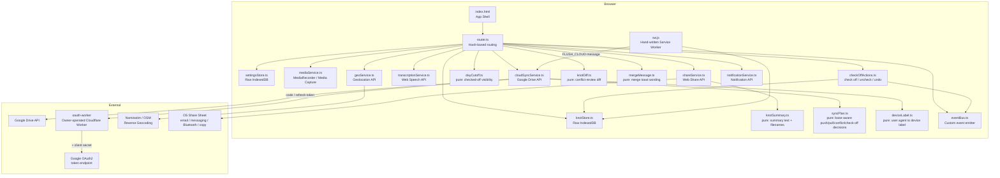

# Design Document

## Overview

e-Handkerchief is a mobile-first Progressive Web App that lets users capture location-aware knots — via voice recording, photo/video, or text — with minimal friction. Every knot is timestamped and geo-tagged automatically. The app stores all data locally in IndexedDB and works fully offline after first load. Voice transcription is optional and additive; it never blocks the core capture flow. Cloud backup (Google Drive) is always available on a deployed site and, once connected, runs an automatic two-way sync so the same knots appear on every device signed into that account. Content sync is **base-aware**: a copy is replaced silently only when just one side changed since the two last agreed, and a knot edited on two devices is surfaced as a **conflict** for the user to review — it is never resolved by "newest wins". A knot can be **checked off**, which is deliberately not a content edit and syncs on its own clock. One or several knots can be sent elsewhere at any time through the platform's own Share sheet. A Daily Email Summary is planned but not yet implemented; the Settings screen keeps its toggle and recipient address for when it ships.

The implementation uses vanilla HTML, CSS, and TypeScript compiled to plain ES module JavaScript. There is no framework runtime, no bundler, and no npm install step required by the end user. `tsc` (the TypeScript compiler) is the only build tool.

---

## Architecture

### High-Level Architecture


```mermaid
graph TD
    subgraph Browser
        HTML[index.html<br/>App Shell]
        Router[router.ts<br/>Hash-based routing]
        KnotStore[knotStore.ts<br/>Raw IndexedDB]
        SettingsStore[settingsStore.ts<br/>Raw IndexedDB]
        MediaService[mediaService.ts<br/>MediaRecorder / Media Capture]
        GeoService[geoService.ts<br/>Geolocation API]
        TranscriptionService[transcriptionService.ts<br/>Web Speech API]
        KnotSummary[knotSummary.ts<br/>pure: summary text + filenames]
        ShareService[shareService.ts<br/>Web Share API]
        SyncPlan[syncPlan.ts<br/>pure: base-aware push/pull/conflict/check-off decisions]
        DayCutoff[dayCutoff.ts<br/>pure: checked-off visibility]
        CheckOffActions[checkOffActions.ts<br/>check off / uncheck / undo]
        KnotDiff[knotDiff.ts<br/>pure: conflict-review diff]
        MergeMessage[mergeMessage.ts<br/>pure: merge toast wording]
        DeviceLabel[deviceLabel.ts<br/>pure: user agent to device label]
        CloudSync[cloudSyncService.ts<br/>Google Drive API]
        NotifService[notificationService.ts<br/>Notification API]
        EventBus[eventBus.ts<br/>Custom event emitter]
        SW[sw.js<br/>Hand-written Service Worker]
    end

    subgraph External
        GDrive[Google Drive API]
        OAuthWorker[oauth-worker<br/>Owner-operated Cloudflare Worker]
        GoogleToken[Google OAuth2<br/>token endpoint]
        ReverseGeo[Nominatim / OSM<br/>Reverse Geocoding]
        ShareTargets[OS Share Sheet<br/>email / messaging / Bluetooth / copy]
    end

    HTML --> Router
    Router --> KnotStore
    Router --> SettingsStore
    Router --> MediaService
    Router --> GeoService
    Router --> TranscriptionService
    Router --> ShareService
    Router --> CloudSync
    Router --> NotifService
    Router --> EventBus
    ShareService --> KnotSummary
    CloudSync --> SyncPlan
    CloudSync --> DeviceLabel
    Router --> DayCutoff
    Router --> CheckOffActions
    CheckOffActions --> KnotStore
    CheckOffActions --> EventBus
    Router --> KnotDiff
    Router --> MergeMessage
    SW --> KnotStore
    SW -->|FLUSH_CLOUD message| CloudSync
    CloudSync --> GDrive
    CloudSync -->|code / refresh token| OAuthWorker
    OAuthWorker -->|+ client secret| GoogleToken
    ShareService --> ShareTargets
    GeoService --> ReverseGeo
```

The architecture is intentionally flat: a thin vanilla-JS UI layer built from TypeScript screen modules calls service modules directly. There is no application backend; all persistence is local. The one server-side piece the app itself depends on is `oauth-worker/`, a tiny Cloudflare Worker operated by the site owner. It completes Google's OAuth token exchange and refresh, because Google requires a client secret that must not ship in the static bundle. The optional transcription Worker (`transcribe-worker/`) is configured per user and is separate. The Service Worker is hand-written and handles asset caching, offline fallback, and background sync (a single `cloud-sync` tag) without Workbox. External network calls (Google Drive and its OAuth broker, reverse geocoding, the user's own transcription Worker) never block capture and degrade gracefully when unavailable. Reverse geocoding and deferred transcription are optional features. Google Drive backup is always offered, although each user decides whether to connect.

### Component Breakdown

| Component | Responsibility |
|---|---|
| **index.html** | App shell; loads `src/app.js` as an ES module, links `app.css` and `manifest.webmanifest`. |
| **router.ts** | Hash-based single-page routing (`#/`, `#/knots`, `#/calendar`, `#/knot/:id`, `#/random/:id`, `#/conflict/:id`, `#/settings`). Calls screen `render`/cleanup functions. An unrecognised hash falls back to `#/`. |
| **KnotStore** | CRUD on Knots in IndexedDB using hand-written Promise wrappers from `db.ts`. `delete()` also writes a local delete tombstone and drops any recorded conflict; `saveFromSync()` is a plain save used by sync pulls that deliberately does not emit events. Also reads and writes the per-knot sync bookkeeping (`syncState`). |
| **SettingsStore** | Reads/writes app settings to IndexedDB with an in-memory reactive cache using a custom event-emitter pattern. |
| **MediaService** | Wraps MediaRecorder API (audio) and HTML Media Capture (photo/video). Returns Blobs. Records without call-style processing; two Library pickers (`pickPhotoOrVideo`, `pickAudioFile`); `validateMedia` classifies a picked file via *MediaImport*. |
| **MediaSummary** | Pure module (`mediaSummary.ts`): `summarizeMedia(items)` (one entry per media type present, fixed order photo / video / audio) and `describeMediaSummary(entries)` (accessible text such as "3 photos, 1 video, 1 voice recording"), used by the Calendar day list. |
| **MediaImport** | Pure module (`mediaImport.ts`): `classifyImport(type, name)` decides whether a picked file is a photo, video, or audio in any Whisper-supported format (stored under one normalised MIME type each), or unsupported. |
| **TranscriptMerge** | Pure module (`transcriptMerge.ts`): the word-level merge rules for live speech recognition text (`mergeFinalPieces`, `appendSegment` within one recognition instance; `foldSegment` across instances). |
| **SaveError** | Pure module (`saveError.ts`): `isMediaWriteError(err)` and `saveErrorMessage(prefix, err)` turn a failed knot save into the toast text; a media blob that IndexedDB could not write gets a "remove it and pick it again" message instead of the raw browser error. |
| **GeoService** | Wraps `navigator.geolocation`, enforces 10-second timeout, resolves reverse-geocoding via Nominatim; `locate()` also says why a failure happened (using the pure *LocateFailure* classifier). |
| **LocateFailure** | Pure module (`locateFailure.ts`): `classifyLocateFailure(code, permState)` maps a geolocation error code plus the Permissions API state to `'off'` (code 1 with the site still `granted`) or `'unavailable'` (everything else, including `'denied'`). |
| **AddressBackfill** | Pure module (`addressBackfill.ts`: `needsAddress`, `addPending`, `removePending`) plus a service (`addressBackfillService.ts`: `fillPendingAddresses()`) that fills in the address of knots tied offline once the device is back online. |
| **RandomKnot** | Pure module (`randomKnot.ts`): `pickRandomKnot(knots, excludeId, rand)` picks a random knot that is not checked off, optionally excluding one id. |
| **TranscriptionService** | Wraps Web Speech API for live transcription while recording (joining text through *TranscriptMerge*); `remoteTranscribe.ts` handles deferred transcription of a saved recording via the user's own Worker. |
| **KnotSummary** | Pure module (`knotSummary.ts`, no DOM, no settingsStore/db imports): builds the plain-text share summary for one knot or several (with the optional attribution footer) and the filename for each media attachment. Used by ShareService and imported by KnotsScreen for `collectTranscripts`. |
| **ShareService** | Wraps the Web Share API (`navigator.share`) for one or several knots (`shareKnots`; `shareKnot` delegates to it), with a clipboard fallback when it's unavailable. |
| **SyncPlan** | Pure module (`syncPlan.ts`, no DOM, no imports beyond its own types): given local knots, remote Drive entries, local/cloud tombstones, per-knot base versions, pending-job ids and already-conflicted ids, decides what to push, pull, de-duplicate, record as a conflict, and reconcile as check-off state. |
| **DayCutoff** | Pure module (`dayCutoff.ts`): when a checked-off knot leaves the Knots list, given the "New day starts at" time and the app's timezone. |
| **CheckOffActions** | `checkOffActions.ts`, shared by the Knots list and the detail screen: `setCheckedOff` (re-reads the knot, sets the two check-off fields, saves, emits `knot:checkedOff`), `toggleCheckOff` (adds the Undo toast), and `withLatestCheckOff` (copies the stored check-off state onto a knot just before a content save). |
| **KnotDiff** | Pure module (`knotDiff.ts`): the structural difference between this device's copy of a knot and the cloud copy, for the conflict review screen. |
| **DeviceLabel** | Pure module (`deviceLabel.ts`): user-agent string to a short device label ("Android", "Windows", …) stored as `editedOn` on Drive content writes. |
| **MergeMessage** | Pure module (`mergeMessage.ts`): the wording of the "Merge with Cloud" result toast. |
| **CloudSyncService** | Authenticates with Google Drive OAuth2 PKCE flow (token exchange and refresh via `oauth-worker`); upserts each knot's single backup file behind a conflict guard; runs the full two-way sync (via SyncPlan); pushes check-off state as metadata; lists and resolves conflicts; lists and deletes individual backups; manages local/cloud delete tombstones. |
| **oauth-worker** | Owner-operated Cloudflare Worker (`oauth-worker/src/index.js`). `POST /token` and `POST /refresh` add the Google client secret (a Wrangler secret) and relay Google's token endpoint. CORS is locked to `ALLOWED_ORIGIN`. |
| **NotificationService** | The quick-capture notification: reports the permission state, posts it on launch (`ensureShown`, which reports `shown` / `skipped` / `failed` with a reason), turns it on from a user gesture (`enable`, which is where the permission prompt happens) and off (`disable`). |
| **EventBus** | Lightweight publish/subscribe module; decouples service events (`knot:saved`, `knot:deleted`, `knot:checkedOff`, `knots:synced`, `knots:conflicts`, `backup:changed`, `settings:changed`, `sw:waiting`) from screen renders. |
| **BackupStatus** | Pure module (`backupStatus.ts`): `backupStatus(input)` decides whether a knot shows "☁ Not backed up", "☁ Backup deleted" or nothing, from the connection state, an in-flight upload, its `syncState` record and any unfinished upload job. Fed by `CloudSyncService.getBackupStatuses`. |
| **Service Worker** | Hand-written `sw.ts` compiled to `sw.js` (via `tsconfig.sw.json`); precaches all static assets; relays the `cloud-sync` Background Sync tag to the page as `FLUSH_CLOUD`; opens Capture from the quick-capture notification and re-posts it. |

---

## Data Models

### Knot

```typescript
interface Knot {
  id: string;                  // UUID v4
  timestamp: KnotTimestamp;
  location: KnotLocation | null;
  manualLabel?: string;        // display label used when location is null
  mediaItems: MediaItem[];
  transcription?: string;      // @deprecated legacy knot-level transcript; see AudioMediaItem.transcript
  transcriptionStatus?: "none" | "live" | "pending" | "done" | "failed"; // @deprecated, see above
  createdAt: number;           // Unix ms — used for Knots list sort order
  updatedAt: number;           // Unix ms — bumped on every CONTENT edit; the content version compared by sync and conflict detection
  checkedOffAt?: number | null;   // Unix ms when checked off; null/absent = not checked off. Does NOT bump updatedAt.
  checkOffChangedAt?: number;     // Unix ms of the last check/uncheck — the check-off state's own last-write-wins clock; absent = 0. Does NOT bump updatedAt.
}
```

Check-off is deliberately kept out of the content version. Checking off or unchecking a knot sets `checkedOffAt` and `checkOffChangedAt` and leaves `updatedAt` alone, so it causes no content conflict, never lifts a cloud tombstone, and never re-uploads media. Whether a checked-off knot is *listed* is derived at render time (see *DayCutoff*), not stored.

```typescript
interface KnotTimestamp {
  localISO: string;            // "2024-07-04T14:30:00+01:00"
  utcOffset: string;           // "+01:00"
}

interface KnotLocation {
  latitude: number;
  longitude: number;
  accuracyMeters: number | null;
  resolvedAddress?: string;    // up to 100 characters; omitted if reverse-geocoding failed
}
```

### MediaItem

```typescript
type MediaItemType = "audio" | "photo" | "video" | "text";

interface MediaItemBase {
  id: string;                  // UUID v4
  type: MediaItemType;
  createdAt: number;
}

interface AudioMediaItem extends MediaItemBase {
  type: "audio";
  blob: Blob;                  // audio/webm or audio/ogg
  durationSeconds: number;
  transcript?: string;             // this clip's own transcript (live, remote, or hand-edited)
  transcriptionStatus?: "none" | "live" | "pending" | "done" | "failed";
}

interface PhotoMediaItem extends MediaItemBase {
  type: "photo";
  blob: Blob;                  // image/jpeg | image/png | image/gif | image/webp
  widthPx: number;
  heightPx: number;
  thumbnailBlob: Blob;         // 80×80 JPEG
}

interface VideoMediaItem extends MediaItemBase {
  type: "video";
  blob: Blob;                  // video/mp4 | video/quicktime
  durationSeconds: number;
  thumbnailBlob: Blob;         // first-frame JPEG, min 80×80
}

interface TextMediaItem extends MediaItemBase {
  type: "text";
  content: string;             // 1–2000 characters
}

type MediaItem = AudioMediaItem | PhotoMediaItem | VideoMediaItem | TextMediaItem;
```

### Settings

```typescript
interface AppSettings {
  transcriptionEnabled: boolean;          // default: false
  transcriptionServerUrl: string;         // default: '' — deferred-transcription Worker URL
  emailSummaryEnabled: boolean;           // default: false — Daily Email Summary, not yet implemented
  emailSummaryRecipient: string | null;   // default: null — kept for when it ships
  cloudBackupProvider: "google-drive" | null;
  cloudBackupToken: OAuthToken | null;
  notificationPermissionRequested: boolean;
  lastSyncAt: number | null;              // default: null — Unix ms of the last successful sync
  cloudAccountEmail: string | null;       // default: null — connected Google account's email, via Drive about.get
  timezone: string;                       // default: 'auto'
  dateFormat: "DD MMM YYYY" | "MMM DD, YYYY" | "YYYY-MM-DD" | "DD/MM/YYYY" | "MM/DD/YYYY"; // default: 'DD MMM YYYY'
  timeFormat: "24h" | "12h";              // default: '24h'
  dayCutoff: string;                      // default: '03:00' — "HH:MM" local time at which a new day starts; checked-off knots leave the Knots list then
  shareAttribution: boolean;              // default: true — append the "Shared from e-Handkerchief" footer to shared text
  quickCaptureNotification: boolean;      // default: true — keep the quick-capture notification posted (only takes effect once permission is granted)
  pendingAddressKnotIds?: string[];       // optional, no default (absent = none) — local-only: knots tied on THIS device whose address still needs looking up (see AddressBackfill)
}

interface OAuthToken {
  accessToken: string;
  refreshToken: string;
  expiresAt: number;           // Unix ms
}
```

### CloudUploadJob

```typescript
type UploadJobStatus = "pending" | "in-flight" | "failed";

interface CloudUploadJob {
  id: string;
  knotId: string;
  provider: "google-drive";
  createdAt: number;
  attempts: number;            // 0–3
  lastAttemptAt: number | null;
  status: UploadJobStatus;
}
```

### KnotTombstone

```typescript
interface KnotTombstone {
  id: string;        // the deleted knot's id
  deletedAt: number; // Unix ms
}
```

A record of a knot deleted **from this device**. Local deletes never delete the knot's Drive backup — Drive is an archive — and this tombstone stops a later sync from pulling the knot back onto this device. (The parallel *cloud* tombstone, keyed the same way but keyed by knot id inside a single JSON file rather than an object store, is described under CloudSyncService below.)

### SyncStateRecord

```typescript
interface SyncStateRecord {
  knotId: string;                // key
  baseUpdatedAt: number | null;  // the content updatedAt this device and Drive last agreed on; null = none recorded
  conflict?: {                   // present while the knot awaits review
    fileId: string;              // Drive file id of the newest cloud copy when the conflict was recorded
    remoteUpdatedAt: number;     // that cloud copy's content updatedAt
  };
  backupDeletedAt?: number;      // when this device learned the knot's Drive backup was deleted via Manage backups
}
```

Local-only bookkeeping (IndexedDB store `syncState`, keyed on `knotId`; never uploaded). `baseUpdatedAt` is the **base version** of a three-way comparison: it lets sync distinguish "only one side changed" (safe to push or pull) from "both sides changed" (a conflict). It is set after every successful push or upsert (to the local `updatedAt`), after every pull (to the remote `updatedAt`), and whenever a sync finds local and remote equal. Setting a base always clears `conflict` — and `backupDeletedAt`, because `setBase` writes a fresh record (a later push or pull means the backup exists again). `backupDeletedAt` is set by `deleteBackup` (this device) and by `doSyncAll` step 7d2 (a cloud tombstone seen during a sync); it only feeds the "Backup deleted" badge (*BackupStatus*). A local delete clears `conflict` but leaves the base in place (harmless: it is never consulted for a knot that doesn't exist locally).

There is no longer an `EmailJob` type or `emailJobs` store — save-and-send email was retired in favor of the per-knot Share button (Requirement 8); see *IndexedDB Schema* below for how the store was removed.

---

## API Design

### KnotStore API

```typescript
interface KnotStoreAPI {
  /** Save a new or updated knot. Resolves within 1 second. Emits nothing itself — callers emit knot:saved. */
  save(knot: Knot): Promise<void>;

  /** Retrieve a single knot by ID. */
  get(id: string): Promise<Knot | undefined>;

  /** Return all knots sorted by createdAt descending (newest first). */
  listAll(): Promise<Knot[]>;

  /** Permanently delete a knot FROM THIS DEVICE, its media blobs, and record a local tombstone. */
  delete(id: string): Promise<void>;

  /** All local delete tombstones — used by CloudSyncService to avoid re-pulling deleted knots. */
  listTombstones(): Promise<KnotTombstone[]>;

  /** Plain save used by a sync pull. MUST NOT emit events — a pull is not a local edit. */
  saveFromSync(knot: Knot): Promise<void>;

  /** Sync bookkeeping (base version + recorded conflict) for one knot, or undefined. */
  getSyncState(knotId: string): Promise<SyncStateRecord | undefined>;
  /** Create or replace a knot's sync bookkeeping record. */
  putSyncState(record: SyncStateRecord): Promise<void>;
  /** Every sync bookkeeping record. */
  listSyncStates(): Promise<SyncStateRecord[]>;
}
```

Implemented using hand-written Promise wrappers around the raw `indexedDB` API in `db.ts`. Five object stores exist at DB version 5:

- `knots` — keyed on `id`, indexed on `createdAt` for efficient reverse-chronological queries.
- `cloudUploadJobs` — keyed on `id`, indexed on `status`.
- `settings` — single-record store keyed on the fixed constant `"app"`.
- `knotTombstones` — keyed on `id`; records are `{ id, deletedAt }`.
- `syncState` — keyed on `knotId`; records are `SyncStateRecord` (base version and recorded conflict).

See *IndexedDB Schema* below for the full version-by-version upgrade history.

### SettingsStore API

```typescript
interface SettingsStoreAPI {
  /** Load settings; must be called once on app launch before any screen renders. */
  load(): Promise<AppSettings>;

  /** Persist a partial settings update within 500 ms. */
  save(patch: Partial<AppSettings>): Promise<void>;

  /**
   * In-memory cache — always reflects latest persisted state.
   * Listeners are registered via onChange(); callbacks fire after every successful save.
   */
  getCurrent(): AppSettings;
  onChange(listener: (settings: AppSettings) => void): () => void;
}
```

The reactive cache is a plain TypeScript object updated in-memory on every successful `save`. Screen modules call `onChange` to subscribe and receive the returned unsubscribe function; they call it in their cleanup function.

### MediaService API

```typescript
interface MediaServiceAPI {
  /** Start a microphone recording. Returns a handle to stop it. */
  startAudioRecording(): Promise<AudioRecordingHandle>;

  /** Invoke device camera for photo capture. Returns a Blob or throws. */
  capturePhoto(): Promise<Blob>;

  /** Invoke device camera for video capture (max 60 s). Returns a Blob or throws. */
  captureVideo(): Promise<Blob>;

  /**
   * Open the file picker for an existing photo or video from the device library.
   * accept = image/jpeg, image/png, image/gif, image/webp, video/mp4, video/quicktime
   * only (no audio types), so Android opens its photo picker directly.
   * Photo and video results only.
   */
  pickPhotoOrVideo(): Promise<Blob>;

  /**
   * Open the file picker for an existing audio file. accept = `audio/*` (one
   * filter entry, because Android maps audio extensions inconsistently and a
   * narrower list could grey out real files); unsupported audio is rejected
   * after picking by classifyImport. The returned Blob is re-typed to the
   * normalised type (for example an .m4a becomes audio/mp4). Audio results only.
   */
  pickAudioFile(): Promise<Blob>;

  /**
   * Generate an 80×80 JPEG thumbnail from an image or video Blob. The source is
   * centre-cropped to a square ("cover": side = min(w, h), taken from the middle)
   * before being drawn, so it is not squashed; if the natural size is unknown (0)
   * it falls back to the old stretch. Thumbnails stored before this change were
   * stretched and are not regenerated, which is why the Calendar draws photos
   * from the full blob.
   */
  generateThumbnail(source: Blob): Promise<Blob>;
}

interface AudioRecordingHandle {
  /** Resolves with the recorded Blob when recording stops. */
  readonly result: Promise<Blob>;
  /** Elapsed seconds — updated via onElapsed callback at most every 1 second. */
  onElapsed(cb: (seconds: number) => void): void;
  stop(): void;
}
```

### GeoService API

```typescript
interface GeoServiceAPI {
  /**
   * Request current position. Resolves within 10 seconds.
   * Returns best-available fix; returns null on failure.
   */
  getCurrentPosition(): Promise<KnotLocation | null>;

  /**
   * Like getCurrentPosition(), but says why a failure happened. Never rejects.
   * `off`         = the site is still allowed, so the device's own Location is off;
   * `unavailable` = anything else, including every ambiguous case (no fix, timeout, the
   *                 10 s guard, no geolocation support, or permission denied — Android reports
   *                 a blocked site, device Location off and Chrome lacking Android's location
   *                 permission alike as `denied`, so `denied` is not trusted).
   */
  locate(deadlineMs?: number): Promise<LocateResult>; // deadlineMs default 10 000; Capture passes 120 000 offline

  /** Attempt reverse geocoding. Returns address string (≤ 100 chars) or null. */
  reverseGeocode(lat: number, lng: number): Promise<string | null>;
}

type LocateFailureReason = 'off' | 'unavailable';
type LocateResult =
  | { ok: true; coords: KnotLocation }
  | { ok: false; reason: LocateFailureReason };
```

### TranscriptionService API

```typescript
interface TranscriptionServiceAPI {
  readonly isSupported: boolean;
  /** Start live speech recognition; returns a handle streaming interim + final text. */
  startLive(): LiveTranscriptionHandle;
}
```

Live transcription streams through `LiveTranscriptionHandle` (`onText`/`onError`/`onEnd`/`getError`/`stop`, plus a `result` promise) while a recording is in progress. Deferred (post-save) transcription of an already-saved audio blob is a separate pure function, `remoteTranscribe(blob, language?)` in `remoteTranscribe.ts`, which POSTs to the user's configured transcription server and returns `{ ok, text?, error? }`.

### KnotSummary API

```typescript
/** Gather all transcripts to display for a knot (per-item, falling back to the legacy knot-level one). */
function collectTranscripts(knot: Knot): string[]

/** Build the plain-text share/copy summary for a knot; opts.attribution adds the footer once, at the end. */
function knotSummaryText(knot: Knot, formatTimestamp: (iso: string) => string, opts?: SummaryOptions): string

/** Build one combined summary for several knots: header, "———" separators, footer once. */
function knotsSummaryText(knots: Knot[], formatTimestamp: (iso: string) => string, opts?: SummaryOptions): string

interface SummaryOptions { attribution?: { appUrl: string } }

/** Build a share-friendly filename for a media item, e.g. "knot-photo-1.jpg" (or "knot2-photo-1.jpg" with a per-knot prefix). */
function mediaFileName(item: PhotoMediaItem | VideoMediaItem | AudioMediaItem, index: number, prefix?: string): string
```

Pure — no DOM, no `settingsStore`/`db` imports — so it is importable and testable under plain `node` (`knotSummary.chartest.ts`). See *ShareService* below for how the summary text and filenames are assembled into an actual share.

### ShareService API

```typescript
/** Share one or several knots via the platform share sheet, or copy the text to the clipboard as a fallback. */
async function shareKnots(knots: Knot[]): Promise<void>

/** Share one knot; delegates to shareKnots([knot]). */
function shareKnot(knot: Knot): Promise<void>
```

See the dedicated *ShareService* section under *Components and Interfaces* for the full contract.

### CloudSyncService API

```typescript
interface CloudSyncServiceAPI {
  getConnectionStatus(): "connected" | "disconnected";
  onStatusChange(cb: (status: "connected" | "disconnected") => void): () => void;
  connect(): Promise<void>;
  handleOAuthCallback(code: string): Promise<void>;
  /**
   * Google redirected back with `?error=...` (e.g. `access_denied` when the user
   * cancels consent): clears `pkce_verifier`, strips the URL params and shows a
   * toast. Never changes the connection status or the stored tokens.
   */
  handleOAuthError(error: string): Promise<void>;
  disconnect(): Promise<void>;

  /**
   * Fetches the connected Google account's email via Drive `about.get`
   * (no extra OAuth scope needed — `drive.appdata` already covers it) and
   * saves it to `settings.cloudAccountEmail`. Never throws: logs and
   * returns on any failure, leaving the connection untouched. Called after
   * `handleOAuthCallback` connects, and at startup when the email is still
   * unknown (covers connections made before this existed).
   */
  refreshAccountInfo(): Promise<void>;
  /** The connected Google account's email (from settings), or null if unknown/not connected. */
  getAccountEmail(): string | null;

  /** Per-save upload path: upsert now, or queue a retry job on any failure. */
  uploadKnot(knot: Knot): Promise<void>;
  /** Retry queued upload jobs (upsert path; never creates new jobs). Resolves with the number of jobs uploaded successfully this run. */
  uploadPending(): Promise<number>;
  /** Full two-way sync: push/pull only where one side changed, record conflicts, reconcile check-off and duplicates. Single-flight. */
  syncAll(): Promise<{ pulled: number; pushed: number; conflicts: number }>;
  /** Reset every 'failed' upload job to 'pending' and run a full sync. */
  retryFailed(): Promise<void>;

  /** Metadata-only Drive update of a knot's check-off state. No-op if not connected, no backup file, or cloud-tombstoned. Throws on failure; no retry queue. */
  pushCheckOff(knot: Knot): Promise<void>;

  /** Knots currently awaiting conflict review. */
  listConflicts(): Promise<Array<{ knotId: string; fileId: string; remoteUpdatedAt: number }>>;
  /** Download the newest cloud copy of a knot for review. Throws if offline, not connected, or the backup is gone. */
  fetchRemoteKnot(knotId: string): Promise<{ knot: Knot; updatedAt: number; editedOn: string | null; fileId: string }>;
  /** Apply the user's choice. Refuses with { ok:false, reason:'changed-again' } (writing nothing) if the cloud copy moved since expectedRemoteUpdatedAt. */
  resolveConflict(
    knotId: string,
    choice: 'local' | 'remote' | 'both',
    expectedRemoteUpdatedAt: number
  ): Promise<{ ok: true } | { ok: false; reason: 'changed-again' }>;

  /** List every backup file in the Drive appDataFolder, for "Manage backups". */
  listBackups(): Promise<BackupEntry[]>;
  /** Delete one backup file from Drive; if knotId is given, records a cloud tombstone first. */
  deleteBackup(fileId: string, knotId: string | null): Promise<void>;

  /** The plain-language confirm() text for a LOCAL delete, based on connection status. */
  localDeleteConfirmText(): string;

  /** Which knots are not in Drive (for the list badge / page pill). All 'none' when not connected. Never touches the network. */
  getBackupStatuses(knots: Knot[]): Promise<Map<string, BackupBadge>>;
}
```

See the dedicated *CloudSyncService* section under *Components and Interfaces* for the full contract (Drive file format, upsert and conflict guard, sync steps, check-off, conflict resolution, tombstones, and `planSync`).

### DayCutoff API

```typescript
function resolveTimeZone(setting: string | null | undefined): string;   // "auto"/empty -> device zone; else the IANA name as-is
function isCheckedOff(knot: { checkedOffAt?: number | null }): boolean; // true only for a numeric checkedOffAt
function nextCutoffAfter(ms: number, cutoff: string, timeZone: string): number;
function isCheckedOffVisible(checkedOffAt: number | null | undefined, now: number, cutoff: string, timeZone: string): boolean;
```

### CheckOffActions API

```typescript
function setCheckedOff(knotId: string, checkedOff: boolean): Promise<Knot | undefined>;   // undefined if the knot is gone
function toggleCheckOff(knotId: string): Promise<Knot | undefined>;                        // + Undo toast
function withLatestCheckOff(knot: Knot): Promise<Knot>;                                    // copies stored check-off fields onto `knot`, in place
```

### KnotDiff API

```typescript
function diffKnots(local: Knot, remote: Knot): KnotDiff;            // local = this device, remote = the cloud copy
function diffLines(local: string, remote: string): LineDiffOp[];    // LCS line diff, local -> remote
```

### DeviceLabel and MergeMessage APIs

```typescript
function deviceLabelFromUserAgent(userAgent: string): string;       // "Android" | "iPhone" | "iPad" | "Windows" | "Mac" | "Linux" | "another device"
function mergeResultMessage(pulled: number, pushed: number, conflicts: number): string;
```

### NotificationService API

```typescript
const notificationService: {
  permission(): NotificationPermission | 'unsupported';
  ensureShown(): Promise<ShowResult>;                               // post the notification if the setting is on and permission is granted; never throws, reports why it failed
  enable(): Promise<EnableResult>;                                  // call from a click: asks permission if needed, saves the setting, shows it
  disable(): Promise<void>;                                         // saves the setting off and closes any shown notification
};

type ShowResult =
  | { status: 'shown' }
  | { status: 'skipped' }                      // permission not granted, setting off, or no service-worker API
  | { status: 'failed'; reason: string };
interface EnableResult {
  permission: NotificationPermission | 'unsupported';
  show?: ShowResult;                           // present only when permission is granted
}
```

### ToastService API

```typescript
function show(message: string, durationMs?: number): void;
function showPersistent(message: string, onDismiss?: () => void): () => void;
function showAction(message: string, actionLabel: string, onAction: () => void, durationMs?: number): () => void;
```

### Browser APIs Used

| API | Usage |
|---|---|
| `navigator.geolocation.getCurrentPosition` | GPS location on knot creation |
| `MediaRecorder` | Audio recording |
| `<input type="file" accept="..." capture="...">` | Photo/video capture, library pick (photo or video), and library audio pick (`audio/*`) |
| `SpeechRecognition` / `webkitSpeechRecognition` | Live voice transcription |
| `navigator.share` / `navigator.canShare` | Sharing one or several knots (Web Share API) |
| `navigator.clipboard.writeText` | Clipboard fallback when Web Share is unavailable, or after a share failure |
| `indexedDB` (raw, wrapped in Promise helpers) | All local persistence |
| `ServiceWorker` + `BackgroundSync` | Offline queuing (`cloud-sync` tag) |
| `Notification` / `ServiceWorkerRegistration.showNotification` | Quick-capture notification (re-posted at launch and after each tap) |
| `Intl.DateTimeFormat#formatToParts` | Timezone-aware wall-clock arithmetic for the "New day starts at" cutoff |
| `visibilitychange` | Re-evaluate which checked-off knots are still listed when the app returns to the foreground |
| `navigator.onLine` + `online`/`offline` events | Connectivity detection |
| Web App Manifest `shortcuts` | Home-screen quick-launch |
| Google OAuth2 (PKCE) + `oauth-worker` broker | Drive OAuth2 |

---

## File Structure

```
e-Handkerchief/
├── index.html                  # App shell; <script type="module" src="src/app.js">
├── manifest.webmanifest        # PWA manifest
├── app.css                     # All styles (mobile-first, custom properties)
├── src/
│   ├── types.ts                # All TypeScript interfaces
│   ├── db.ts                   # Raw IndexedDB Promise helpers; DB_VERSION, store name constants
│   ├── knotStore.ts            # Knot CRUD + local tombstones + sync bookkeeping (syncState)
│   ├── settingsStore.ts        # Settings load/save/cache
│   ├── router.ts                 # Hash-based router
│   ├── router.chartest.ts        # Characterization test for parseHash / navTabForRoute
│   ├── eventBus.ts             # Lightweight pub/sub
│   ├── geoService.ts           # Geolocation + reverse geocoding
│   ├── locateFailure.ts          # Pure: why a location request failed (off / unavailable)
│   ├── locateFailure.chartest.ts # Characterization test for locateFailure
│   ├── addressBackfill.ts        # Pure: needsAddress / addPending / removePending
│   ├── addressBackfill.chartest.ts # Characterization test for addressBackfill
│   ├── addressBackfillService.ts # fillPendingAddresses(): fill in addresses of knots tied offline
│   ├── mediaService.ts         # Audio/photo/video capture
│   ├── mediaImport.ts            # Pure: classify a picked file (photo / video / Whisper-supported audio)
│   ├── mediaImport.chartest.ts   # Characterization test for mediaImport
│   ├── mediaSummary.ts           # Pure: per-type media summary for the Calendar day list
│   ├── mediaSummary.chartest.ts  # Characterization test for mediaSummary
│   ├── saveError.ts              # Pure: user-facing message for a failed knot save (media write errors)
│   ├── saveError.chartest.ts     # Characterization test for saveError
│   ├── mapsLink.ts             # Google Maps URL builder (pure)
│   ├── dateFormat.ts           # Date/time formatting helpers
│   ├── remoteTranscribe.ts     # Deferred transcription via the user's own Worker
│   ├── transcriptionService.ts # Web Speech API (live) wrapper
│   ├── transcriptMerge.ts        # Pure: word-level merge of live speech text (within / across instances)
│   ├── transcriptMerge.chartest.ts # Characterization test for transcriptMerge
│   ├── knotSummary.ts            # Pure: share summary text (one or several knots) + media filenames
│   ├── knotSummary.chartest.ts   # Characterization test for knotSummary
│   ├── randomKnot.ts             # Pure: pick a random unchecked knot
│   ├── randomKnot.chartest.ts    # Characterization test for randomKnot
│   ├── shareService.ts         # Web Share API wrapper (one or several knots) + clipboard fallback
│   ├── syncPlan.ts               # Pure: base-aware push/pull/conflict/check-off/dedupe decisions
│   ├── syncPlan.chartest.ts      # Characterization test for planSync
│   ├── backupStatus.ts           # Pure: which knots show "Not backed up" / "Backup deleted"
│   ├── backupStatus.chartest.ts  # Characterization test for backupStatus
│   ├── checkOffActions.ts        # Check off / uncheck / Undo, shared by the Knots list and detail screen
│   ├── dayCutoff.ts              # Pure: when a checked-off knot leaves the Knots list
│   ├── dayCutoff.chartest.ts     # Characterization test for dayCutoff
│   ├── knotDiff.ts               # Pure: conflict-review diff of two versions of a knot
│   ├── knotDiff.chartest.ts      # Characterization test for knotDiff
│   ├── deviceLabel.ts            # Pure: user agent -> short device label
│   ├── deviceLabel.chartest.ts   # Characterization test for deviceLabel
│   ├── mergeMessage.ts           # Pure: "Merge with Cloud" result wording
│   ├── mergeMessage.chartest.ts  # Characterization test for mergeMessage
│   ├── notificationService.ts  # Quick-capture notification: permission, ensureShown (ShowResult), enable (EnableResult), disable
│   ├── cloudSyncService.ts     # Google Drive OAuth2 PKCE + upsert + two-way sync + backups
│   ├── toastService.ts         # Global toast UI (DOM-based)
│   ├── app.ts                  # Entry point: init, SW registration, routing, sync triggers
│   ├── components/
│   │   ├── mediaCapture.ts             # Shared mic/photo/video/library capture UI
│   │   ├── timezoneCombobox.ts         # Searchable timezone selector
│   │   └── timezoneCombobox.proptest.ts  # Property-based tests for the combobox
│   └── screens/
│       ├── captureScreen.ts    # Capture screen render + logic
│       ├── knotsScreen.ts      # Knots list screen render + logic
│       ├── calendarScreen.ts   # Calendar screen render + logic
│       ├── knotDetailScreen.ts # Knot detail screen render + logic (Share/Edit/Delete, "Another random knot", check-off tick, conflict banner)
│       ├── conflictScreen.ts   # Conflict review screen (#/conflict/{id})
│       └── settingsScreen.ts   # Settings screen render + logic
├── sw.ts                       # Service Worker source
├── config.js                   # Runtime config; Google client ID + OAuth broker URL injected at deploy
├── oauth-worker/               # Owner-operated Cloudflare Worker: Google token exchange/refresh
│   └── src/index.js
├── transcribe-worker/          # Per-user Cloudflare Worker: deferred transcription proxy
├── tsconfig.json                # TypeScript config for src/**/*.ts (ES2020, strict)
└── tsconfig.sw.json              # Separate TypeScript config for sw.ts (WebWorker lib)
```

After `tsc` compilation every `.ts` file produces a `.js` sibling at the same path. `index.html` references `<script type="module" src="src/app.js">`. The Service Worker is registered from `sw.js`, relative to the app's own base path. `*.chartest.ts` and `*.proptest.ts` files are test infrastructure, not app code — see *Correctness Properties and Testing* below.

---

## Build System

The build step is:

```sh
tsc
tsc -p tsconfig.sw.json
```

`tsc` reads `tsconfig.json`, compiles every `src/**/*.ts` source to a `.js` ES module in place. `sw.ts` is compiled separately via `tsconfig.sw.json`, because it needs the `WebWorker` lib (which conflicts with `DOM` in a single `tsconfig`) rather than `DOM`. Neither config bundles, tree-shakes, or requires an npm install step for end users. The output is deployable as static files served from any HTTP server.

### Deploy-time injection

`config.js` is a plain (non-module, not compiled) script loaded by `index.html` before `src/app.js`. It sets `window.__GOOGLE_CLIENT_ID__` and `window.__OAUTH_BROKER_URL__`, which `CloudSyncService` reads at module load. The committed file holds the placeholders `@@GOOGLE_CLIENT_ID@@` and `@@OAUTH_BROKER_URL@@`. The GitHub Pages deploy workflow replaces them with the `GOOGLE_CLIENT_ID` and `OAUTH_BROKER_URL` Actions secrets via `sed`. An unreplaced placeholder sets its global to `''`, and a trailing `/` on the broker URL is stripped.

- Google Drive backup is a required feature: **CI fails** if either secret is empty.
- Placeholder tokens must be distinct from the global names. When they were identical, `sed` also rewrote the assignment target and produced a syntax error.
- After injection, CI runs `node --check _site/config.js` so a malformed config fails the build instead of deploying silently.
- Test files are not deployed: the workflow deletes `*.chartest.js` and `*.proptest.js` from `_site/src` after copying.
- The Google **client secret** is never injected here. Everything in `config.js` is publicly readable, so the secret lives only in `oauth-worker` as a Wrangler secret.

### tsconfig.json

```json
{
  "compilerOptions": {
    "target": "ES2020",
    "module": "ES2020",
    "moduleResolution": "bundler",
    "lib": ["ES2020", "DOM", "DOM.Iterable"],
    "outDir": ".",
    "rootDir": ".",
    "strict": true,
    "noUnusedLocals": false,
    "noUnusedParameters": false,
    "esModuleInterop": true,
    "skipLibCheck": true,
    "declaration": false,
    "sourceMap": false
  },
  "include": ["src/**/*.ts"],
  "exclude": ["node_modules", ".kiro", "scripts"]
}
```

### tsconfig.sw.json

```json
{
  "compilerOptions": {
    "target": "ES2020",
    "module": "ES2020",
    "moduleResolution": "bundler",
    "lib": ["ES2020", "WebWorker"],
    "outDir": ".",
    "rootDir": ".",
    "strict": true,
    "noUnusedLocals": false,
    "noUnusedParameters": false,
    "esModuleInterop": true,
    "skipLibCheck": true,
    "declaration": false,
    "sourceMap": false
  },
  "include": ["sw.ts"],
  "exclude": ["node_modules", ".kiro", "scripts"]
}
```

`outDir: "."` means compiled `.js` files are emitted next to their `.ts` sources in both configs. `index.html` loads `src/app.js`; the Service Worker is registered as `sw.js` relative to the app's base path (so it works at the origin root or on a GitHub Pages subpath).

---

## Component Design

### Architecture Principles

- Each screen module exports a single `render(container: HTMLElement): () => void` function that builds and inserts the screen's DOM into `container` and returns a cleanup function.
- The router calls the current screen's cleanup function, clears the container, then calls the new screen's `render`.
- All DOM manipulation uses `document.createElement`, `element.textContent`, or `element.innerHTML` only with static/sanitized markup — never with raw user data.
- No virtual DOM, no reactive framework — the DOM is updated imperatively when state changes (e.g. a counter element's `textContent` is set directly on input events).
- The `eventBus.ts` module is a lightweight typed pub/sub; services emit named events (`knot:saved`, `knot:deleted`, `knot:checkedOff`, `knots:synced`, `knots:conflicts`, `backup:changed`, `settings:changed`, `sw:waiting`) that screens subscribe to and unsubscribe from in their cleanup functions.

### IndexedDB Implementation (`db.ts`)

Hand-written Promise helpers, no library dependency:

```typescript
function openDB(): Promise<IDBDatabase>
function dbGet<T>(db: IDBDatabase, store: string, key: string): Promise<T | undefined>
function dbPut<T>(db: IDBDatabase, store: string, value: T, key?: string): Promise<void>
function dbDelete(db: IDBDatabase, store: string, key: string): Promise<void>
function dbGetAll<T>(
  db: IDBDatabase,
  store: string,
  indexName?: string,
  direction?: IDBCursorDirection
): Promise<T[]>
function dbGetAllByIndex<T>(
  db: IDBDatabase,
  store: string,
  indexName: string,
  query: IDBValidKey | IDBKeyRange
): Promise<T[]>
```

Every helper wraps `IDBRequest.onsuccess`/`onerror` in a `new Promise` and resolves/rejects accordingly. `db.ts` also exports the object-store name constants `KNOT_OBJECT_STORE` (`'knots'`), `KNOT_TOMBSTONE_STORE` (`'knotTombstones'`) and `SYNC_STATE_STORE` (`'syncState'`), used by `knotStore.ts` instead of string literals.

#### IndexedDB Schema (DB_VERSION 5)

`openDB()` opens `"e-handkerchief-db"` at version **5**. `onupgradeneeded` branches on `event.oldVersion`, so each version's block only does the work needed for that step, and a brand-new database takes the `oldVersion < 1` branch straight to the current schema:

| Store | Key | Index | Since |
|---|---|---|---|
| `knots` | `id` | `createdAt` (non-unique) | v1 (as `notes`, renamed at v2) |
| `cloudUploadJobs` | `id` | `status` (non-unique) | v1 |
| `settings` | fixed key `"app"` | — | v1 |
| `knotTombstones` | `id` | — | v3 |
| `syncState` | `knotId` | — | v5 |

Upgrade history:

- **v1 (fresh install, historical):** created `notes`, `emailJobs`, `cloudUploadJobs`, `settings`.
- **v1 → v2 — entity rename, note → knot (2026-09-24):** deletes the `notes` store and creates `knots` with the same shape; clears `cloudUploadJobs` (its records used the old `noteId` field name). **This intentionally drops existing local data** — the app was still in testing at the time, only test knots existed, and no migration script was written. `emailJobs` and `settings` were untouched at this step.
- **v2 → v3 — local delete tombstones:** creates `knotTombstones`, so a later Drive sync can never pull a knot back onto a device it was deliberately deleted from.
- **v3 → v4 — retire save-and-send email:** deletes the `emailJobs` store (nothing reads it anymore; Share replaced per-knot email, and the Daily Email Summary is a future feature — Requirement 8.6).
- **v4 → v5 — edit-conflict detection (2026-09-29):** creates `syncState`. Nothing is migrated: existing knots simply have no base version yet, and `planSync`'s no-base rule (see *SyncPlan*) decides them without losing data. The block is `if (oldVersion >= 1 && oldVersion < 5)`, guarded with `objectStoreNames.contains`, because a fresh database already gets the store in its `oldVersion < 1` branch. The new `Knot` check-off fields and the new settings need no upgrade step: absent `checkedOffAt`/`checkOffChangedAt` mean "not checked off" and "0", and `SettingsStore.load` merges defaults over stored settings.
- A fresh database (`oldVersion < 1`) creates the final v5 shape directly — `knots`, `cloudUploadJobs`, `settings`, `knotTombstones`, `syncState` — without ever creating `notes` or `emailJobs`.

Each version's block is additive to `onupgradeneeded`, so a future `v5 → v6` step is a new `if (oldVersion < 6) { ... }` block alongside the existing ones.

### Router (`router.ts`)

Manages a single `<main id="app">` container element. On `hashchange` and initial load:
1. Calls the current cleanup function (if any) and clears the container's children.
2. Parses `window.location.hash` against the known routes (`#/`, `#/knots`, `#/calendar`, `#/knot/:id`, `#/random/:id`, `#/conflict/:id`, `#/settings`); unknown hashes fall back to `#/`. `#/random/:id` parses to the same `knot` route as `#/knot/:id`, with an extra param `random: '1'` (so there is no new `Route` value); `#/random/` with no id is an unknown route.
3. Calls the matching screen's `render(container)` and stores the returned cleanup function.

```typescript
type Route = "capture" | "knots" | "calendar" | "knot" | "conflict" | "settings";
interface RouteMatch { route: Route; params: Record<string, string>; }

function parseHash(hash: string): RouteMatch
function navigate(path: string): void
function initRouter(container: HTMLElement): void
```

`parseHash` is pure (no `window` access at import time), so it is exercised directly by `router.chartest.ts` under plain `node` — see *Correctness Properties and Testing*.

**Bottom navigation.** `app.ts` builds a fixed nav bar (Knots, Calendar, a centre "+" for Capture, Settings). Which tab is current comes from the pure `navTabForRoute(route)` in `router.ts`: the `knot` and `conflict` routes map to `'knots'`, and every other route maps to itself (an unknown hash parses to `capture`). Because `#/random/…` is the `knot` route, it highlights Knots too. `updateActive()` in `app.ts` sets `aria-current="page"` on exactly that tab, so `#/knot/…`, `#/random/…` and `#/conflict/…` highlight **Knots** (they previously marked "+" as current, which also hid its glyph). When Capture is current, the "+" button is darker (`--color-primary-dark`) with a ring (a 3 px surface-coloured gap, then a 2 px primary ring); otherwise it is the normal green — a subtle signal that you are on Capture. `navTabForRoute` is covered by `router.chartest.ts`.

### CaptureScreen (`src/screens/captureScreen.ts`)

Default landing view rendered at route `#/`. Title "Tie a Knot"; Save button "Tie Knot"; textarea placeholder "What do you want to remember?".

**Lifecycle:**
1. On `render`, record a `KnotTimestamp` immediately (local ISO string + UTC offset) and call `GeoService.locate(deadlineMs)`; a spinner and "Getting location…" show while location resolves. **Offline** (`!navigator.onLine` when the request starts, including a retry) the deadline is 120 000 ms and the text is "Getting location (no internet — GPS can take a minute or two)…", because a cold GPS fix without assisted GPS can take minutes and coordinates need no internet; online the deadline stays 10 000 ms. Failure copy is the same in both cases.
   - **Location retry.** On failure the location line becomes a link-styled `button.location-retry` whose text depends on the `LocateResult` reason, reading exactly:
     - `off` (site still allowed, so the device's Location is off) — "Location is off — turn it on, then tap to retry";
     - `unavailable` (everything else, including a Permissions API state of `denied`) — "Location unavailable — tap to retry".

     There is deliberately no "blocked for this site" message: Android folds a blocked site, the device's Location being off, and Chrome lacking Android's location permission into the same `denied`, so it can't be told reliably. Tapping it shows "Getting location…" with the spinner and asks again; taps while a request is loading are ignored. A request counter (`locationRequestId`) guarantees only the **latest** request can set `location` or render, and a `disposed` flag stops anything rendering after the user leaves the screen. The knot saves with whatever location is known at save time (`null` if none yet).
2. The shared `mediaCapture` component (mic/photo/video/library, live transcript, previews, errors) is mounted between the textarea and the Save button; it owns the draft media items. **Library menu:** tapping "🖼️ Library" toggles an inline `.media-library-menu` (`aria-expanded` on the Library button follows it) with two buttons: "🖼️ Photo or video" (aria-label "Pick a photo or video from your library") calls `mediaService.pickPhotoOrVideo()`, and "🎵 Audio file" (aria-label "Pick an audio file") calls `pickAudioFile()`. Two separate pickers because a mixed accept list stops Android opening its photo picker. The menu closes on a second Library tap, on Escape, after a pick, and when Mic, Dictate, Photo or Video is tapped. A Library pick that classifies as audio (any Whisper-supported format, see *MediaImport*) becomes an `AudioMediaItem` (duration read from `<audio>` metadata with a 3 s cap, `0` on failure; `transcriptionStatus` `pending` when transcription is enabled, else `none`), playable through `<audio controls>` and transcribed from the detail page's existing "🎧 Transcribe voice" panel. The Photo and Video controls accept photo/video only. The unsupported-format error reads "Unsupported file format. Please use JPEG, PNG, GIF, WEBP, MP4, MOV, or an audio file (MP3, M4A, WAV, OGG, FLAC, WEBM)."
3. On Save: validate at least one media item is present; build the `Knot` and call `KnotStore.save()`; on success, emit `knot:saved` via `eventBus` — the app-level listener in `app.ts` (not this screen) triggers the cloud upload; navigate to `#/knots`. If the knot has coordinates but `needsAddress`, its id is added to `AppSettings.pendingAddressKnotIds` (a failure here is only logged and never blocks the save); the backfill is deliberately **not** triggered from here (see *AddressBackfill*). When every pending audio item was imported from the Library (not recorded), the post-save toast is "Saved. To transcribe the audio file, open the knot and tap 'Transcribe voice'." instead of the live-transcription messages; an imported item removed from the draft before saving is not counted.

**Validation:**
- No media items → "Please add at least one item before saving."
- Text > 2 000 chars → input stops accepting characters; counter shown.
- File > 100 MB or unsupported format → inline error, item not added.

**Cleanup function:** removes all event listeners, tears down the media-capture component (stops any active recording, revokes object URLs).

### KnotsScreen (`src/screens/knotsScreen.ts`)

Route `#/knots`. Displays all knots as an inline, scrollable feed, newest first.

**Data loading:** Calls `KnotStore.listAll()` on every `render`. Subscribes to `knot:saved`, `knot:deleted`, `knot:checkedOff`, `knots:synced`, and `knots:conflicts` via `eventBus` to reload without a full re-route (`knots:synced` is how a knot pulled from another device shows up here; `knots:conflicts` refreshes the conflict badge), and to `backup:changed` to refresh just the backup badges (see below). Cleans up all the subscriptions.

**Checked-off knots:** each entry has a check-off button (`.knot-check-btn`) showing **✓** (aria-label "Check off knot"), or **↩** (aria-label "Uncheck knot") when the knot is already checked off; it stops propagation so it never navigates. It calls `toggleCheckOff(knot.id)` from *CheckOffActions* (which saves without touching `updatedAt`, emits `knot:checkedOff`, and shows the "Checked off · Undo" / "Unchecked · Undo" toast). A checked-off entry is drawn faded and struck through (`.knot-entry--checked-off`) while `isCheckedOffVisible(checkedOffAt, now, settings.dayCutoff, resolveTimeZone(settings.timezone))` is true; once it is false the entry is omitted from the list. When any knots are hidden that way, a toggle "Show N checked-off knot(s)" / "Hide checked-off knots" reveals them; it is the **first child of the list** (above the empty-state message and the entries, so it stays reachable in a long list), and its CSS spacing is `margin-bottom`. Visibility is derived at render time — nothing is stored and there is no persistent background job. The list re-renders (a) on `visibilitychange` when the app becomes visible, and (b) on a **timer** set to the earliest upcoming cutoff among the visible checked-off knots (`nextCutoffAfter`, plus 500 ms, capped at 24 hours), so a knot disappears while the list is open. The timer is cleared on every render and on cleanup. Empty states: "No knots yet — tap + to tie your first." when there are no knots at all, and "All your knots are checked off." when every knot is hidden.

**Random:** a "🎲 Random" header button (`.knots-random-btn`, `margin-left: auto`, aria-label "Open a random unchecked knot") sits before "Select". It is hidden only in select mode (and stays visible when the list is empty or all-hidden, since hidden checked-off knots don't matter to it). On click it calls `KnotStore.listAll()` — the whole store, not just the displayed list — then `pickRandomKnot(all, null)` from *RandomKnot* and navigates to `#/random/{id}`. With no unchecked knot it toasts "No unchecked knots yet"; if `listAll()` throws it logs and toasts "Could not load knots".

**Select mode:** a "Select" header button (hidden when there is nothing to select) turns entries into checkbox rows and shows a sticky bar with "Cancel" and "Share (N)" (disabled while N is 0). The selection survives re-renders while in select mode, and entries that leave the screen are dropped from it. In select mode a tap on an entry — including on its **location link**, whose default action is suppressed — toggles its selection instead of opening the knot or Maps; the per-entry check-off/delete buttons and conflict badge are not shown. Share (N) builds the list from the in-memory knots and calls `shareKnots(chosen)` synchronously from the click handler, then leaves select mode. Long-press is not used because it clashes with the media controls.

**Conflict badge:** an entry whose knot is in conflict (from `cloudSyncService.listConflicts()`, refreshed on `knots:conflicts`) shows a button "⚠ Also edited on another device" that navigates to `#/conflict/{id}`.

**Backup badge:** `loadAndRender` also calls `cloudSyncService.getBackupStatuses(knots)` (a failure just means no backup badges). An entry whose status is `not-backed-up` or `backup-deleted` gets a non-interactive `.backup-status-badge` (`display: block; width: fit-content; max-width: 100%`, warning tint like the conflict badge, text wraps) on its own line directly under the entry header, reading "☁ Not backed up" or "☁ Backup deleted". Entries carry `data-knot-id`. On `backup:changed` the screen fetches fresh statuses and **updates the badges in place** (`applyBackupBadges`, with a sequence guard against stale lookups) instead of re-rendering the list, so select mode, scroll position and the checked-off toggle are untouched; each full load bumps the guard so an older lookup can't overwrite it. The badge is also shown in select mode. It never appears together with the conflict badge (BackupStatus rule 3).

**Each entry renders (via `createElement` / DOM manipulation):**
- Timestamp formatted per the user's Date Format / Time Format settings.
- Location: resolved address, a manually-entered label, or `±DD.DDDDD, ±DDD.DDDDD`, as a clickable Google Maps link when GPS coordinates are present.
- Text content with `element.style.whiteSpace = "pre-wrap"` (set via `textContent`, never `innerHTML`).
- Audio: `<audio controls>` with `src` set to an object URL created from the Blob.
- Photo: `` with `src` set to an object URL of the thumbnail.
- Video: `<video controls>` with `poster` set to an object URL of the thumbnail.
- Transcripts, via the shared `collectTranscripts()` from `knotSummary.ts`.
- On any `error` event on a media element: replace with a grey `<div>` containing "Media unavailable".
- Each entry is a `role="link"` `<div>` (not an `<a>`, so a location link can nest inside it) that navigates to `#/knot/{id}` on click/Enter/Space.
- A delete (🗑) button per entry, confirmed via `cloudSyncService.localDeleteConfirmText()` (see *CloudSyncService*).

**Empty state:** "No knots yet — tap + to tie your first."

**Cleanup function:** revokes all object URLs created for this render; unsubscribes every event listener and the `visibilitychange` listener; clears the cutoff refresh timer.

### CalendarScreen (`src/screens/calendarScreen.ts`)

Route `#/calendar`. A scrollable, reverse-chronological month grid.

**Data loading:** Calls `KnotStore.listAll()` on `render`; groups knots into per-day counts keyed by `YYYY-MM-DD` in the user's configured timezone (or the device default). Subscribes to `knot:saved`, `knot:deleted`, `knot:checkedOff`, and `knots:synced` to reload. Checked-off knots are never hidden here: they still count toward the day's dots/badge and appear in the day-detail panel, drawn faded.

**Rendering:** One month block per month from the earliest knot's month through the current month, most-recent month first. Each month is a 7-column grid (Sunday-first) with leading blank cells for the 1st's weekday offset. A day with knots gets `calendar-day--has-knots`, an `aria-label` stating the count, and either up to 4 dots or (for 5+) a numeric badge. Today's cell gets `calendar-day--today`.

**Day-detail panel:** Tapping a day with knots toggles an inline panel below the grid listing that day's knots (newest first): each row shows the formatted time and a short preview (first text item's leading ~60 characters, or "🎤 Voice" / "📷 Photo" / "🎬 Video" for a media-only knot), and navigates to `#/knot/{id}` on click/Enter/Space. Tapping the same day again closes the panel; tapping a different day replaces it.

**Thumbnail strip (Requirement 13.13):** a row is a flex row: a `.calendar-day-detail-text` column (`flex: 1; min-width: 0`) holding the time, the preview and a visually hidden `.sr-only` span with `describeMediaSummary(...)`, then a right-aligned `.calendar-day-detail-thumbs` strip (`flex: none`, `aria-hidden="true"`) that exists only when `summarizeMedia(knot.mediaItems)` is non-empty. The strip has one 40×40 tile per type present (at most three), in the order photo, video, audio:
- **Photo:** an `` of the *full* photo blob with `object-fit: cover`. The stored 80×80 `thumbnailBlob` is not used for photos because thumbnails generated before the `generateThumbnail` centre-crop were stretched to fit.
- **Video:** an `` of the video's `thumbnailBlob` with a ▶ disc overlay.
- **Audio:** a neutral tile (`--color-primary-soft`) with ▶.
- A `.calendar-thumb-count` pill (bottom right) shows the count only when it is above 1.
- If an `` fires `error`, the tile's content is replaced by a neutral tile with 📷 or 🎬.
A checked-off row's existing fade (`opacity`) fades its thumbnails too.

**Object-URL lifecycle:** every `URL.createObjectURL` made for the panel is pushed onto `panelUrls`; `clearPanelUrls()` revokes them all and runs at the start of every `renderDayDetail`, when the open day is tapped closed, in `loadAndRender` (explicitly when no day is open; an open day goes through `renderDayDetail`), and in the cleanup function.

**Cleanup function:** unsubscribes all event listeners and revokes the panel's object URLs.

### KnotDetailScreen (`src/screens/knotDetailScreen.ts`)

Routes `#/knot/:id` and `#/random/:id` (the latter parses to the same screen with `params.random === '1'`). Loads a single `Knot` from `KnotStore` by UUID on mount.

**Header (view mode)** is two rows, so it fits a phone without overflowing (the old single row of four buttons plus the back button did not):
- Row 1 (`.knot-detail-header`): **← Back to Knots**.
- Row 2 (`.knot-detail-actions`): **Share**, **Edit**, **Delete** as smaller buttons that wrap if needed (`btn btn-ghost` except Delete, which is `btn btn-danger`). On `#/random/:id` an **"Another random knot"** button (`btn btn-ghost btn-sm`) comes first in this row, so the destructive Delete stays last. It calls `listAll()` then `pickRandomKnot(all, knotId)`: with no other unchecked knot it toasts "This is your only unchecked knot"; otherwise it navigates to `#/random/{next.id}`; a failed read toasts "Could not load knots". The `hashchange` makes the router run this screen's cleanup and render the next knot from scratch. Like Share/Edit/Delete, it is part of the view-mode actions: `renderEditMode` empties `.knot-detail-actions`, and leaving edit mode (`renderKnot`) rebuilds it. The back button stays "← Back to Knots".

**Check-off tick.** There is no text "Check off" / "Uncheck" button. Check-off is the same ✓ / ↩ tick button as in the Knots list (`.knot-check-btn`, accessible names "Check off knot" / "Uncheck knot"), placed in the knot card beside the timestamp (`.knot-detail-meta`), and hidden in edit mode.
- **Checked-off pill.** While the knot is checked off, a green pill `span.knot-checked-off-pill` reads "✓ Checked off · {`formatKnotTimestamp(checkedOffAt)`}" (so it follows the user's time zone and date/time format). It sits on its own line under the timestamp + tick row. The tick is unchanged, and the detail page deliberately does **not** fade or strike through a checked-off knot (that is the Knots list's job). The pill's background is the `--color-primary-soft` token (light `rgba(45,122,79,0.15)`, dark `rgba(76,175,118,0.18)`), which `.knot-check-btn` hover/focus and `.backup-badge` also use.
- It calls `toggleCheckOff(knot.id)` — the same change as the Knots list (no `updatedAt` bump, `knot:checkedOff` event, "Checked off · Undo" / "Unchecked · Undo" toast). The screen does not update itself directly: it re-renders from the `knot:checkedOff` event. A checked-off knot stays viewable here after it leaves the Knots list, and this is where it can be unchecked.
- **Conflict banner:** a `.conflict-banner` at the top of the content, filled asynchronously from `cloudSyncService.listConflicts()` and refreshed on `knots:conflicts`. While the knot is in conflict it reads "This knot also has edits from another device." and offers a **Review** button that navigates to `#/conflict/{id}`; otherwise it is hidden.
- **Backup pill:** a placeholder `div` after the checked-off pill row, filled asynchronously by `updateBackupPill()` from `getBackupStatuses([knot])`. For `not-backed-up` it holds a `.knot-backup-pill` reading "☁ Not backed up yet — it backs up automatically when you're online."; for `backup-deleted`, "☁ Backup deleted — this knot is only on this device. Edit it to back it up again."; otherwise (or if the lookup fails) it stays empty. Same warning tint as the list badge, but `display: inline-block` with a medium radius so the long text wraps at 320 px. The placeholder is dropped in edit mode and on the not-found view (`backupPillEl = null`), so a late lookup does nothing; it is rebuilt by `renderKnot`.
- **Share** calls `shareKnot(knot)` directly and synchronously from the click handler (see *ShareService* — this preserves the click's user-gesture window).
- **Edit** switches to an inline edit form (location label, one textarea per existing text item plus an "add text" box, existing non-text media with per-item Remove, and the shared media-capture component for adding more). Saving rebuilds the knot's `mediaItems`, bumps `updatedAt`, calls `withLatestCheckOff` (the form was built from a possibly stale copy, so the latest stored check-off state is taken rather than written back over), calls `KnotStore.save`, and emits `knot:saved`. **Cancel** tears down the media-capture component and **re-reads the knot from the store** before leaving edit mode, because its check-off state may have changed while editing. Transcript saves also call `withLatestCheckOff` before saving.
- **Delete** confirms via `cloudSyncService.localDeleteConfirmText()` (its wording depends on whether Google Drive is connected — see *CloudSyncService*), then calls `KnotStore.delete(knot.id)` (which also records the local tombstone), emits `knot:deleted`, shows "Knot deleted", and navigates to `#/knots`.

**Media rendering:** audio via `<audio controls>` with a per-item transcription sub-panel beneath it (showing the effective transcript — this item's own, or, for the first audio item only, the legacy knot-level `transcription` as a backward-compatible fallback — with Transcribe/Re-transcribe/Save-transcript controls wired to `remoteTranscribe()`); photo at full resolution; video via `<video controls>` with a poster frame; text via `textContent` with `white-space: pre-wrap`. A failed media element is replaced with a "Media unavailable" placeholder.

**Not-found state:** heading "Knot not found", body "This knot isn't on this device.", and a "Go to Knots" button.

**Reactivity:** subscribes to `knots:synced`, `knot:checkedOff`, `knots:conflicts`, and `backup:changed` (which only refreshes the backup pill). While **not** editing, `knots:synced` re-fetches and re-renders the current knot so a pulled update from another device appears, and `knot:checkedOff` for **this** knot re-renders it so the tick's glyph and the faded state are current (for example after Undo from the toast, or a change made in the Knots list). While editing, both handlers are no-ops, so an in-progress edit is never clobbered; the edit's Save then merges the latest check-off state via `withLatestCheckOff`, so nothing is lost. `knots:conflicts` just refreshes the banner.

**Navigation:** "← Back to Knots" button calls `navigate('#/knots')`.

**Cleanup function:** unsubscribes from `knots:synced` (and the conflict/check-off listeners); revokes all object URLs.

### ConflictScreen (`src/screens/conflictScreen.ts`)

Route `#/conflict/:id`, exported as `renderConflict(container, params)`. Title "Review changes", with a "← Back to Knots" button. It reviews one knot that was edited on this device and also changed in the cloud.

- **Loading:** shows a spinner, reads the local knot from `KnotStore`, and checks `cloudSyncService.listConflicts()`. **If there is no local knot, or no recorded conflict for it, it navigates to `#/knots`** (for example a stale link or an already-resolved conflict). Otherwise it downloads the latest cloud copy with `cloudSyncService.fetchRemoteKnot(id)`; if that throws (offline, not connected, backup gone) it shows "Connect to the internet to review this knot" and offers no choice.
- **Comparison:** `diffKnots(local, remote)` from `knotDiff.ts` drives the view. A two-line header reads "On this device · <time>" and "Latest in the cloud · Edited on <device> · <time>" (the device label is `editedOn`, or "another device" when the backup has none). Sections, each shown only when it has content: **"Changed text"** (with the legend "− marks lines only on this device. + marks lines only in the cloud version." and a line diff — a `del` line exists only on this device, an `add` line only in the cloud version), **"Only on this device"** and **"Only in the cloud"** (text, photo/video thumbnails, and playable voice recordings present on one side only), **"Transcripts"**, **"Location"**, and **"Location label"**. When the two versions' content is identical it says "The content is the same; only the edit times differ." Check-off state is never shown — it merges on its own clock.
- **Choices**, each calling `cloudSyncService.resolveConflict(id, choice, remote.updatedAt)` with the `updatedAt` of the copy the user was shown, and disabling the buttons while it runs: "Keep this device's version" (`'local'`), "Keep the cloud version" (`'remote'`), "Keep both" (`'both'`). A hint under the buttons reads "Keep both keeps this version and saves the cloud version as a new knot."
- **`changed-again`:** if `resolveConflict` returns `{ ok: false, reason: 'changed-again' }`, nothing was written; the screen toasts "This knot changed again on another device — please review the latest version" and reloads, re-rendering the newer cloud version.
- **Success:** toasts "Kept this device's version" / "Kept the cloud version" / "Kept both versions", then navigates to `#/knot/{id}` for `'local'` and `'remote'`, and to `#/knots` for `'both'` (which has produced a new knot). The Knots list, Calendar, and detail view refresh from `knots:synced` and `knots:conflicts`.
- **Errors:** if `resolveConflict` throws (offline, backup or local knot missing, or a later step of "Keep both" failing), the screen toasts "Couldn't finish — please try again. Nothing was deleted." and re-enables the buttons. With the current `resolveConflict` order that message is accurate — see *Conflict resolution* under CloudSyncService.
- **Entry points:** the persistent conflict toast from `app.ts`, the Knots-list badge, and the detail-page banner.

### SettingsScreen (`src/screens/settingsScreen.ts`)

Route `#/settings`. All controls read from and write to `SettingsStore`, in these sections (the "New day starts at" field inside Date & Time, and the **Sharing** and **Notifications** sections, are new):

**Voice Transcription** — enable toggle; a "Transcription server URL (optional)" field for deferred transcription, validated only by being a URL-shaped string.

**Daily Email Summary** — "Enable daily email summary" toggle (bound to `emailSummaryEnabled`) and a "Recipient Email" field (`emailSummaryRecipient`, `<input type="email" maxlength="254">`, disabled when the toggle is off, validated on `blur` with an RFC-5321-style regex). A `settings-row-desc` hint beneath the toggle row reads: *"Coming soon — your recipient address is saved for when it's available. To send a single knot now, open it and tap Share."* The feature is not implemented; nothing reads these values to send mail today. The options for building it are written up in *Daily Email Summary — options (deferred)*, before *Known Limitations*.

**Date & Time** — Timezone (searchable combobox, see `timezoneCombobox.ts`), Date Format, Time Format, a live preview line, all via `formatKnotTimestamp`, and — placed **after** the preview line so the preview isn't read as belonging to it — a **"New day starts at"** `<input type="time">` bound to `dayCutoff` (default `03:00`) with the hint "Checked-off knots stay visible (faded) until this time, then leave the Knots list. They stay in Calendar." A change that isn't a valid `HH:MM` (a cleared input) reverts to the previous value; a failed save reverts and toasts "Could not save setting".

**Sharing** — toggle "Append source when sharing" with the hint *Adds "— Shared from e-Handkerchief" and a link to the application at the end of what you share.* (the dash is the em dash of the real footer), bound to `shareAttribution` (default on; a stored absent value counts as on).

**Toggle layout.** `buildToggle` returns a `<label class="toggle-switch">`. `.toggle-switch` is `display: block` (not `inline-block`, which leaves a baseline gap): placed inside a plain `div.settings-row-control` (the Notifications row) an inline label ignored its 44×26 size, so the absolutely positioned slider and knob spilled out to the right on a phone. The label wrappers of the Transcription, Email, Sharing and Notifications rows also carry `settings-row-labelwrap` (`min-width: 0; flex: 1`) so the text shrinks instead of pushing the toggle off-screen.

**Notifications** — "Quick-capture notification", with the hint "Keeps a 'Tap to tie a knot' notification in your notification drawer. On Android you can still swipe it away; it comes back the next time you open the app." The control follows `notificationService.permission()`:
- `granted` → an on/off **toggle** bound to `quickCaptureNotification` (a stored absent value counts as on). Turning it on calls `notificationService.enable()` and off calls `disable()`; if `enable()` finds permission has been revoked meanwhile, the control is re-rendered.
- `default` (not asked yet) → an **"Allow notifications"** button. Its click handler calls `notificationService.enable()` directly (the permission prompt needs a user gesture), then re-renders the control.
- `denied` → the plain text **"Blocked in browser settings"**.
- `unsupported` (no Notification API) → the **whole section is hidden**.
The stored setting defaults to on but only takes effect once permission is granted.

**Notification failure line.** Inside the row's label wrapper, under the description, sits a hidden `settings-row-desc mt-sm` element. When `ensureShown()` / `enable()` reports `failed`, it shows "Couldn't show the notification (`<reason>`). Switch this off and on to try again." This happens after the toggle's or the "Allow notifications" button's `enable()` returns, and once on screen mount when permission is `granted` and the setting is on (the mount call re-posts the notification, which replaces rather than stacks because of the shared tag). The line is hidden on success, on disable, and whenever permission is not granted; results that arrive after the screen is cleaned up are ignored (`notifDisposed`).

**Cloud Backup** — Google Drive status badge and a Connect/Disconnect button. Badge text: "Disconnected" when not connected; when connected, "Connected as `{email}`" once `cloudSyncService.getAccountEmail()` returns the account's email (fetched via `refreshAccountInfo()`), or plain "Connected" while it is still unknown. Set via `textContent` only. The badge wraps long addresses (`overflow-wrap: anywhere`) instead of overflowing, and its wrapper (`settings-row-labelwrap`, `min-width: 0; flex: 1`) lets it shrink so the Connect/Disconnect button stays on-screen at narrow widths. It re-renders on `cloudSyncService.onStatusChange` and on `settingsStore.onChange` (so the badge picks up the email once `refreshAccountInfo()` resolves after connecting). Below the badge, in order: a **"Merge with Cloud"** button (disabled + labelled "Merging…" while a sync is in flight; result toast `mergeResultMessage(pulled, pushed, conflicts)` — see *MergeMessage*; error toast "Merge failed — check your connection"), a description line reading "Sends new and edited knots from this device to Google Drive, and brings in new and edited knots from your other devices. Data is never deleted during a merge. If a knot was edited on two devices, you'll be asked which version to keep.", a **"Last merged: …"** / **"Not merged yet"** line (from `settings.lastSyncAt`, updated after every sync and on `settings:changed`), a **"Manage backups"** button, and then — directly under that button it describes — an explanatory block (two `<p>` elements inside one `settings-row-desc`, built with `createElement`/`textContent`/`<strong>`, never `innerHTML`) reading:

> **Manage backups** deletes a knot's **cloud backup**. Copies already on your devices are not deleted, and they won't be backed up again unless you edit them.
>
> **Deleting a knot** (from Knots or its detail page) removes it from **this device only**. Its cloud backup is kept, and your other devices keep their copies.

(The block used to sit above "Merge with Cloud", far from the button it explains; it moved, and the "Manage backups" paragraph now comes first, with no wording change.) After the explanation come the offline/disconnected hint and the inline panel (`.backup-list`) that the button toggles.

The panel calls `cloudSyncService.listBackups()` on open and renders one `.backup-row` per file, newest first: a primary line (the file's `description`, or "Backup from `<modifiedTime>`" for a knot-kind file with no description, or "Old-format backup (`<name>`)" for a non-knot file), a secondary badge ("On this device" / "Only in backup", by comparing `knotId` against `KnotStore.listAll()`, or "Old format"), a "Checked off" badge when `BackupEntry.checkedOffAt` is set (so the user can tell which backups are safe to delete), and a Delete button (`confirm('Delete this backup from Google Drive? Copies on your devices are not deleted.')`, then `deleteBackup()`, removing the row and toasting "Backup deleted" on success). Empty state: "No backups in Google Drive yet."; loading state: "Loading backups…"; error state: "Could not load backups — check your connection".

**Merge with Cloud** and **Manage backups** are disabled, with the hint "Connect Google Drive and go online to merge or manage backups.", whenever Google Drive is disconnected or `navigator.onLine` is false; this reacts to `cloudSyncService.onStatusChange` and to `window`'s `online`/`offline` events, both unsubscribed on cleanup.

**Save behaviour:** every `change`/`blur` event on a control immediately calls `SettingsStore.save(patch)`. On failure, the control reverts to its previous value and a toast is shown.

**Cleanup function:** removes all event listeners, unsubscribes `settings:changed` and the connection-status listener.

### Service Worker (`sw.ts` → `sw.js`)

Hand-written, no Workbox dependency. **`sw.js` is a classic script**: `app.ts` registers it without `type: 'module'` (module workers aren't universal, for example older Firefox), so `sw.ts` must contain no `import` or `export`. A stray `export {};` once made `sw.js` a SyntaxError, so no service worker ever ran; the deploy workflow now guards this by parsing the built file with `node -e "new Function(require('fs').readFileSync('sw.js','utf8'))"` and failing the build on error. The precache list, copied verbatim from `sw.ts`:

```typescript
const ASSETS: string[] = [
  '',
  'index.html',
  'app.css',
  'manifest.webmanifest',
  'config.js',
  'src/app.js',
  'src/router.js',
  'src/db.js',
  'src/knotStore.js',
  'src/settingsStore.js',
  'src/eventBus.js',
  'src/toastService.js',
  'src/geoService.js',
  'src/locateFailure.js',
  'src/addressBackfill.js',
  'src/addressBackfillService.js',
  'src/mediaService.js',
  'src/mediaImport.js',
  'src/mediaSummary.js',
  'src/saveError.js',
  'src/transcriptionService.js',
  'src/transcriptMerge.js',
  'src/notificationService.js',
  'src/cloudSyncService.js',
  'src/syncPlan.js',
  'src/backupStatus.js',
  'src/knotSummary.js',
  'src/randomKnot.js',
  'src/knotDiff.js',
  'src/checkOffActions.js',
  'src/dayCutoff.js',
  'src/mergeMessage.js',
  'src/deviceLabel.js',
  'src/shareService.js',
  'src/remoteTranscribe.js',
  'src/dateFormat.js',
  'src/mapsLink.js',
  'src/types.js',
  'src/components/mediaCapture.js',
  'src/components/timezoneCombobox.js',
  'src/screens/captureScreen.js',
  'src/screens/knotsScreen.js',
  'src/screens/calendarScreen.js',
  'src/screens/knotDetailScreen.js',
  'src/screens/settingsScreen.js',
  'src/screens/conflictScreen.js',
  // icons
  'icons/icon-192.png',
  'icons/icon-512.png',
  'icons/shortcut-capture.png',
];
```

`ASSETS` entries are relative to `<base>` (derived from `self.location.pathname`, so the app works at the origin root or a GitHub Pages subpath); `PRECACHE_URLS` maps each to a full pathname.

**Install handler:** Opens the cache, calls `cache.addAll(PRECACHE_URLS)`, calls `self.skipWaiting()`.

**Activate handler:** Deletes any cache whose name is not `CACHE_NAME` or the Nominatim cache, calls `self.clients.claim()`.

**Fetch handler:**
1. Requests to the Nominatim host: network-first with a 5-second timeout; successful responses are cached with 50-entry FIFO eviction.
2. Requests that are a navigation, the base/index path, or match `.js|.css|.html|.webmanifest`: network-first (so a normal online reload always picks up fresh app code), falling back to cache, then to the cached index shell for navigations. A response is **not** written to the cache when the request URL has a query string: the OAuth return (`/?code=…`, `?error=…`) carries a single-use authorisation code that must not sit in Cache Storage, and one-off query URLs would only fill the cache. The offline fallback is unchanged (a navigation still falls back to the cached index).
3. Everything else (icons, images): cache-first, falling back to network.
4. Any offline miss returns a synthetic `503 Response`, never a browser error page.

**Sync handler:** Listens for `sync` events with tag `"cloud-sync"` only (the former `"email-sync"` tag was removed along with `EmailQueue`) and messages every client `{ type: "FLUSH_CLOUD" }`; `app.ts` handles that message by calling `cloudSyncService.syncAll()`. `CloudSyncService.uploadKnot()` registers this tag (best-effort, feature-detected) whenever it queues a retry job, so the SW can nudge a sync even if the tab that queued it has since closed.

**Notification click:** `notificationclick` closes the notification and, for the `capture-shortcut` tag, focuses an already-open app window (posting it a `{ type: "NAVIGATE", to: "#/" }` message) or otherwise opens `new URL('./#/', sw.registration.scope)`. Resolving against the SW registration scope fixes the earlier bug where a bare `'/#/'` opened the origin root instead of the app's GitHub Pages subpath. After opening, the handler **re-posts** the notification (same title, body "Tap to tie a knot", `tag: "capture-shortcut"`, `silent: true`, `requireInteraction: true`), because a tap removes it and the notification should stay available. The same post is made by `notificationService.ensureShown()` at every app launch; the shared tag makes a repeat post replace rather than stack.

**Update banner:** When a new SW installs while an old one is active (`sw.registration.active` is already set at install time), posts `{ type: "SW_WAITING" }` to all clients. The very first install has no active worker and posts nothing, so the banner never appears for the initial install. `app.ts` listens for this message and renders a "New version available — tap to reload" banner. Tapping it posts `{ type: "SKIP_WAITING" }` back to the SW, which calls `self.skipWaiting()`; then `app.ts` calls `location.reload()`.

`ASSETS` must be kept in sync manually with the compiled JS file list (a small maintenance cost that replaces Workbox's build-time manifest injection).

### ToastService (`src/toastService.ts`)

A DOM-based global toast system. Maintains a `<div id="toast-container">` appended to `<body>`. Exposes:

```typescript
function show(message: string, durationMs?: number): void
function showPersistent(message: string, onDismiss?: () => void): () => void
function showAction(message: string, actionLabel: string, onAction: () => void, durationMs?: number): () => void
```

`show` creates a `<div class="toast">` with the message text set via `textContent`, appends it to the container, and removes it after `durationMs` (default 5 000 ms) **or as soon as the user taps/clicks it** (the click clears the timer and removes the toast; plain `show` toasts have `cursor: pointer`). This applies to every plain `show` toast, so the "Saved. …" transcription notice (Requirement 7.3) dismisses "after 5 seconds or on user interaction". `showAction` and `showPersistent` are unchanged by this. `showPersistent` returns a dismiss function; the toast remains until the dismiss function is called or the user taps it (e.g. the "Backup failed… Tap to retry." toast, whose tap calls `cloudSyncService.retryFailed()`). `showAction` creates a `<div class="toast toast--action">` holding a message `<span>` and one `<button class="toast-action-btn">` (both via `textContent`); it auto-dismisses after `durationMs` (default 5 000 ms), and clicking the button runs `onAction` at most once and removes the toast. It returns a dismiss function that removes the toast **without** running `onAction`. It backs the "Checked off · Undo" / "Unchecked · Undo" toasts.

---

## Components and Interfaces

### KnotStore (`src/knotStore.ts`)

Persists and retrieves `Knot` objects in IndexedDB using the helpers from `db.ts`. Single source of truth for all captured knots; also owns local delete tombstones.

**Contracts:**
- `save` must resolve within 1 second under normal storage conditions; on a transient failure it resets the cached DB connection and retries once.
- `listAll` returns knots in non-increasing `createdAt` order (via the `createdAt` index, `"prev"` direction).
- `delete` removes both the knot record and all associated media blobs, **and** writes a `{ id, deletedAt: Date.now() }` tombstone — centralized here so every delete call site gets one automatically.
- `saveFromSync` performs the same write as `save` but is a distinct entry point that callers (only `CloudSyncService`, for a sync pull) use specifically so it is obvious at the call site that no `knot:saved` event should follow.
- `delete` also drops any recorded conflict for the knot (a deleted knot can no longer be reviewed), but leaves its base version in `syncState`.
- `getSyncState` / `putSyncState` / `listSyncStates` are plain reads/writes of the `syncState` store; the sync logic that decides *what* to record lives in `CloudSyncService`.
- Check-off changes are ordinary `save()` calls that leave `updatedAt` untouched; callers emit `knot:checkedOff` rather than `knot:saved`.
- All methods must work identically whether `navigator.onLine` is `true` or `false`.

---

### SettingsStore (`src/settingsStore.ts`)

Reads and writes `AppSettings` to the single-record `settings` IndexedDB store. Exposes a synchronous in-memory cache via `getCurrent()` and a subscription model via `onChange()`.

**Contracts:**
- `load` must be called exactly once before any screen renders.
- `save` must persist within 500 ms.
- Any key absent from IndexedDB is filled with its documented default on `load`.
- On write failure, the caller is responsible for reverting the in-memory state and calling `onChange` listeners with the reverted value.

---

### MediaService (`src/mediaService.ts`)

Wraps `MediaRecorder` and the HTML Media Capture API. Returns raw `Blob` values; does not persist to IndexedDB.

**Contracts:**
- Files larger than 100 MB or of unsupported type are rejected before any blob is written to IndexedDB.
- `validateMedia(blob | file)` throws `FileSizeError` / `UnsupportedFormatError`, otherwise returns the `ImportClassification` (`{ kind, mimeType }`) from `classifyImport(blob.type, file.name)` — the file name is passed because external recorders' `.m4a` files often carry a wrong or empty type.
- There are two Library pickers, because a single mixed accept list (photo/video plus audio) stops Android from opening its photo picker, and one `audio/*` entry is the only reliable desktop filter. `pickPhotoOrVideo` accepts `image/jpeg,image/png,image/gif,image/webp,video/mp4,video/quicktime` and allows photo and video results only; `pickAudioFile` accepts `audio/*` and allows audio results only. (The earlier combined `pickFromLibrary` is removed.) The chosen file is returned re-typed to the normalised `mimeType` when it differs (so an `.m4a` is stored as `audio/mp4`). `capturePhoto` / `captureVideo` allow photo and video results only, so an audio file picked through them is rejected rather than stored as a broken photo.
- `startAudioRecording` calls `getUserMedia` with `echoCancellation`, `noiseSuppression` and `autoGainControl` all `false` and `channelCount: 1`: call-style processing degrades a voice memo, and on Android `echoCancellation` also selects the voice-call microphone path. A `NotAllowedError` / `SecurityError` propagates unchanged; any other error retries once with `{ audio: true }`. (Risk: with automatic gain control off some phones may record quietly; reverting is a one-line change to `{ audio: true }`.) The recorder uses `audio/webm;codecs=opus` if supported, else `audio/mp4`, at `audioBitsPerSecond: 128000`, falling back to a plain `new MediaRecorder(stream)` if those options are rejected. Live speech recognition is unchanged.
- `pickFile` (behind all four pickers) **reads the picked file fully into memory** with `file.arrayBuffer()` and resolves a fresh `new Blob([buf], { type: mimeType })` — always, even when the type is unchanged. Android's picker and cloud providers (for example a Google Photos item still downloading) hand over lazy, provider-backed `File` objects, and a `new Blob([file])` is still only a reference; IndexedDB would then read the bytes at save time and fail with `Failed to write blobs (InvalidBlob)`. The 100 MB size check and the validation/kind checks run first, so memory use is bounded and unsupported files are never read. If `arrayBuffer()` rejects, `pickFile` rejects with `FileReadError` (message "Could not read the selected file"); `mediaCapture` shows "Couldn't read that file — it may still be downloading to your phone. Wait a moment, then pick it again." and attaches nothing.
- `generateThumbnail` always returns an 80×80 JPEG blob (rendered via an offscreen `<canvas>`).
- If `MediaRecorder` is unsupported, `startAudioRecording` throws `MediaUnsupportedError`.
- `elapsedSeconds` callbacks fire at most every 1 second.

---

### MediaImport (`src/mediaImport.ts`)

Pure — no DOM — so it runs under plain `node` (`mediaImport.chartest.ts`, 65 cases). `classifyImport(type, name)` returns `{ kind: 'photo' | 'video' | 'audio', mimeType }` or `null`. It accepts every audio format Whisper (Groq) can transcribe — flac, mp3, mp4, mpeg, mpga, m4a, ogg, wav, webm — and deliberately rejects raw AAC, WMA and AMR.
- **A known extension always wins** over the reported type (case-insensitive): Android providers report files inconsistently (for example an `.m4a` as `audio/mp4a-latm`, `audio/aac`, `video/mp4`, `''` or `application/octet-stream`).

  | Extension | Stored as |
  |---|---|
  | `m4a` | `audio/mp4` |
  | `mp3`, `mpga`, `mpeg` | `audio/mpeg` |
  | `wav` | `audio/wav` |
  | `ogg`, `oga`, `opus` | `audio/ogg` |
  | `flac` | `audio/flac` |
  | `weba` | `audio/webm` |

- Otherwise the type (lower-cased, `;codecs=…` stripped) maps through the alias table below; `image/jpeg|png|gif|webp` → photo; `video/mp4`, `video/quicktime` → video; anything else → `null`.

  | Reported types | Stored as |
  |---|---|
  | `audio/mp4`, `audio/x-m4a`, `audio/m4a`, `audio/mp4a-latm` | `audio/mp4` |
  | `audio/mpeg`, `audio/mp3`, `audio/x-mp3`, `audio/x-mpeg` | `audio/mpeg` |
  | `audio/wav`, `audio/x-wav`, `audio/wave`, `audio/vnd.wave` | `audio/wav` |
  | `audio/ogg`, `audio/opus` | `audio/ogg` |
  | `audio/flac`, `audio/x-flac` | `audio/flac` |
  | `audio/webm` | `audio/webm` |

- Rejected (→ `null`): `audio/aac` and `.aac`, `.wma`, `.amr`, and any other type. The error copy is "Unsupported file format. Please use JPEG, PNG, GIF, WEBP, MP4, MOV, or an audio file (MP3, M4A, WAV, OGG, FLAC, WEBM)." (The Photo and Video buttons show the same copy for a rejected audio file.)
- The **single MIME→extension table** is `extensionForMimeType` in `knotSummary.ts` (exported; WAV and FLAC added): `mediaFileName` uses it for share filenames, and `remoteTranscribe` uses it for the upload name `audio.<ext>`, falling back to `webm` for an unknown type. So a stored `audio/wav` uploads as `audio.wav`, `audio/mpeg` as `audio.mp3`, `audio/mp4` as `audio.m4a`.
- No client-side size check is made against the transcription provider's file limit (Groq's free tier is 25 MB). A large WAV or FLAC over the limit surfaces as the existing transcription error toast; the audio is still saved and playable.

---

### SaveError (`src/saveError.ts`)

Pure — no DOM or IndexedDB imports — so it runs under plain `node` (`saveError.chartest.ts`, 20 checks).
- `isMediaWriteError(err)`: true when `err` is an object whose `message` matches `/blob/i` (Chrome: "Failed to write blobs (InvalidBlob)") or whose `name` is `NotReadableError`; false for `null`/`undefined`, strings and other errors (for example a quota error).
- `saveErrorMessage(prefix, err)`: for a media write error, `<prefix> — a photo, video or audio file couldn't be saved. Remove it and pick it again.`; otherwise `<prefix>: <detail>`, where the detail is `err.message` for an error-like object and `String(err)` for anything else (this is what Capture showed before). Prefixes in use: "Could not tie knot" (`CaptureScreen`) and "Could not save changes" (`KnotDetailScreen` edit mode).
- **Why:** the raw browser message ("Failed to write blobs (InvalidBlob)") tells the user nothing they can act on; the cause is almost always one attached file whose bytes could not be stored, and removing it and picking it again is the fix.

**Edit-save order (`KnotDetailScreen`, Save Changes):** a local `saving` flag makes further Save taps no-ops; while it is set, Save shows "Saving…" and Save and Cancel are disabled. `finalizePendingRecording()` and `getCaptured()` run first, then the knot is built; `withLatestCheckOff` and `knotStore.save` run inside a `try/catch`. On failure the error is logged, the toast is `saveErrorMessage('Could not save changes', err)` (8 s), the buttons are re-enabled, and nothing is re-rendered — the form, the removed-media ids and the draft media panel are left as they were, so the user can remove the offending item or retry. `mediaCapture.destroy()` runs only **after** a successful save (previously it ran before, so a failed save left a dead, panel-less form with no message). The empty-knot validation early-return also restores the buttons.

---

### TranscriptMerge (`src/transcriptMerge.ts`)

Pure — no DOM or `window` — so it runs under plain `node` (`transcriptMerge.chartest.ts`, 40 cases). Android Chrome delivers **cumulative** finals and, when the user speaks fast, **revises** earlier words inside them (`["I wanna go", "I want to go to the shop"]); after an automatic restart a new recognition instance may also re-deliver all or part of the previous tail. The old joiner collapsed pieces only on a strict prefix, so a revision was joined and the phrase repeated, and across restarts only an exact tail was caught. All comparison is on normalised **words** (lower-cased, punctuation stripped, inner apostrophes kept), while output uses the original text, single-spaced.

**Shared rules** (both merges): an empty side gives the other; if `next` starts with all of `acc` the result is `next` (cumulative growth); if `acc` starts or ends with all of `next` the result is `acc` (stale or re-delivered).

- **`mergeFinalPieces(pieces)`** joins the final pieces of **one** recognition instance (index order): trims, drops empties, folds left with `appendSegment`. `["1","1 2","1 2 3"]` → `1 2 3`.
- **`appendSegment(acc, next)`** (within one instance) adds the **revision** rule: `next` re-says the tail of `acc` with some words changed. Candidate tails are `acc[s..]` where `acc[s]` equals `next`'s first word and the tail has `m >= 2` words (a 1-word tail never merges, so "no" + "no thanks" survives). With `l` = LCS of the tail against the first `min(len(next), m+2)` words of `next`, a candidate is valid only if `l >= ceil(0.6·m)` **and** either `next` is strictly longer than the tail, or `next` is the same length with `l >= 0.8·m`; a shorter `next` never revises. The best-scoring valid candidate (`2l − m`, ties to the shorter tail, so the least deletion) has its tail replaced by `next`. Anything else is appended.
- **`foldSegment(acc, next)`** (across instances: the running `committed` buffer, `finish()` and the live text) **never revises**. Rules: the shared ones; an exact word-level suffix/prefix overlap of `k >= 2` words is merged (`"buy milk and eggs"` + `"and eggs then bread"` → `"buy milk and eggs then bread"`); otherwise a plain append. A 1-word overlap is kept.

**Why two merges (review fix).** The first version used the revising merge everywhere and could **drop a sentence**: "I need to buy milk" + pause + "I need to call mom" lost the first sentence, because the second starts like the first. Cross-instance text now uses the never-revising `foldSegment`, and the revision thresholds were tightened. Losing text is worse than a repeat, so every ambiguous case keeps text.

**Known limits:**
- A deliberate repeat of two or more words across a restart boundary ("thank you" + "thank you") collapses into one.
- Within one instance, an equal-length, near-identical sentence ("I went to the store" then "I went to the park") counts as a revision and replaces the previous one.
- A short revision of a short tail ("…bought apples" → "bought oranges and pears") is appended rather than replaced, because the overlap is too small to trust.
- A revision that changes the **first** word of the revised tail is not detected unless the tail starts at a matching word.

---

### GeoService (`src/geoService.ts`)

Wraps `navigator.geolocation.getCurrentPosition` with a configurable deadline (`locate(deadlineMs = 10000)`; Capture passes 120 000 when offline). Optionally resolves coordinates to a human-readable address via Nominatim.

**Contracts:**
- Must resolve (not reject) within `deadlineMs` (default 10 s) plus up to 1 s for the permission lookup after an error, regardless of GPS availability. `deadlineMs` is used for both the `getCurrentPosition` `timeout` option and the guard timer. `getCurrentPosition()` keeps the default.
- Returns `null` on permission denial, timeout, or unavailability — never throws to callers.
- `locate()` is the underlying call and `getCurrentPosition()` is a thin wrapper over it (`ok ? coords : null`). It resolves **exactly once**: a `settled` flag makes every later caller (the 10 s guard, a late error, a late permission answer) a no-op, and the guard is cleared as soon as an error arrives so it cannot fire during the permission lookup.
- **Why a failure happened.** Android Chrome reports `PERMISSION_DENIED` (code 1) when the site is blocked, when the phone's own Location toggle is off, and when Chrome lacks Android's location permission — and the Permissions API then reports `denied` for all three, so `denied` cannot be trusted to mean "site blocked". Only after a code-1 error does `locate()` query `navigator.permissions.query({ name: 'geolocation' })` — after the error, so the state is fresh — capped at 1 s; a throw, a missing Permissions API, or a timeout gives `null`. The pure `classifyLocateFailure(code, permState)` in `locateFailure.ts` then maps:
  - code 1 + `granted` → `'off'` (the site is still allowed, so the device's Location must be off);
  - every other input (code 1 + `denied` / `prompt` / `null`, any other code, a `null` code from the 10 s guard, an exception, or no `navigator.geolocation`) → `'unavailable'`.

  `CaptureScreen` uses `locate()` so it can show the "Location is off" copy when the cause is certain, and the generic "Location unavailable" copy otherwise. (An earlier design also returned `'denied'` and `'unknown'`; they were removed because the "blocked for this site" claim was shown on phones where Location was simply off.) `classifyLocateFailure` is covered by `locateFailure.chartest.ts`.
- `resolvedAddress` is capped at 100 characters.
- No background location tracking.

---

### AddressBackfill (`src/addressBackfill.ts`, `src/addressBackfillService.ts`)

A knot tied offline gets its coordinates (a GPS fix needs no internet) but no address, because the Nominatim lookup does. The backfill fills the address in later.

**Pure module `addressBackfill.ts`** (no DOM or IndexedDB imports; runs under plain node): `needsAddress(knot)` — true iff `location` is non-null, `resolvedAddress` is blank, and `manualLabel` is blank; `addPending(ids, id)` — deduplicated, order-preserving; `removePending(ids, id)`. Covered by `addressBackfill.chartest.ts`.

**Service `addressBackfillService.ts`** — `fillPendingAddresses(): Promise<void>`:
- Returns immediately when offline or when nothing is pending. **Single-flight:** a module-level in-flight promise, so a second call returns the same promise.
- At most **10** ids per run, processed one at a time, with at least **1.1 s** between Nominatim calls (usage policy: 1 request/s); no wait before the first call, and none for ids skipped without a network call.
- Per id: re-read the knot. Missing or no longer `needsAddress` → drop the id, no network call. Otherwise `reverseGeocode`; on a non-null address, re-read the knot **again** (it may have changed during the await) and, if it still `needsAddress`, save it with `resolvedAddress` set and `updatedAt = Date.now()`, emit `knot:saved` (which triggers the cloud upload and screen refresh), and drop the id. A `null` result keeps the id for the next run. If the device goes offline mid-run, the run stops. A per-item error is logged with `console.warn` and the id is kept.
- The pending list is read fresh from `settingsStore.getCurrent()` and persisted after each change, so ids added by Capture during a run are not lost.

**Triggers:** app start (after settings load) and the `window` `online` event, both in `app.ts` with a logging `.catch`. It is deliberately **not** triggered from Capture's save: the `knot:saved` emit there has just started an upload of the same knot, and a backfill right away would bump `updatedAt` and start a second concurrent upload (a possible duplicate Drive file, or an older base landing after a newer one).

**Local-only state:** `AppSettings.pendingAddressKnotIds` lists the knots tied on **this** device that still need an address. It is never synced, so only the creating device backfills; two devices therefore never both edit the same knot for this, and it cannot cause conflict reviews. Filling in the address counts as a content edit (`updatedAt` changes), so the knot is backed up again.

---

### TranscriptionService (`src/transcriptionService.ts`)

Wraps `SpeechRecognition` / `webkitSpeechRecognition` for **live** transcription during an active recording.

**Contracts:**
- `startLive()` returns a no-op "unsupported"/"start-failed" handle rather than throwing when the API is missing or fails to start.
- Handles auto-restart transparently on mobile browsers that end recognition after a short silence, folding finalized text into a running `committed` buffer so restarts don't duplicate text. Text is joined through the pure *TranscriptMerge* module: within one recognition instance the final pieces are merged with `mergeFinalPieces` (cumulative growth replaces, a re-delivery is ignored, a revision of the tail replaces the old wording); across instances (the fold into `committed`, `finish()`, and the live text shown while recording) `foldSegment` is used, which never revises, so no previously recognised sentence can be dropped. Interim text only ever replaces the latest partial and never reaches `committed`.
- **Stop safety cap.** `stop()` relies on the engine firing `onend` to resolve the handle's `result` promise, and some engines never do. So `stop()` also starts a `STOP_SAFETY_MS` (3000 ms) timer. If `result` is still unresolved when it fires, the service calls `recognition.abort()` (in a try/catch) and resolves `result` with the text collected so far (`null` if none) — the same shape as a normal resolve. `stopped` is already set, so no auto-restart can begin; a normal `onend` clears the timer; `result` never resolves twice. Without the cap, `MediaCapture`'s `await liveTranscription.result` would hang and block finishing the recording. An empty result flows into the existing deferred path (`transcriptionStatus: 'pending'`).
- **Late events are ignored.** Once the session has finished, `recognition.onerror` returns immediately — for example the `aborted` error that engines dispatch asynchronously after the cap's `abort()` — so it can't overwrite the live transcript box or `getError()` after the recording was finalized.
- Only invoked when `transcriptionEnabled` is `true` in settings and the device is online.
- Deferred transcription of an already-saved recording is a **separate** pure function, `remoteTranscribe()` in `remoteTranscribe.ts` — it POSTs the blob to the user's configured Worker and returns `{ ok, text?, error? }`; it does not go through `TranscriptionService`.

---

### KnotSummary (`src/knotSummary.ts`)

Pure text-building module with no DOM and no `settingsStore`/`db` imports, so it is importable and testable under plain `node`.

**Contracts:**
- `collectTranscripts(knot)` prefers per-`AudioMediaItem` transcripts (in media order); if none exist, it falls back to the single legacy `knot.transcription`, for backward compatibility with knots saved before per-item transcripts existed.
- `knotSummaryText(knot, formatTimestamp, opts?)` assembles, in order: the formatted timestamp; the place (a `📍` line with the resolved address or `lat, lng` to 5 decimal places, plus a Google Maps URL line, when `location` is set; otherwise a `📍` line with `manualLabel` if set; otherwise nothing); every text item's content (blank-line separated); every transcript from `collectTranscripts`, each prefixed `🎙 `; and a trailing `(N photo(s), N video(s), N voice recording(s) attached in e-Handkerchief)` line, omitting any zero count and pluralising correctly. Sections are joined with exactly one blank line each — the result never has a doubled blank line — and trailing whitespace is trimmed.
- With `opts.attribution` set, `knotSummaryText` appends the footer as its own section, once, at the end: `— Shared from e-Handkerchief`, a newline, then `opts.attribution.appUrl`. Without it, the output is byte-for-byte what it was before attribution existed.
- `knotsSummaryText(knots, formatTimestamp, opts?)` returns `""` for no knots and the same text as `knotSummaryText` for exactly one. For several it emits a header line (`N knots from e-Handkerchief` with attribution, plain `N knots` without), each knot's body (no footer) joined by a `———` line (with a blank line either side), and the footer **once** at the end when attribution is on. It too never produces a doubled blank line.
- `mediaFileName(item, index, prefix = 'knot')` maps the item's blob MIME type (stripped of any `;codecs=…` parameter) to a file extension via the fixed table behind the exported `extensionForMimeType(mimeType)` (JPEG→jpg, PNG→png, GIF→gif, WEBP→webp, MP4 video→mp4, QuickTime→mov, WebM video or audio→webm, AAC/MP4 audio→m4a, MP3→mp3, OGG→ogg, WAV→wav, FLAC→flac; anything else→bin — the single MIME→extension table, also used by `remoteTranscribe` for its upload name), producing `{prefix}-{type}-{index}.{ext}`. The caller decides how `index` is numbered — `ShareService` numbers 1-based, separately per media type — and passes a per-knot `prefix` (`knot1`, `knot2`, …) in a multi-knot share so two knots' files never collide.

---

### ShareService (`src/shareService.ts`)

Wraps the Web Share API for one or several knots. `shareKnots(knots)` is the implementation; `shareKnot(knot)` delegates to it with a one-element array. `KnotDetailScreen`'s Share button calls `shareKnot`, and the Knots list's Select mode calls `shareKnots(selected)`.

**Contracts:**
- Builds the summary text via `knotsSummaryText(knots, formatKnotTimestamp, opts)` — `opts` carries the attribution footer only when `settings.shareAttribution` is not `false`, with `appUrl = location.origin + location.pathname` (which respects a GitHub Pages subpath) — the title (`'e-Handkerchief knot'`, or `'e-Handkerchief knots'` for several), and the candidate `File[]` (one per photo/video/audio item of every knot) **synchronously** before making any network- or permission-gated call. In a multi-knot share, file names carry a per-knot prefix (`knot1-…`, `knot2-…`) so they never collide.
- Makes **at most one** `navigator.share()` call per invocation — never retries after a rejection — because a second call would run outside the original click's user-gesture / transient-activation window and some browsers reject that with `NotAllowedError`. The caller is likewise required to call `shareKnot()` / `shareKnots()` synchronously from the click handler with no `await` beforehand.
- Includes the candidate files in the share only when there is at least one AND their **combined** size across all selected knots is ≤ 50 MB AND `navigator.canShare?.({ files })` returns true; otherwise shares `{ title, text }` only.
- If `navigator.share` doesn't exist, copies the text to the clipboard and toasts "Knot copied to clipboard" ("Knots copied to clipboard" for several); if the clipboard write also fails, toasts "Sharing isn't supported in this browser".
- On a `navigator.share()` rejection: an `AbortError` (user cancelled) is silent — no toast. Any other error attempts a best-effort clipboard copy, toasting "Couldn't share — knot copied to clipboard" on success or "Couldn't share this knot" if that also fails (plural wording for several knots).

---

### BackupStatus (`src/backupStatus.ts`)

Pure — types-only imports — so it runs under plain `node` (`backupStatus.chartest.ts`, 20 checks). Manage backups lists only files that are in Drive, so a knot that exists only on this device was invisible; this module decides which knots get the "☁ Not backed up" / "☁ Backup deleted" badge. `backupStatus({ connected, uploading, knot: { updatedAt }, state, hasJob })` returns `'none' | 'not-backed-up' | 'backup-deleted'` by these rules, **in order** (first match wins):

1. not `connected` → `none`.
2. `uploading` (this device is sending the knot right now) → `none`; avoids flashing the badge on a just-tied knot.
3. `state.conflict` present → `none`; the "⚠ Also edited on another device" badge covers it.
4. `state.backupDeletedAt` set and `>= knot.updatedAt` → `backup-deleted` (deleted in Manage backups and not edited since; an edit after the deletion falls through).
5. `state.baseUpdatedAt === knot.updatedAt` and no unfinished upload job (`hasJob` false) → `none` (backed up).
6. otherwise → `not-backed-up` (saved offline, failed upload, never merged, no base yet, or edited since the base).

Inputs come from `CloudSyncService.getBackupStatuses`, which reads `syncState` records, unfinished upload jobs and the in-memory `uploadingIds` once per call. The badge is a local, best-effort signal derived from bookkeeping; it does not list Drive.

---

### SyncPlan (`src/syncPlan.ts`)

Pure decision logic for two-way sync — no DOM, no network, no clock reads (every timestamp is passed in). Fully covered by `syncPlan.chartest.ts`.

```typescript
interface LocalEntry {
  id: string; updatedAt: number;
  checkedOffAt?: number | null; checkOffChangedAt?: number;   // absent -> null / 0
}
interface RemoteEntry {
  fileId: string; knotId: string; updatedAt: number;
  checkedOffAt?: number | null; checkOffChangedAt?: number;   // from the file's appProperties
}
interface CheckOffPush { knotId: string; fileId: string; checkedOffAt: number | null; checkOffChangedAt: number }
interface CheckOffPull { knotId: string; checkedOffAt: number | null; checkOffChangedAt: number }
interface SyncPlan {
  push: string[];                                         // knot ids
  pull: RemoteEntry[];
  deleteDupes: string[];                                  // fileIds
  remoteById: Map<string, RemoteEntry>;
  conflicts: RemoteEntry[];                               // both sides changed since base (or inconsistent)
  baseUpdates: { knotId: string; updatedAt: number }[];   // both sides agree: record this as the base
  checkOffPush: CheckOffPush[];
  checkOffPull: CheckOffPull[];
}

function planSync(
  local: LocalEntry[],
  remote: RemoteEntry[],
  localTombstones: Set<string>,
  cloudTombstones: Record<string, number>,
  base: Map<string, number> = new Map(),                  // knotId -> base updatedAt (only knots that have one)
  pendingJobKnotIds: Set<string> = new Set(),             // knots with a pending, in-flight or failed upload job
  conflicted: Set<string> = new Set()                     // knots already recorded as in conflict
): SyncPlan
```

**Content rules** (`l` = local `updatedAt`, `r` = the deduped remote entry's, `b` = the recorded base):
- **De-duplicate** remote entries by `knotId`: keep the one with the greatest `updatedAt` (ties keep the first one seen); every entry that loses goes into `deleteDupes` by `fileId`. `remoteById` holds only the kept entries.
- **Local only** (no remote entry): push — **unless** a cloud tombstone for that knot id is `>=` the local `updatedAt` (the backup was deliberately deleted via Manage backups and the knot hasn't been edited since; the push is skipped).
- **Remote only**: pull, unless this device deleted the knot (local tombstone). Cloud tombstones are **not** consulted for pulls — a cloud-tombstoned knot that is somehow still present remotely is pulled anyway.
- **On both sides**, not locally tombstoned (a locally tombstoned knot that somehow still exists is never pulled, and only pushed if strictly newer):
  1. `l === r` → `baseUpdates` gets `{ knotId, updatedAt: l }`. This also resolves a previously recorded conflict, because setting a base clears it.
  2. Already in `conflicted` (and still differing) → reported again in `conflicts`; **never pushed or pulled**.
  3. A base is known: `l > b && r === b` → push (subject to the cloud-tombstone rule); `r > b && l === b` → pull; both `> b` → `conflicts`; anything else inconsistent (for example either side older than `b`) → `conflicts`.
  4. **No base recorded** — knots that were on the device before base tracking existed: `r > l` **and** the knot is not in `pendingJobKnotIds` → pull; every other case → `conflicts`.

**Why the no-base rule is what it is.** Before base tracking, every local edit either uploaded at once or left a queued upload job. So a newer remote copy with no job for that knot can only mean this device's copy is stale, and pulling is safe. If there is a job, or the local copy is the newer one, this device might hold an edit Drive has never seen, and pulling or pushing could silently lose one — so it is surfaced for review exactly once and the base is recorded when the user resolves it.

**Check-off rule** (independent of content): for every knot present locally **and** remotely (after dedupe), compare `checkOffChangedAt` (absent = 0). Local greater → `checkOffPush { knotId, fileId, checkedOffAt, checkOffChangedAt }`; remote greater → `checkOffPull { knotId, checkedOffAt, checkOffChangedAt }`; equal → nothing. This never looks at `updatedAt`, tombstones, or conflicts, and never adds to `push`/`pull` — so a check-off can neither lift a cloud tombstone nor re-upload content, and a knot in a content conflict still reconciles its check-off state. Knots present on only one side produce no check-off operations.

---

### CloudSyncService (`src/cloudSyncService.ts`)

Authenticates with Google Drive via OAuth2 PKCE, upserts each knot's single backup file, runs the full two-way sync via `SyncPlan`, and exposes the "Manage backups" list/delete API. Connection state is available via `getConnectionStatus()` / `onStatusChange()`.

**Account email:** `refreshAccountInfo()` calls Drive `about.get` (`GET /drive/v3/about?fields=user(emailAddress,displayName)`) through the existing `driveFetch` helper — no additional OAuth scope is needed, since `drive.appdata` already authorises it — and saves the result to `settings.cloudAccountEmail`. It never throws: a non-OK response or a missing/non-string `emailAddress` is logged with `console.warn` and the function returns, leaving the connection as-is. It's called once after `handleOAuthCallback` connects (before the post-connect `syncAll()` kick-off), and again at app startup (`app.ts`) when already connected, online, and `cloudAccountEmail` is still `null` — covering accounts connected before this feature existed. `getAccountEmail()` just reads `settings.cloudAccountEmail`. `disconnect()` and `expireConnection()` both clear it back to `null`.

#### Backup file format

Each knot's backup is one Drive file `knot-{id}.json` in the app-data folder (`spaces=appDataFolder`, so the app can only see its own files):

- **`appProperties`** (Drive requires string values, so numbers are `String(...)`; these drive de-duplication and all `SyncPlan` decisions without downloading file content):
  - `knotId` and `updatedAt` — the knot's id and content version. Written on every write.
  - `editedOn` — a short label of the writing device from `deviceLabelFromUserAgent(navigator.userAgent)` ("Android", "iPhone", "iPad", "Windows", "Mac", "Linux", else "another device"). Written on **every content write** (POST and PATCH); the conflict review shows it as "Edited on Android". Older files simply lack it.
  - `checkedOffAt` — Unix ms the knot was checked off; **absent** when unchecked (an uncheck clears the key with `null`, and `""` is read the same as missing).
  - `checkOffChangedAt` — Unix ms of the last check or uncheck; missing = 0.
  - **Content PATCHes send only `knotId`, `updatedAt` and `editedOn` — never the two check-off keys.** Google documents that `null` values are cleared on update and that the custom-properties PATCH example leaves other keys untouched; the design relies on `files.update` merging `appProperties` **per key**, so a key that is not sent stays as it is. A stale local check-off value can therefore never overwrite a newer one written by another device. Only creating a **new** file (POST) writes the check-off keys along with the content. *(See Known limitations: the per-key merge is inferred from documentation and still needs confirming on a real device.)*
- **`description`**: a short preview built by `buildKnotDescription()` — the local date via `formatKnotTimestamp`, then the place (`resolvedAddress`, or `manualLabel`, or `lat, lng` to 5 dp, omitted if none), then the first 80 characters of the first text item's content or (failing that) the first per-audio `transcript`, all joined with `' · '`. Shown verbatim as a backup row's primary line in "Manage backups" when present.
- **Body**: the serialized `Knot`, with every media item that has a `blob` also carrying `mimeType: blob.type` (and photo/video items also `thumbnailMimeType: thumbnailBlob.type`) alongside the base64-encoded blob data. `jsonToKnot()` uses these on restore, falling back to a per-type default MIME type (`audio/webm`, `image/jpeg`, `video/mp4`) for files serialized before this field existed.

#### Upsert

`sendKnotToDrive(knot, existingFileId?)` performs a multipart upload: with `existingFileId`, it **PATCH**es `.../upload/drive/v3/files/{fileId}?uploadType=multipart` — critically, the metadata sent on a PATCH must **not** include `parents` (Drive rejects that on update); without one, it **POST**s a new file with `parents: ['appDataFolder']`.

`upsertKnot(knot)` (internal) wraps this: it looks up existing files by exact name (`q=name='knot-{id}.json'`), picks the one with the greatest effective `updatedAt` (from `appProperties.updatedAt`, falling back to `modifiedTime` if that's missing or non-numeric) as the PATCH target (or POSTs if none exist), then best-effort DELETEs any other files that matched — a race between devices can otherwise leave more than one file for the same knot. `upsertKnot` never queues a retry job itself; it's a building block used by both `uploadKnot` and `uploadPending`.

**Conflict guard.** Before writing to an existing file, `upsertKnot` reads the file's effective `updatedAt` (`remoteU`) and this knot's recorded base (`syncState.baseUpdatedAt`, or `null`). If the pure helper `remoteChangedSinceBase(remoteU, base, knot.updatedAt)` (in `syncPlan.ts`) returns true — i.e. `remoteU !== knot.updatedAt` **and** (`base !== null ? remoteU > base : true`; no remote file is never a conflict) — that is, another device changed the file since this device's base, or there is no base and the two differ — it writes **nothing**. Instead it records the conflict in `syncState` (`conflict: { fileId, remoteUpdatedAt: remoteU }`, keeping the base), emits `knots:conflicts` with the current total, and throws a typed `ConflictError`. A remote whose `updatedAt` already equals the knot's is never a conflict (there is nothing to overwrite). After a successful write it records `baseUpdatedAt = knot.updatedAt` (which also clears any conflict). See *Known limitations* for the residual race.

#### uploadKnot / uploadPending / retryFailed

- **`uploadKnot(knot)`** — the per-save path (called by `app.ts`'s `knot:saved` listener whenever Drive is connected). Calls `upsertKnot`; on a `ConflictError` it returns quietly without queueing anything (a retry would only hit the same guard, and the conflict — surfaced through `knots:conflicts` — now owns that edit); on any other failure (HTTP error, offline, or the OAuth broker being unreachable during a token refresh) it queues a `CloudUploadJob` — but only if no `'pending'` job already exists for that knot id — and rethrows. When a job is newly queued, it best-effort registers the `cloud-sync` Background Sync tag (feature-detected, wrapped in try/catch, non-blocking) so the Service Worker can nudge a retry even after the tab closes. For the duration of the call (a `try/finally`) the knot id is in the in-memory `uploadingIds` set and `backup:changed` is emitted at the start and in the `finally`, so a just-tied knot doesn't flash a "Not backed up" badge while its upload is in flight. `uploadPending` retries do not use `uploadingIds`; such a knot shows the badge (it has an unfinished job) until the retry finishes.
- **`uploadPending()`** — processes every `'pending'` job: marks it `'in-flight'`, looks up the knot (deleting the job as orphaned if it's gone locally), and calls `upsertKnot` directly (not `uploadKnot`, so a failed retry never enqueues a duplicate job). On success the job is deleted and counted; on a `ConflictError` the job is deleted (the conflict owns it) and not counted; on any other failure, attempts < 3 puts it back to `'pending'`, attempts ≥ 3 marks it `'failed'`. The method **resolves with the number of jobs uploaded successfully in this run** (`Promise<number>`); `doSyncAll` adds it to `pushed`, and `retryFailed` ignores it. At most one toast is shown per `uploadPending` run, regardless of how many jobs newly failed: the exact knot id (first 8 chars) if exactly one failed, or a count if more than one — either way with a "Tap to retry" action wired to `retryFailed()`.
- **`retryFailed()`** — resets every `'failed'` job to `'pending'` with `attempts: 0`, then calls `syncAll()`.

#### syncAll (single-flight)

`syncAll()` is a no-op (`{ pulled: 0, pushed: 0, conflicts: 0 }`) when not connected or `navigator.onLine` is `false`. Otherwise it resolves with `{ pulled, pushed, conflicts }`, where `conflicts` is the number of knots in conflict after the pass. While a sync is already running, a second call returns the **same promise** rather than starting a second pass. The pass itself (`doSyncAll`, never called directly):

1. `uploadPending()` first, so queued retries aren't racing the full sync; the number it returns seeds `pushed`.
2. Lists **every** file in the app-data folder, paginated (`pageSize=1000`, following `nextPageToken`).
3. Filters to `knot-*.json` files that have both `appProperties.knotId` and `appProperties.updatedAt`; a knot file missing either is skipped with a `console.warn` (a non-numeric `updatedAt` is skipped the same way). Each `RemoteEntry` also carries `checkedOffAt` (`""`/missing → null) and `checkOffChangedAt` (missing → 0) parsed from `appProperties`.
4. Reads the cloud tombstones file, `KnotStore.listAll()`, `KnotStore.listTombstones()`, and the sync bookkeeping. It builds the `base` map (only knots with a recorded base), the `conflicted` set, and `pendingJobKnotIds` (every knot with a pending, in-flight or failed upload job), then calls `planSync`.
5. Deletes each `deleteDupes` file, best-effort — a failure here is logged and counted but does not abort the sync.
6. Pushes each `plan.push` knot. The plan was built from a listing taken earlier in the pass, so **immediately before each write** it re-lists that knot's files, takes the newest, re-reads the knot's base, and evaluates the same `remoteChangedSinceBase` guard as `upsertKnot`. If the cloud copy changed in the meantime it writes **nothing**: it records a conflict (as `upsertKnot` does), which is counted in the returned `conflicts` / the merge's "need review" count, and its queued upload job is cleared in step 10 (the conflict owns that edit). It is neither counted as pushed nor treated as a failure. Otherwise it pushes via `sendKnotToDrive` onto the **freshly found** file id (not the plan's), and records the base (`baseUpdatedAt = knot.updatedAt`).
7. Pulls each `plan.pull` entry: downloads with `alt=media`, runs `jsonToKnot`, then sets the check-off fields from the file's `appProperties` **if the remote `checkOffChangedAt` is at least the local one, otherwise keeps the local values** — never trusting the JSON body's check-off fields, which can be stale. It saves via `KnotStore.saveFromSync` — **not** `KnotStore.save`, so a pull never emits `knot:saved` and is never mistaken for a local edit — and records the base (`baseUpdatedAt = remote updatedAt`).
8. Applies `plan.baseUpdates` (a knot found equal on both sides gets that value as its base, which also clears a recorded conflict), records each `plan.conflicts` entry in `syncState`, and drops a recorded conflict whose knot no longer exists locally or in Drive. **Step 7d2 (backup-deleted marks):** for every local knot that a cloud tombstone blocks from being pushed (`tombstone >= knot.updatedAt`) and that has no file in Drive, it writes `backupDeletedAt = tombstone` onto the knot's `syncState` (preserving base and conflict), only when the stored value differs, best effort per item. This is how a device that did *not* delete the backup learns of it. Pushes, pulls and base updates in the same pass replace the record via `setBase` and so clear the flag; the conflict paths may drop it, and the next pass re-marks it.
9. Executes `plan.checkOffPush` (a metadata-only `PATCH files/{fileId}` with only the two check-off `appProperties`, `null` clearing `checkedOffAt`) and `plan.checkOffPull` (re-reads the local knot, skips it if it already has an equal-or-newer `checkOffChangedAt`, otherwise updates **only** `checkedOffAt` and `checkOffChangedAt` via `saveFromSync`, with no event). Per-item failures are logged and skipped.
10. After pushes succeed, deletes any pending/failed `CloudUploadJob` for those knot ids, and for knots now in conflict, including those the step-6 re-check just found conflicted (a knot pushed by the full sync no longer needs its queued retry; a conflicted knot's edit is owned by the conflict).
11. Saves `lastSyncAt: Date.now()`.
12. If `pulled > 0` or any check-off was pulled, emits `knots:synced` — this, not `knot:saved`, is how `KnotsScreen`, `CalendarScreen`, and `KnotDetailScreen` learn to reload.
13. Counts the knots in conflict, and emits `knots:conflicts { count }` when the count is above zero **or** this pass cleared some (so a badge or toast for them can go away). `knots:conflicts` can be emitted more than once per sync (also from the upsert guard), so listeners must treat it as *current state*, not as "show a new toast".
14. When the pass ends — success **or** failure, via the single-flight `.finally` — emits `backup:changed`, because queued uploads were retried and bases may have changed. (`notifyStatus` emits it too when the connection changes.)

A per-item failure anywhere in steps 5–9 is counted, `console.warn`'d, and the loop continues; a failure in the initial listing (step 2/3) or in an auth call underneath any of these throws and aborts the whole pass.

#### Check-off sync

`pushCheckOff(knot)` is the per-action path, called by `app.ts` when `knot:checkedOff` fires (fire-and-forget with `.catch`). If Drive is connected it finds the knot's newest existing backup file; if there is none, it does nothing (the first upload will carry the check-off keys). If the knot has a cloud tombstone at or after its `updatedAt`, it does nothing — a check-off never recreates or touches a deliberately deleted backup. (The tombstone comparison mirrors `planSync`'s push rule rather than treating any tombstone entry as blocking: `deleted-backups.json` is never pruned when a later edit re-creates the backup, so an unconditional rule would block that knot's check-offs forever.) Otherwise it sends the metadata-only PATCH described above and throws on a non-OK response. There is **no retry queue**: the next full sync reconciles a missed check-off through `planSync`'s check-off rule.

#### Conflict resolution

`listConflicts()` returns the recorded conflicts. `fetchRemoteKnot(id)` downloads the newest cloud copy (throwing if offline, not connected, or the backup is gone) and overlays the file's check-off `appProperties` on it, returning `{ knot, updatedAt, editedOn, fileId }`.

`resolveConflict(id, choice, expectedRemoteUpdatedAt)`:

1. Re-reads the newest remote file's `updatedAt`. **If it differs from `expectedRemoteUpdatedAt`** — another device pushed while the review was open — it records the new remote version in `syncState`, writes nothing, and returns `{ ok: false, reason: 'changed-again' }`.
2. For `'remote'` and `'both'` it downloads the cloud copy **before any write**, so a failed download leaves everything untouched.
3. **`'remote'`**: saves the cloud copy locally (applying the same check-off rule as a pull, keeping the local check-off state if it is newer) via `saveFromSync`, and sets the base to the remote `updatedAt`.
4. **`'local'`**: sets the local `updatedAt` to **`max(Date.now(), remoteU + 1)`** — strictly newer than the cloud copy even under clock skew, so the resolved version is the newest content everywhere — saves it locally, and writes it straight to the existing Drive file with `sendKnotToDrive` (deliberately bypassing the upsert guard, since the user has just decided), then sets the base and best-effort deletes duplicate files.
5. **`'both'`** protects the cloud version **before** overwriting it. In order: (a) the cloud copy is already downloaded (step 2); (b) build the copy as a **new knot** — `crypto.randomUUID()` id, `createdAt = updatedAt = now`, original `timestamp`/location/media preserved, check-off fields removed; (c) **save the copy locally**; (d) only then do the `'local'` half (step 4: save `kept`, `sendKnotToDrive(kept, target.id)`, set the base, delete duplicates); (e) POST the copy with `sendKnotToDrive(copy)` and set its base.
6. Emits `knots:synced` (so screens reload) and `knots:conflicts` with the new count, and returns `{ ok: true }`.

**"Keep both" failure modes.** The order in step 5 exists so that **the cloud version can never be lost**: it is safely stored on this device *before* Drive's copy is overwritten. The steps can fail independently, and the call then throws:
- **Saving the copy locally fails** (step c, for example storage full): nothing has been overwritten — neither the Drive file nor the local knot — and the conflict is still recorded, so the user can simply try again.
- **The `'local'` half fails** (step d, for example a network error while pushing): the copy is already safe locally and Drive has not yet been overwritten (or, at worst, the push did not complete). The conflict is still recorded. A retry builds a *second* copy of the cloud version, which the user can check off or delete.
- **POSTing the copy fails** (step e): the `'local'` half has been applied and the conflict is cleared, but the copy exists locally as a local-only knot with no backup yet; the next sync pushes it (a local-only knot is always pushed unless cloud-tombstoned). If the user retries the review at that point, the cloud file already equals this device's version, so `resolveConflict` answers `changed-again` and the review re-opens showing identical content.

In every case nothing has been deleted, so the review screen's error text ("Couldn't finish — please try again. Nothing was deleted.") is accurate.

#### listBackups / deleteBackup / localDeleteConfirmText

- **`listBackups()`** lists every app-data file except `deleted-backups.json` (paginated the same way as `syncAll`), classifying each as `kind: 'knot'` (a `knot-` prefixed name with `appProperties.knotId`) or `kind: 'old'` (anything else — e.g. a leftover pre-rename `note-*.json` test file), and sorts newest first by `updatedAt` (falling back to `modifiedTime`). Each `BackupEntry` carries `checkedOffAt: number | null`, parsed from the file's `appProperties` (always `null` for an `'old'` file), which "Manage backups" shows as a "Checked off" badge.
- **`deleteBackup(fileId, knotId)`** writes the cloud tombstone **before** deleting the Drive file (not after): if the tombstone write fails, the file is left alone and the error propagates so the UI can show it; only once the tombstone is durably written does it send the DELETE. Reversing that order would risk the file being gone with no tombstone recorded, so another device holding that knot would silently re-upload it on its next sync. After the Drive delete succeeds it also writes `backupDeletedAt` (the tombstone time) onto the knot's `syncState` record, preserving the other fields — best effort, a failure is only `console.warn`'d because the delete already happened — and emits `backup:changed`.
- **`getBackupStatuses(knots)`** returns a `Map<knotId, BackupBadge>` for the Knots list and detail page. When not connected every entry is `'none'`. Otherwise it reads `listSyncStates()` and the unfinished upload jobs (`listUnfinishedJobs`) once and applies the pure `backupStatus` rule set per knot (`uploading` comes from the in-memory `uploadingIds` set). It never touches the network, so it is cheap enough to call on every `backup:changed`.
- **`localDeleteConfirmText()`** returns the plain-language confirm() text for a *local* delete (Requirement 11.11): when connected, *"Delete this knot from this device? Its cloud backup is kept — you can remove it in Settings › Cloud Backup › Manage backups."*; otherwise, *"Delete this knot from this device? This cannot be undone."*

#### Cloud tombstones (`deleted-backups.json`)

A single JSON file in the app-data folder, `{ [knotId]: deletedAt }`. Its name deliberately does **not** start with `knot-`, so none of the `knot-*.json` filters anywhere in this file ever mistake it for a knot backup. `readCloudTombstones()` treats a missing file as `{}`; `writeCloudTombstones()` upserts it the same way a knot backup is upserted (find-by-name, then PATCH or POST).

#### Where each sync trigger fires

| Trigger | Where |
|---|---|
| App startup, already connected and online | `app.ts` `init()`, after registering the `knot:saved` listener and the Service Worker |
| Device regains connectivity | `app.ts`'s `window.addEventListener('online', …)` |
| Immediately after connecting Drive | `CloudSyncService.handleOAuthCallback()`, right after status flips to `'connected'` |
| User taps "Merge with Cloud" | `SettingsScreen`'s `onSyncClick` |
| Background Sync `cloud-sync` tag fires | `sw.ts`'s `sync` handler → posts `FLUSH_CLOUD` → `app.ts`'s SW message listener calls `syncAll()` |

(Not a full sync, but related: a check-off or uncheck fires `knot:checkedOff`, and `app.ts`'s listener calls `cloudSyncService.pushCheckOff(knot)` fire-and-forget with `.catch`.)

**Conflict toast (`app.ts`).** `app.ts` keeps **one** persistent toast for conflicts, and because `knots:conflicts` fires several times per sync and carries current state, it only acts when the **count changes**. Count 0 dismisses the toast; a changed count dismisses the old toast and shows a new one ("1 knot also has edits from another device — tap to review" / "N knots …"); an unchanged count does nothing. Tapping it (a persistent toast dismisses on tap) navigates to `#/conflict/{id}` when `listConflicts()` returns exactly one conflict, and to `#/knots` otherwise; it is **not** re-shown after a tap while the count stays the same, and a programmatic dismiss is not mistaken for a tap. At startup `listConflicts()` seeds the toast, so conflicts recorded in an earlier session are surfaced. `app.ts` also calls `notificationService.ensureShown()` on every launch and registers the `knot:saved`, `knot:checkedOff` and `knots:conflicts` listeners before `initRouter`, so nothing is missed.

Every fire-and-forget `syncAll()`/`retryFailed()` call (i.e. every one of the above except the directly-awaited "Merge with Cloud" click) is chained with `.catch(() => {})` so a rejected sync never surfaces as an unhandled promise rejection.

#### OAuth broker, deploy-time injection, and token refresh

Unchanged from the existing design — see *Security Considerations → OAuth2 PKCE Flow* and *Build System → Deploy-time injection* below/above. In summary: `connect()` uses PKCE with `access_type=offline&prompt=consent`; `handleOAuthCallback` exchanges the code via `oauth-worker` `POST /token` (never directly with Google) and strips `?code=` from the URL before exchanging; if Google instead redirects back with `?error=...` (for example the user cancels consent), `app.ts` calls `handleOAuthError(error)`, which removes `pkce_verifier` from `sessionStorage`, strips the URL params, and toasts "Google Drive connection cancelled" for `access_denied` or "Could not connect to Google Drive" (plus a `console.warn` of the code) for anything else — the connection status and tokens are never changed, so an already-connected user stays connected; `driveFetch()` refreshes the access token via `oauth-worker` `POST /refresh` when under 60 s remain, and retries once on a `401`; a refused refresh (`invalid_grant`) clears the token, flips status to disconnected, and toasts "Google Drive session expired — please reconnect"; `disconnect()` revokes the refresh token; tokens are never logged.

---

### NotificationService (`src/notificationService.ts`)

Owns the quick-capture notification ("Tap to tie a knot"). A web app **cannot** make an undismissable notification — `requireInteraction` is ignored on Android, and a PWA has no Quick Settings tile (that would need a native/TWA wrapper, which is out of scope) — so the design is to put it back: the app re-posts it at every launch and the Service Worker re-posts it after every tap.

**Contracts:**
- `permission()` returns the current `Notification.permission`, or `'unsupported'` when the API is missing.
- `ensureShown()` posts the notification (`tag: "capture-shortcut"`, body "Tap to tie a knot", `silent: true`, `requireInteraction: true`) through the service-worker registration and returns a `ShowResult`; it never throws. `{ status: 'skipped' }` means the API is missing, permission is not `granted`, `settings.quickCaptureNotification` is off, or there is no service-worker API. Otherwise it **no longer swallows errors**:
  - `navigator.serviceWorker.ready` is raced against a 5 s timeout (timer cleared afterwards); on timeout it returns `failed` with reason "service worker not ready";
  - a `showNotification` error is logged with `console.error` and returned as `failed` with reason `` `${err.name}: ${err.message}` `` (or `String(err)`);
  - after a successful `showNotification` it calls `reg.getNotifications({ tag })`; an empty list is `failed` with reason "not listed after showing" (Android can accept the call and still display nothing). If `getNotifications` itself throws, the post is treated as `shown` (best effort) with a `console.warn`;
  - otherwise `{ status: 'shown' }`.

  The shared tag makes a repeat post replace rather than stack. `app.ts` calls it on every launch and ignores the result; the Settings screen shows a failure (see *SettingsScreen*).
- `enable()` **must be called from a click handler**, because the browser's permission prompt needs a user gesture — this is why the request moved from startup to the Settings toggle. If permission is `default` it calls `Notification.requestPermission()`, then saves `quickCaptureNotification: true` and `notificationPermissionRequested: true`, then, when permission is granted, calls `ensureShown()`. It returns an `EnableResult`: `{ permission, show }` when granted, `{ permission }` otherwise.
- `disable()` saves `quickCaptureNotification: false` and closes any notification with that tag.
- The stored setting defaults to on but only takes effect once permission is granted; a denied permission is never re-prompted and the Settings toggle shows "Blocked in browser settings".
- `notificationclick` in `sw.ts` opens Capture under the SW scope and re-posts the notification — see *Service Worker*.

---

### CheckOffActions (`src/checkOffActions.ts`)

The one place that changes a knot's check-off state, shared by `KnotsScreen` and `KnotDetailScreen`. It imports `knotStore`, `eventBus`, `toastService` and `dayCutoff`, so it is not a pure module and has no chartest.

**Contracts:**
- `setCheckedOff(knotId, checkedOff)` **re-reads the knot from the store first** (so it never writes over a fresher copy, for example one just pulled by a sync), sets `checkedOffAt` to now (or `null` when unchecking) and `checkOffChangedAt` to now, and saves with `knotStore.save`. `updatedAt` is deliberately left alone. It then emits `knot:checkedOff` — **not** `knot:saved` — and returns the updated knot, or `undefined` if the knot no longer exists. `app.ts`'s `knot:checkedOff` listener is what sends the metadata-only Drive update.
- `toggleCheckOff(knotId)` flips the state via `setCheckedOff` and shows `toastService.showAction('Checked off' | 'Unchecked', 'Undo', …)`. Undo calls `setCheckedOff` with the previous state, and so carries a **fresh** `checkOffChangedAt`, which wins over the first change on every device. If Undo's save fails it toasts "Could not undo — please try again".
- `withLatestCheckOff(knot)` copies the **stored** `checkedOffAt`/`checkOffChangedAt` onto `knot` in place (deleting a field the store doesn't have) and returns it; if the knot is no longer stored it is returned unchanged. The detail screen calls it right before every content save (transcript saves and the edit form's Save), because that screen may have held its in-memory copy for a long time — without it a content save could write an old check-off state back over a newer one made from the list, via Undo, or pulled by a sync. There is a tiny remaining race between that read and the save (see *Known Limitations*).

---

### DayCutoff (`src/dayCutoff.ts`)

Pure module — no DOM, no `db`/`settingsStore` imports, importable under plain `node`. It decides when a checked-off knot leaves the Knots list. Wall-clock arithmetic uses `Intl.DateTimeFormat#formatToParts`, so it follows the IANA zone's real offsets (DST, half-hour zones) without a date library.

**Contracts:**
- `resolveTimeZone(setting)`: `"auto"` or empty resolves to the device's own zone; anything else is returned as-is. An unknown zone name degrades to UTC rather than throwing.
- `isCheckedOff(knot)`: true only when `checkedOffAt` is a number.
- `nextCutoffAfter(ms, cutoff, timeZone)`: the first instant **strictly after** `ms` at which the zone's wall clock reads `cutoff` (`"HH:MM"`; a malformed value falls back to `"03:00"`). With the default 03:00, a knot checked off at 01:00 leaves the list at 03:00 that morning, and one checked off at 23:00 leaves it at 03:00 the next day. A knot checked off *exactly at* the cutoff instant waits for the next day's.
- **DST rules.** If the cutoff time does not exist that day (a spring-forward gap, e.g. 01:30 on the day clocks skip 01:00–02:00 in `Europe/London`), the cutoff is the **first instant after the gap**. If it occurs twice (a fall-back overlap), the **first occurrence** is used — so a knot checked off between the two occurrences waits for the next day's cutoff. Extreme zones (UTC+14, UTC−12) and a `00:00` cutoff are handled by the same arithmetic.
- `isCheckedOffVisible(checkedOffAt, now, cutoff, timeZone)`: `null`/`undefined` → always visible; otherwise visible while `now < nextCutoffAfter(checkedOffAt, cutoff, timeZone)`.

Nothing is stored for visibility: `KnotsScreen` derives it at render time and again on `visibilitychange`, so no background job is needed. Covered by `dayCutoff.chartest.ts`.

---

### KnotDiff (`src/knotDiff.ts`)

Pure module — no DOM, no `db`/`settingsStore` imports. `diffKnots(local, remote)` compares **this device's** copy of a knot with the **cloud** copy for the conflict review screen, reported from the point of view of a user choosing between them.

**Contracts:**
- Text items are matched by media-item id: text present on only one side goes to `onlyOnThisDevice` / `onlyInCloud`; text present on both sides with different content goes to `changed`, with a line diff (`diffLines`, a longest-common-subsequence diff, local → remote, so a `del` line exists only on this device and an `add` line only in the cloud version).
- Photos, videos, and voice recordings are compared by id only: each type has `onlyOnThisDevice` / `onlyInCloud` lists.
- Transcripts are compared per audio item present on both sides (after trimming), plus the legacy knot-level `transcription`.
- Location differs when the coordinates or `resolvedAddress` differ (accuracy alone is ignored); `manualLabel` is compared after trimming.
- `identical` is true when none of the above differs.
- **Deliberately ignored:** `checkedOffAt`/`checkOffChangedAt` (check-off merges on its own clock and is never part of a content conflict) and the bookkeeping timestamps `updatedAt`/`createdAt`.

Covered by `knotDiff.chartest.ts`.

---

### DeviceLabel (`src/deviceLabel.ts`)

Pure. `deviceLabelFromUserAgent(ua)` returns "Android", "iPhone", "iPad", "Windows", "Mac", "Linux", or "another device" (the exported `UNKNOWN_DEVICE_LABEL`). Android is tested before Linux (Android user agents contain "Linux") and iOS before Mac (iOS user agents contain "like Mac OS X"). iPadOS 13+ reports a Mac user agent and is therefore labelled "Mac" — it cannot be told apart by user agent alone. The result is stored as `appProperties.editedOn` on every content write; the conflict review shows "Edited on Android", and an old file without the label shows "another device". Covered by `deviceLabel.chartest.ts`.

---

### MergeMessage (`src/mergeMessage.ts`)

Pure, no imports. `mergeResultMessage(pulled, pushed, conflicts)` produces the toast text for "Merge with Cloud":
- all three zero → `Already up to date — nothing to merge`;
- otherwise `Merged — ` followed by the non-zero parts joined by `, `, in this order: `N knot(s) brought in` (`1 knot brought in`, `2 knots brought in`), `N backed up`, `N need(s) review` (`1 needs review`, `2 need review`). Zero parts are omitted, so a merge that only found conflicts reads `Merged — 1 needs review`.

`pushed` includes the queued uploads flushed at the start of the merge (`uploadPending`'s return value), which is what fixes a merge toast that always said zero when most saves had already uploaded on their own. Covered by `mergeMessage.chartest.ts`.

---

### EventBus (`src/eventBus.ts`)

Typed publish/subscribe module used to decouple service events from screen renders.

```typescript
type EventMap = {
  "knot:saved": Knot;                  // a CONTENT save: triggers the Drive upsert
  "knot:deleted": string;              // the deleted knot's id
  "knot:checkedOff": Knot;             // a knot was checked off or unchecked (NOT a content save): triggers pushCheckOff only
  "knots:synced": { pulled: number; pushed: number };
  "knots:conflicts": { count: number };// number of knots currently awaiting conflict review
  "backup:changed": void;              // a knot's backup status may have changed (upload started/finished, sync pass done, backup deleted, connection changed)
  "settings:changed": AppSettings;
  "sw:waiting": void;
};

function emit<K extends keyof EventMap>(event: K, data: EventMap[K]): void
function on<K extends keyof EventMap>(event: K, cb: (data: EventMap[K]) => void): () => void
```

All screen `render` functions that subscribe to events store the returned unsubscribe function and call it in their cleanup function. `knots:synced` is emitted by `CloudSyncService.syncAll()` when at least one knot was pulled or a check-off state was pulled, and by `resolveConflict` so screens reload after a resolution. `knots:conflicts` is emitted by the upsert guard, by `syncAll`, and by `resolveConflict`; because it can fire more than once per sync, listeners treat `count` as current state (replace, don't stack). `knot:checkedOff` is emitted by the Knots list and the detail screen, never by sync. `backup:changed` is emitted by `CloudSyncService` — when `uploadKnot` starts and finishes (success or failure), after every `syncAll` pass (success or failure), after `deleteBackup`, and whenever the connection status changes — and carries no data: listeners re-query `getBackupStatuses`.

---

## Correctness Properties and Testing

There is no test framework dependency (no fast-check, no Vitest). Each pure module has a small, dependency-free **characterization test** (`*.chartest.ts`) or **property test** (`*.proptest.ts`) written in plain TypeScript with a minimal hand-rolled assertion helper. Each is run the same way: compile with `tsc` (the same compile that builds the app), then run the emitted `.js` directly under `node`:

```sh
tsc
node src/router.chartest.js
node src/syncPlan.chartest.js
node src/knotSummary.chartest.js
node src/dayCutoff.chartest.js
node src/knotDiff.chartest.js
node src/deviceLabel.chartest.js
node src/mergeMessage.chartest.js
node src/locateFailure.chartest.js
node src/addressBackfill.chartest.js
node src/randomKnot.chartest.js
node src/mediaImport.chartest.js
node src/mediaSummary.chartest.js
node src/transcriptMerge.chartest.js
node src/saveError.chartest.js
node src/backupStatus.chartest.js
node src/components/timezoneCombobox.proptest.js
```

Each prints one PASS/FAIL line per case and exits non-zero on any failure, so it composes with CI or a pre-commit hook without any additional tooling.

---

### Property 1: Round-trip fidelity

For any valid `Knot` value, saving it and immediately retrieving it by ID must yield a deep-equal copy. No fields may be dropped, mutated, or coerced during serialization to or deserialization from IndexedDB.

```
∀ knot: Knot → save(knot) ∘ get(knot.id) ≡ knot
```

**Validates: Requirements 5.1** — KnotStore `save` + `get`. Verified by manual testing; not covered by an automated test.

---

### Property 2: Knots list order invariant

For any set of knots with distinct `createdAt` values, `KnotStore.listAll()` must return them sorted in non-increasing order of `createdAt` (newest first). The invariant must hold regardless of insertion order.

```
∀ knots: Knot[] → listAll().map(k => k.createdAt) is non-increasing
```

**Validates: Requirements 6.2** — KnotStore `listAll`. Verified by manual testing; not covered by an automated test.

---

### Property 3: Offline save always succeeds

Saving a knot must never reject solely because `navigator.onLine === false`. Offline persistence is a core guarantee; the knot must be retrievable after save even with no network connectivity.

```
∀ knot: Knot, onLine: false → save(knot) resolves (does not reject)
```

**Validates: Requirements 5.1** — KnotStore `save` under offline conditions. Verified by manual testing; not covered by an automated test.

---

### Property 4: Settings defaults

For any subset of settings keys that are absent from IndexedDB, `SettingsStore.load()` must return the documented default value for each missing key. Partial stored state must be merged with defaults rather than returned as-is.

```
∀ stored: Partial<AppSettings> → load() fills missing keys with defaults
```

**Documented defaults:**

| Key | Default |
|---|---|
| `transcriptionEnabled` | `false` |
| `transcriptionServerUrl` | `''` |
| `emailSummaryEnabled` | `false` |
| `emailSummaryRecipient` | `null` |
| `cloudBackupProvider` | `null` |
| `cloudBackupToken` | `null` |
| `notificationPermissionRequested` | `false` |
| `lastSyncAt` | `null` |
| `cloudAccountEmail` | `null` |
| `timezone` | `'auto'` |
| `dateFormat` | `'DD MMM YYYY'` |
| `timeFormat` | `'24h'` |
| `dayCutoff` | `'03:00'` |
| `shareAttribution` | `true` |
| `quickCaptureNotification` | `true` |

**Validates: Requirements 12.14, 12.15, 12.16, 12.17** — SettingsStore `load`. Verified by manual testing; not covered by an automated test.

---

### Property 5: Text truncation

For any string input supplied as the `content` of a `TextMediaItem`, the stored `content` length must be at most 2 000 characters. The truncation must occur before the item is written to IndexedDB, not after retrieval.

```
∀ input: string → save({type:"text", content: input}).content.length ≤ 2000
```

**Validates: Requirements 4.1** — TextMediaItem content enforcement in CaptureScreen / MediaService. Verified by manual testing; not covered by an automated test.

---

### Property 6: Router — hash parsing (`router.chartest.ts`)

For each known route hash, `parseHash` returns the matching `{ route, params }`; for any unrecognised hash it falls back to `capture`. `#/random/{id}` parses to the `knot` route with `params {id, random: '1'}` (a plain `#/knot/{id}` has no `random` key), and `#/random/` or `#/random` with no id falls back to `capture`. The pure `navTabForRoute` is covered too: `knot` and `conflict` map to `knots`, every other route maps to itself, an unknown hash resolves to `capture`, and `#/random/abc` resolves to `knots`. Twenty-four labelled cases in all (fifteen `parseHash` cases plus nine for `navTabForRoute`), run directly under `node`.

**Validates: Requirement 13.1, 13.11, 19.4, 19.7** — `router.ts` `parseHash` and `navTabForRoute`. **Automated** — `node src/router.chartest.js`.

---

### Property 7: SyncPlan — base-aware push/pull/conflict/check-off/dedupe decisions (`syncPlan.chartest.ts`)

For any combination of local knots, remote Drive entries, local and cloud tombstones, base versions, pending-job ids, and already-conflicted ids, `planSync` must:
- push a local-only knot, and pull a remote-only knot unless locally tombstoned (a push is blocked by an at-or-after cloud tombstone);
- on both sides: record a base update when `updatedAt` is equal (which also resolves a recorded conflict); push only when only the local side changed since base; pull only when only the remote side changed; report a **conflict** when both changed or the state is inconsistent (either side older than base); and never push or pull an already-conflicted knot that still differs;
- with **no base**: pull when the remote is newer and the knot has no pending job, and report a conflict in every other case (including a newer local copy);
- reconcile check-off independently of content: local `checkOffChangedAt` greater → `checkOffPush`, remote greater → `checkOffPull`, equal → nothing; a check-off change must never add to `push`/`pull`, never lift a cloud tombstone, work even for a knot in a content conflict, and produce nothing for a knot present on only one side;
- for duplicate remote entries sharing a knot id, keep only the newest (ties keep the first seen) and queue the rest for deletion, with decisions made against the kept entry.

The same file also covers `remoteChangedSinceBase` (the push guard shared by `upsertKnot` and Merge step 6): no remote file → false; remote equal to local → false even with an older base; no base and a differing remote → true; with a base, remote equal to base → false, remote greater → true, remote older than base → false.

Thirty-six scenarios (twenty-nine for `planSync`, seven for `remoteChangedSinceBase`). Of the original eleven `planSync` ones, one was **changed by design** on 2026-09-29 (the user rejected newest-wins): "local newer than remote → push" now supplies a base equal to the remote, because with no base a newer local copy is a conflict; and one keeps its expectations but now passes through the no-base pull rule. One gained extra assertions (an empty plan has no conflicts, base updates or check-off operations); the rest are untouched.

**Validates: Requirement 11.5, 11.6, 11.7, 11.8, 11.10, 14.9, 17.1, 17.2** — `syncPlan.ts` `planSync`. **Automated** — `node src/syncPlan.chartest.js`.

---

### Property 8: KnotSummary — share text and filenames (`knotSummary.chartest.ts`)

For representative knots, `knotSummaryText` must produce the address/Maps-URL lines when a GPS location is present, a manual-label line when only that is set, no pin line when neither is set, a `🎙`-prefixed transcript line (including the legacy `knot.transcription` fallback when no per-item transcript exists), a correctly-pluralised attachment-count line, and no doubled blank line in any case. `mediaFileName` must map each documented MIME type — including one with a `;codecs=…` parameter — to its extension, fall back to `.bin` for an unrecognised type, and honour a custom prefix. `knotSummaryText`'s attribution footer must appear once at the end when on and not at all when off, and `knotsSummaryText` must produce nothing for no knots, the single-knot text for one, and for several a header, `———` separators, and one footer (or a plain `N knots` header without attribution). Fourteen scenarios.

**Validates: Requirement 8.2, 8.3, 15.1, 15.2, 15.4, 16.2, 16.3** — `knotSummary.ts` `knotSummaryText` / `knotsSummaryText` / `mediaFileName`. **Automated** — `node src/knotSummary.chartest.js`.

---

### Property 9: DayCutoff — when a checked-off knot leaves the list (`dayCutoff.chartest.ts`)

For a check-off time and a "New day starts at" time, `nextCutoffAfter` must return the first instant strictly after the check-off at which the zone's wall clock reads the cutoff: 01:00 → 03:00 the same day; 23:00 → 03:00 the next day; exactly at 03:00 → the next day's 03:00; a `00:00` cutoff → the next midnight. It must follow the zone's real offset, including a non-UTC zone, the `Europe/London` spring-forward **gap** (the first instant after the gap) and fall-back **overlap** (the first occurrence), and the extreme zones UTC+14 (`Pacific/Kiritimati`) and UTC−12 (`Etc/GMT+12`); a malformed cutoff falls back to 03:00. `isCheckedOffVisible` must treat `null`/`undefined` as always visible and otherwise be true before the cutoff and false at or after it. Fifteen scenarios.

**Validates: Requirement 14.4, 14.5, 14.7** — `dayCutoff.ts`. **Automated** — `node src/dayCutoff.chartest.js`.

---

### Property 10: KnotDiff — what differs between two versions (`knotDiff.chartest.ts`)

Identical knots report `identical` with nothing else; changed text is reported with a local → remote line diff; text, photos, and voice recordings present on one side only are reported as `onlyOnThisDevice` / `onlyInCloud` by media id; per-audio and legacy transcript changes, location changes (address or coordinates, but not accuracy alone), and `manualLabel` changes are reported; and differences in check-off state, `updatedAt`, or `createdAt` alone leave the knots `identical`. Nine scenarios.

**Validates: Requirement 17.4** — `knotDiff.ts`. **Automated** — `node src/knotDiff.chartest.js`.

---

### Property 11: DeviceLabel and MergeMessage — pure wording (`deviceLabel.chartest.ts`, `mergeMessage.chartest.ts`)

`deviceLabelFromUserAgent` must label Android before Linux, iPhone before Mac, and fall back to "another device" for an unrecognised or empty user agent (eight scenarios). `mergeResultMessage` must return the up-to-date text for 0/0/0 and otherwise join only the non-zero parts, with singular/plural wording (`1 knot brought in`, `1 needs review`, `2 need review`) (six scenarios, including a conflicts-only merge).

**Validates: Requirement 11.2 (editedOn), 18.1, 18.2, 18.4** — `deviceLabel.ts`, `mergeMessage.ts`. **Automated** — `node src/deviceLabel.chartest.js`, `node src/mergeMessage.chartest.js`.

---

### Property 12: LocateFailure — why a location request failed (`locateFailure.chartest.ts`)

`classifyLocateFailure(code, permState)` must return `'off'` for code 1 with `granted`, and `'unavailable'` for every other input: code 1 with `denied`, `prompt` or `null`, and every other code (2, 3, or `null`) whatever the permission state. Twelve scenarios. The Permissions API lookup, its 1 s cap, and the settle-once guarantee in `geoService.locate()` need a browser and are verified by hand.

**Validates: Requirement 1.4, 1.5** — `locateFailure.ts`. **Automated** — `node src/locateFailure.chartest.js`.

---

### Property 13: RandomKnot — which knot may be picked (`randomKnot.chartest.ts`)

`pickRandomKnot` must return `null` for an empty list, when every knot is checked off, and when excluding an id leaves no unchecked knot; return the only candidate when there is one; never return the excluded id or a checked-off knot (including `checkedOffAt: 0`, which is still a number) over a sweep of `rand` values from 0 to 1; and, with an injected `rand`, pick `candidates[floor(rand * length)]` over the *filtered* list (0 → first, just under 1 → last, exactly 1 clamped to the last). Sixteen checks.

**Validates: Requirement 19.2, 19.5** — `randomKnot.ts`. **Automated** — `node src/randomKnot.chartest.js`.

---

### Property 14: MediaImport — what a picked file is (`mediaImport.chartest.ts`)

`classifyImport(type, name)` must let a known audio extension decide the type whatever the reported type is (`.m4a` → `audio/mp4`; `.mp3`/`.mpga`/`.mpeg` → `audio/mpeg`; `.wav` → `audio/wav`; `.ogg`/`.oga`/`.opus` → `audio/ogg`; `.flac` → `audio/flac`; `.weba` → `audio/webm`; case-insensitive, including with an empty, `application/octet-stream`, `video/mp4` or `audio/mp4a-latm` type); normalise the MIME aliases to the same stored types; leave the JPEG/PNG/GIF/WEBP and MP4/MOV mappings unchanged; and return `null` for `audio/aac`, `.aac`, `.wma`, `.amr` and anything else. Sixty-five cases. The shared `extensionForMimeType` table is covered in `knotSummary.chartest.ts` (Whisper audio types, codecs stripped, unknown → `bin`).

**Validates: Requirement 3.4, 3.7** — `mediaImport.ts`. **Automated** — `node src/mediaImport.chartest.js`.

---

### Property 15: TranscriptMerge — live text without repeats or losses (`transcriptMerge.chartest.ts`)

`mergeFinalPieces` / `appendSegment` (within one instance) must collapse cumulative finals (`["1","1 2","1 2 3"]` → `1 2 3`), ignore stale or re-delivered text, replace the tail on an anchored revision (`["I wanna go","I want to go to the shop"]`), keep positional distinct segments, keep a 1-word repeat ("I said no" + "no thanks"), and never revise with a shorter or weakly overlapping `next`. `foldSegment` (across instances) must never revise: it ignores an exact re-delivery, takes cumulative growth, merges an overlap of two or more words, keeps a 1-word overlap, and keeps both of two sentences that start alike ("I need to buy milk" + "I need to call mom" — the review-fix regression). Comparison ignores case and punctuation, apostrophes inside words are kept, and the documented known limits are pinned as tests. Forty cases. The `SpeechRecognition` wiring and the fast-speech behaviour on a real phone need a browser and are verified by hand.

**Validates: Requirement 7.1, 7.5** — `transcriptMerge.ts`. **Automated** — `node src/transcriptMerge.chartest.js`.

---

### Property 16: SaveError — which save failures are media write errors (`saveError.chartest.ts`)

`isMediaWriteError` must be true for Chrome's `{ name: 'UnknownError', message: 'Failed to write blobs (InvalidBlob)' }`, for a lower-case "invalidblob", and for a `NotReadableError` name, and false for a quota error, a plain `Error`, a thrown string, `null`, `undefined`, and an object whose `message` is not a string. `saveErrorMessage(prefix, err)` must give the "Remove it and pick it again" text for media write errors with both prefixes ("Could not tie knot", "Could not save changes"), and `<prefix>: <detail>` (the `message`, or `String(err)`) for everything else. Twenty checks. The IndexedDB write itself, the pick-time read, and the edit-form behaviour after a failed save need a browser and a real file provider and are verified by hand.

**Validates: Requirement 3.8, 5.6, 13.12** — `saveError.ts`. **Automated** — `node src/saveError.chartest.js`.

---

### Property 17: AddressBackfill — which knots need an address (`addressBackfill.chartest.ts`)

`needsAddress(knot)` must be true exactly when `knot.location` is non-null, its `resolvedAddress` is undefined, empty or whitespace, and `knot.manualLabel` is undefined, empty or whitespace. It must be false for a null location (with or without a label), a non-blank address, and a non-blank manual label. `addPending(ids, id)` must dedupe, preserve order, accept `undefined`, and not mutate its input; `removePending(ids, id)` must leave the list unchanged when the id is absent and return `[]` for `undefined`. Fifteen checks. The service (network, timing, settings persistence) needs a browser and is verified by hand.

**Validates: Requirement 1.11** — `addressBackfill.ts`. **Automated** — `node src/addressBackfill.chartest.js`.

---

### Property 18: MediaSummary — one entry per media type, in a fixed order (`mediaSummary.chartest.ts`)

`summarizeMedia(items)` must return an empty array for no items and for text-only items; one entry per type present, always in the order photo, video, audio whatever the input order, with absent types omitted; `count` equal to the number of items of that type; and `first` equal to (the same object as) the first item of that type in array order. `describeMediaSummary(entries)` must return `''` for no entries, use the singular for a count of 1 ("1 photo", "1 video", "1 voice recording") and the plural otherwise, and join entries with ", " (for example "3 photos, 1 video, 1 voice recording"). Seventeen checks. The thumbnail rendering, image-error fallback and object-URL revocation need a browser and are verified by hand.

**Validates: Requirement 13.13** — `mediaSummary.ts`. **Automated** — `node src/mediaSummary.chartest.js`.

---

### Property 19: BackupStatus — which knots are not in Drive (`backupStatus.chartest.ts`)

`backupStatus` must return `none` when Drive is not connected (even with an upload in flight, a job, a conflict or a deletion mark); `none` while uploading, even for a never-synced knot or one marked deleted; `none` for a knot in conflict, even if it is marked deleted or has a job; `backup-deleted` when `backupDeletedAt >= knot.updatedAt` (including equality and `0`/`0`), and it must beat a matching base; `not-backed-up` (not `backup-deleted`) when the knot was edited after the deletion; `none` when `baseUpdatedAt === knot.updatedAt` with no job, but `not-backed-up` when a job exists; and `not-backed-up` for no state at all, a `null` base, and a base older or newer than the knot. Twenty checks. The IndexedDB reads, `uploadingIds`, the `backup:changed` emissions, the step 7d2 marking and the badge/pill rendering need a browser and a real Drive account and are verified by hand.

**Validates: Requirement 6.11, 11.14, 13.14** — `backupStatus.ts`. **Automated** — `node src/backupStatus.chartest.js`.

---

### Drive and Share behaviour: verified by hand

Everything that requires a real Google account, a real Drive app-data folder, a real platform share sheet, or a real notification drawer — connecting, the full `syncAll` pass against live Drive data, `pushCheckOff` and `resolveConflict` against live files, `listBackups`/`deleteBackup` against live files, `navigator.share`/`navigator.canShare`, and the quick-capture notification's permission, tap, and relaunch behaviour — is **verified manually** against a real deployment, not by an automated test. `syncPlan.ts`, `knotSummary.ts`, `dayCutoff.ts`, `knotDiff.ts`, `deviceLabel.ts`, `mergeMessage.ts`, `locateFailure.ts`, `randomKnot.ts`, `mediaImport.ts`, `mediaSummary.ts`, `transcriptMerge.ts`, `saveError.ts`, and `backupStatus.ts` are deliberately factored out as pure modules specifically so the *decision logic* each of those features depends on can still be tested automatically, even though the I/O around them cannot be. Pending real-device checks: a check-off syncs to a second device without a content re-upload and shows in Manage backups; a check-off on one device followed by a content edit on another keeps the check-off (this is also the check for the per-key `appProperties` merge); editing the same knot on two offline devices and then syncing gives a review prompt, and all three choices work; the Merge toast counts after an offline save; the notification survives a tap and a relaunch and opens Capture under the subpath; multi-share with media opens the native sheet.

---

## Error Handling

| Failure Scenario | Handling |
|---|---|
| Geolocation denied / failed | The location line becomes a retry button. Android Chrome folds a blocked site, the device's Location being off, and Chrome lacking Android's location permission into one error (code 1), so only one case is told apart: code 1 with the Permissions API state `granted` shows "Location is off — turn it on, then tap to retry"; every other case (code 1 with `denied`, `prompt` or an unreadable state, and all other codes) shows "Location unavailable — tap to retry". Knot saves without location (or with the fix, if a retry succeeds before saving). |
| Geolocation timeout (10 s) | Save best-available fix; if none, location field marked unavailable. |
| Microphone denied | Error toast; mic button disabled for remainder of session. |
| Camera / MediaRecorder unsupported | Error toast; camera/mic button hidden. |
| File > 100 MB or wrong format | Inline error under the control; file not attached; existing content preserved. |
| Picked file cannot be read (pick-time `FileReadError`, e.g. a Google Photos item still downloading) | Inline error under the control: "Couldn't read that file — it may still be downloading to your phone. Wait a moment, then pick it again."; nothing attached; existing content preserved. |
| IndexedDB save failure (new knot) | Toast (8 s) "Could not tie knot: <detail>" via `saveErrorMessage`; the Capture Screen and its media stay intact, so the user can retry. Knot content not discarded. |
| IndexedDB save failure (knot edit) | Toast (8 s) "Could not save changes: <detail>"; the edit form, removed-media state and draft media panel are left unchanged (the panel is destroyed only after a successful save); Save is re-enabled. |
| Media write failure on save (`InvalidBlob` / `NotReadableError`) | Same toasts, but the text is "<prefix> — a photo, video or audio file couldn't be saved. Remove it and pick it again." |
| IndexedDB settings save failure | Toast; control reverts to previous value. |
| No live transcript produced (failure, no speech, unsupported, offline) | After saving, a non-blocking toast (`toastService.show`, 5 seconds, or dismissed on tap) that starts "Saved." and gives the reason where known (for example "Live transcription was blocked (mic permission)…"). Audio saved normally and marked `transcriptionStatus: 'pending'` so it can be transcribed later from the knot. |
| Share: Web Share unsupported | Text copied to clipboard; toast "Knot copied to clipboard" (or "Sharing isn't supported in this browser" if the clipboard write also fails). |
| Share: `navigator.share` rejects (not a cancel) | Best-effort clipboard copy; toast "Couldn't share — knot copied to clipboard" (or "Couldn't share this knot" if that also fails). |
| Share: user cancels the share sheet (`AbortError`) | Silent — no toast, no error. |
| Cloud upload failure (per-save path) | Job queued in `cloudUploadJobs`, retried up to 3×; on the 3rd failure, a persistent "Backup failed… Tap to retry." toast (naming the knot, or a count if several failed in one retry pass). |
| Cloud sync per-item failure (push, pull, dedupe delete, or check-off push/pull) | Counted and `console.warn`'d; the sync pass continues rather than aborting. |
| Save would overwrite a backup changed by another device | Nothing is written; a conflict is recorded, `knots:conflicts` emitted, and no retry job is queued (`ConflictError`). |
| Both sides of a knot changed since base (during a full sync) | Neither side is pushed or pulled; the conflict is recorded and the user reviews it. |
| Check-off metadata PATCH fails | `pushCheckOff` throws; the caller's `.catch` swallows it. No retry queue — the next full sync reconciles the state. |
| Conflict review offline / cloud copy unavailable | "Connect to the internet to review this knot"; no choice offered. |
| Cloud copy changed again during a conflict review | `resolveConflict` returns `{ ok:false, reason:'changed-again' }` and writes nothing; the newer cloud version is shown with "This knot changed again on another device — please review the latest version". |
| "Keep both" fails part-way | The cloud version was saved locally as a new knot before Drive's copy was overwritten, so nothing is lost; the review screen toasts "Couldn't finish — please try again. Nothing was deleted." (see *Conflict resolution* for what each failing step leaves behind). |
| Notification permission denied | No prompt again; the Settings toggle shows "Blocked in browser settings". |
| Cloud sync listing or auth failure | Throws; the sync pass aborts (caught by the `.catch(() => {})` on every fire-and-forget trigger, or surfaced as the "Merge failed" toast on a manual "Merge with Cloud"). |
| Google Drive auth failure (incl. OAuth broker unreachable or misconfigured) | Toast "Could not connect to Google Drive." Status remains disconnected. Google's `error`/`error_description` is logged via `console.warn` (never tokens). |
| Google Drive refresh token refused (`invalid_grant`) | Toast "Google Drive session expired — please reconnect." Token cleared; status becomes disconnected. |
| "Manage backups" delete failure | Tombstone write failing aborts before the Drive DELETE; row is not removed; toast "Could not delete backup — check your connection." |
| Service Worker asset not cached | SW returns a synthetic `503` response; app shows its own offline banner, not the browser error page. |
| SW update available | Non-blocking banner "New version available — tap to reload" appears; user taps to `location.reload()`. |

All errors are surfaced through `ToastService` (`src/toastService.ts`), a DOM-managed singleton that components call directly. Blocking errors (save failure, validation) use inline messages; non-blocking errors use auto-dismissing (also tap-to-dismiss) or persistent toasts.

---

## Daily Email Summary — options (deferred)

**Status:** deferred by the user; the decision between the options below is pending. No code exists for it — the Settings toggle and recipient address are stored but nothing sends mail (Requirement 8.6).

**Blocker.** Knots exist only in each device's IndexedDB, so a server-side cron cannot read them. A PWA also cannot run reliably at a fixed time: Periodic Background Sync is Chromium-only, needs the app installed, and its timing is not guaranteed.

**Costs.**
- Cloudflare Workers Free (100k requests/day, 5 cron triggers, KV 1k writes and 100k reads per day) is enough for this.
- Cloudflare Email Service can send to arbitrary recipients only on Workers Paid.
- Resend Free allows 3,000 emails/month and 100/day, and needs a verified domain you own.
- So $0/month is possible with Workers Free + Resend Free, but it needs a domain (about $10/year) and caps the whole service at 100 digests/day across all users.

**Options.**
- **(a) Catch-up send.** On the first app open each day, send yesterday's digest through a relay Worker. No server-side storage, but nothing is sent on a day the app isn't opened.
- **(b) Push knot text to Worker KV on save**, and a cron sends at each user's local midnight. Fully automatic, but it stores user content on a server.
- **(c) A Worker reads the Drive backup** using a stored refresh token. The heaviest option for privacy and security.

**Any option needs** double opt-in verification of the recipient address and rate limiting, so the relay can't become an open spam relay.

---

## Known Limitations

- **Upsert race (two devices saving at nearly the same moment).** Drive API v3 has **no conditional writes**: there is no ETag / `If-Match` (the `etag` field was dropped in v3), so check-then-write cannot be made atomic. Both `upsertKnot` and Merge (`syncAll` step 6) therefore re-check the cloud version right before each content write, via the shared `remoteChangedSinceBase` guard. The window that remains is the gap between that list call and the write itself. If two devices write the same knot inside it, both can pass; the device whose write lands first then pulls the other device's version at its next sync without asking, because its recorded base equals its own write — so one edit is pulled over **without a review**. The Drive `version` field must **not** be used as a guard instead: check-off metadata PATCHes bump it too, so it would flag a harmless check-off as a content change.
- **Pre-upgrade knots (one-time conflicts).** A knot that existed before the v5 upgrade has no base version. If it is edited before the first sync after the upgrade (for example offline at launch), the guard's "no base and the two differ" rule turns it into a conflict. That is the intended one-time review — no data is lost — but the user may see a prompt for a knot they only edited on one device. Once a sync finds the two sides equal, or the user resolves the review, a base is recorded and it does not recur.
- **`appProperties` per-key merge is inferred, not confirmed.** The design relies on Drive's `files.update` merging `appProperties` per key, so a content PATCH that omits the check-off keys leaves them unchanged. Google's v3 reference documents that `appProperties` entries with a `null` value "are cleared in update", and that `files.update` has patch semantics (only the fields supplied are changed) — together that implies per-key merge, but it never says so outright. Its custom-properties guide shows a PATCH of one key leaving the others intact — but the guide's example uses `properties`, not `appProperties`, and the reference does not state the merge in so many words. It still needs confirming on a real device (check off on device A, content-edit on device B, and confirm the check-off survives).
- **Quick-capture notification cannot be pinned.** A web app cannot create an undismissable notification (`requireInteraction` is ignored on Android, and there is no Quick Settings tile for a PWA); on Android the user can swipe it away, and it returns at the next launch and after each tap. A native or TWA wrapper would be needed to change that.
- **"Keep both" can leave a duplicate copy.** It is not atomic, but it cannot lose the cloud version (see *Conflict resolution*): if it fails part-way and the user retries, a second copy of the cloud version can be created. The extra knot can be checked off or deleted.
- **Check-off read/save race.** `withLatestCheckOff` reads the stored check-off state and the caller then saves, as two separate steps; a check-off made in the tiny gap between them can still be overwritten by the content save.

---

## Security Considerations

### Data at Rest
- All knot content — including audio, photo, and video blobs — is stored in IndexedDB, which is origin-scoped and not accessible by other origins. No additional encryption is applied at the app layer; device-level full-disk encryption is the expected defence.
- The Google Drive OAuth2 access token and refresh token are stored in IndexedDB. They must never be logged or included in error reports.

### OAuth2 PKCE Flow
- The Google Drive integration uses the PKCE extension to the OAuth2 authorization code flow. No client secret is embedded in the app bundle. The `code_verifier` is generated using `crypto.getRandomValues` and discarded after use.
- Google "Web application" clients require `client_secret` on the token endpoint even with PKCE. The token exchange and refresh therefore go through `oauth-worker`, which holds the client ID and secret as Wrangler secrets and never accepts them from the request. It proxies only the `authorization_code` and `refresh_token` grants and never logs tokens. CORS is restricted to `ALLOWED_ORIGIN`, and an unset value denies all origins.
- The OAuth client and broker belong to the site owner. A self-deployed fork must register its own Google OAuth client and deploy its own broker. The owner's client rejects the fork's `redirect_uri`, and the owner's broker rejects the fork's origin.
- The `redirect_uri` is the app's own origin, preventing token interception by other installed apps.
- Access is scoped to `drive.appdata` — the app-data folder — so the app can read and write only its own backup files, never the rest of the user's Drive.

### Content Security Policy
The app sets a strict CSP via a `<meta>` tag in `index.html`:
```
default-src 'self';
script-src 'self';
style-src 'self' 'unsafe-inline';
img-src 'self' blob: data:;
media-src 'self' blob:;
connect-src 'self' https:;
worker-src 'self';
```
`connect-src` is intentionally `https:` rather than a host list. The app connects to hosts that are configured per deployment or per user: the owner's `oauth-worker` broker (injected at deploy) and each user's transcription Worker (a Settings value). Google (`oauth2.googleapis.com`, `www.googleapis.com`) and Nominatim are also reached. Tightening this to a fixed list would break Connect and deferred transcription.
`'unsafe-eval'` is explicitly excluded. TypeScript compiled to plain ES modules does not require it.

### Geolocation
- GPS coordinates are only captured when the user actively opens the Capture Screen; no background location tracking occurs.
- Reverse geocoding requests are sent to Nominatim (OpenStreetMap) over HTTPS. The request contains only the lat/lng pair; no user identity is transmitted.

### Input Validation
- Text input is bounded at 2 000 characters client-side; the raw string is stored as-is (no HTML interpretation). The Knots list and Knot Detail screens set text via `element.textContent`, not `innerHTML`, preventing XSS. The Settings screen's explanatory copy uses the same rule even though the text itself is static — no `innerHTML` with content, ever.
- File type and size limits (100 MB; JPEG/PNG/GIF/WEBP/MP4/MOV, plus MP3/M4A/WAV/OGG/FLAC/WEBM audio from the Library; no AAC, WMA or AMR) are enforced before any blob is written to IndexedDB.
- Email addresses (for the Daily Email Summary recipient) are validated against a standard RFC 5321 format regex before being stored.

### Service Worker Scope
- The Service Worker is registered relative to the app's own base path: `sw.js` lives at `<base>/sw.js`, so its scope is `<base>/` — the origin root when hosted there, or the repository subpath (for example `/e-handkerchief/`) on GitHub Pages. `sw.ts` derives `<base>` from `self.location.pathname`, and the `notificationclick` handler opens `new URL('./#/', sw.registration.scope)` for the same reason. It intercepts only same-origin requests within that scope. Third-party scripts are not proxied through the SW.
- SW update checks occur on every navigation; the SW itself is fetched with `Cache-Control: no-cache` to ensure prompt delivery of security patches.

---

## Technology Stack

| Concern | Choice | Justification |
|---|---|---|
| **UI** | **Vanilla HTML + CSS + TypeScript (ES modules)** | No framework runtime; output works directly in browser after `tsc` compilation. No npm install required by end users. |
| **Build** | **`tsc` only** | Ships with Node.js (available via Kiro). A single `tsc` invocation compiles all source files. No bundler configuration to maintain. |
| **Module system** | **ES modules (`type="module"`)** | Native browser support on all modern mobile browsers; no runtime module loader needed. |
| **State management** | **Plain TypeScript objects + EventBus** | No reactive framework overhead. Sufficient for this app's complexity level. |
| **IndexedDB** | **Hand-written Promise wrappers (`db.ts`)** | Removes the `idb` library dependency. The wrapper covers all required operations. |
| **Service Worker** | **Hand-written `sw.ts`** | No Workbox dependency; the precache list is small and static, making manual maintenance tractable. |
| **CSS** | **Single `app.css` with custom properties** | Zero runtime, mobile-first media queries, dark mode via `prefers-color-scheme`. No preprocessor needed. Colour tokens include `--color-primary-soft`, a translucent green (light `rgba(45,122,79,0.15)`, dark `rgba(76,175,118,0.18)`) for the checked-off pill, check-off tick hover/focus, backup badges and the timezone combobox's highlighted option (so the highlight is correct in dark mode). |
| **Icons / Illustrations** | **SVG sprites inlined at build** | No icon font dependencies; full control over contrast and sizing for accessibility. |
| **Reverse Geocoding** | **Nominatim (OpenStreetMap)** | Free, no API key required, HTTPS. Rate-limited to 1 req/s — acceptable for the app's usage pattern. |
| **Testing** | **Framework-free `*.chartest.ts` / `*.proptest.ts`** | Plain TypeScript compiled by `tsc` and run with `node` (see *Correctness Properties and Testing*). No test runner dependency. Google Drive and Web Share behaviour are verified by hand in a browser. |

---

## Terminology

- **"Knot" is the entity's name everywhere** — in the TypeScript types, in IndexedDB (the `knots` object store, `CloudUploadJob.knotId`, `KnotTombstone`), and on Google Drive (`knot-{id}.json`, `appProperties.knotId`). There is no lingering "note" naming in any of these; where "note" appears in code today it means something else (see below).
- **The rename happened on 2026-09-24**, together with the Drive two-way sync and Share features, as a single decision while the app was still in testing. Because of that timing, **no data migration was written** — the IndexedDB upgrade from v1 to v2 (see *IndexedDB Schema*) simply drops the old `notes` store and any queued `cloudUploadJobs`, since only test data existed at the time.
- **"Check off" / "checked off" / "uncheck"** is the vocabulary for marking a knot as dealt with, in user-facing copy and in code (`checkedOffAt`, `checkOffChangedAt`, `knot:checkedOff`, `.knot-entry--checked-off`). "Tie a knot" means *create* a knot and is never used for checking one off.
- **"Record voice note"** — the `aria-label` on the microphone button in `mediaCapture.ts` — is kept on purpose. It's a plain-language, generic description of the action ("note" as in "a quick note to self"), not a reference to the old entity name, and changing it isn't part of the rename.
