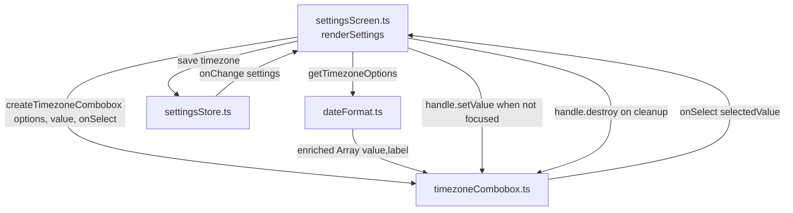

# Design Document

## Overview

This feature replaces the native timezone `<select>` in the Settings screen's **Date & Time**
section with a **searchable combobox**: a text input paired with an absolutely-positioned,
filterable dropdown list. The user types to narrow the list of IANA timezones, then selects an
entry by pointer (tap/click) or keyboard (arrow keys + Enter). Only a value that exists in the
option list can be committed.

The design has three moving parts:

1. **`getTimezoneOptions()` enrichment** (in `src/dateFormat.ts`) — each non-`'auto'` option's
   label gains its current UTC offset, e.g. `Asia/Singapore (UTC+08:00)`, computed via `Intl` at
   render time. This is a pure-data change; the returned shape stays `Array<{ value; label }>`.

2. **A self-contained combobox component** (new file `src/components/timezoneCombobox.ts`) — a plain
   factory function that builds DOM via `document.createElement`, manages its own open/close,
   filtering, highlight, and keyboard state, exposes ARIA, and returns a handle with
   `setValue`/`getValue`/`destroy`, mirroring the existing `buildSelect`/`buildToggle` return-shape
   style.

3. **Integration into `settingsScreen.ts`** — the `tzControl = buildSelect(...)` block is replaced
   by a `createTimezoneCombobox(...)` call. `onTimezoneChange` becomes the combobox's `onSelect`
   callback (same save / preview / revert+toast / no-op-skip behavior). The `settingsStore.onChange`
   re-sync updates the combobox via `setValue` only when its input is not the active element, and the
   combobox's `destroy()` is pushed onto the existing `listenerCleanups` array.

All work is vanilla HTML/CSS/TypeScript compiled by `tsc` alone. No frameworks, no bundler, no new
npm dependencies. Source imports use `.js` extensions per the project's `"module": "ES2020"` setup.

## Architecture



Responsibility split:

- **`dateFormat.ts`** owns option data and offset text. It knows nothing about the DOM.
- **`timezoneCombobox.ts`** owns all DOM, interaction, filtering, highlight, and ARIA state. It never
  touches `settingsStore`; it only reports selections through its `onSelect` callback and reflects
  external values through `setValue`. This keeps it reusable and unit-testable.
- **`settingsScreen.ts`** owns persistence orchestration (save, preview, revert, no-op skip, external
  re-sync, cleanup), exactly as it does today for the native select.

### Module boundaries and reusability

The combobox is authored as timezone-specific in name but option-generic in behavior: it accepts an
arbitrary `Array<{ value; label }>` and reports the chosen `value`. Requirement notes that it *could*
later be reused elsewhere but reuse is not required — see Design Decisions & Rationale for why we ship
a `timezoneCombobox.ts` rather than a generic `searchableSelect.ts`.

## Components and Interfaces

### `dateFormat.ts` additions

A new exported pure helper formats a timezone's current offset, and `getTimezoneOptions()` uses it to
enrich labels.

```ts
/**
 * Compute the current UTC offset text for an IANA timezone, formatted as `UTC±HH:MM`.
 * Returns null when the timezone is invalid or the runtime cannot resolve an offset.
 * Pure with respect to inputs except for the implicit "now" used to resolve DST.
 */
export function formatTimezoneOffset(timeZone: string, at?: Date): string | null;

/**
 * Existing signature is preserved. First option is always
 * { value: 'auto', label: 'Automatic (follow device)' }.
 * Every other option's label becomes `${tz.replace(/_/g,' ')} (${offsetText})`
 * when an offset can be resolved, otherwise it stays name-only.
 */
export function getTimezoneOptions(): Array<{ value: string; label: string }>;
```

`formatTimezoneOffset` implementation approach:

1. Build `new Intl.DateTimeFormat('en-US', { timeZone, timeZoneName: 'shortOffset' })` and call
   `formatToParts(at ?? new Date())`. Read the `timeZoneName` part, which returns strings such as
   `GMT+8`, `GMT+5:30`, `GMT`, or `UTC`.
2. Normalize that token to the canonical `UTC±HH:MM` shape: strip the `GMT`/`UTC` prefix, treat a bare
   prefix (no digits) as `+0`, split hours/minutes, zero-pad both to two digits, and always emit a
   sign, giving `UTC+08:00`, `UTC+05:30`, `UTC+00:00`, `UTC-05:00`.
3. Wrap the whole thing in `try/catch`; return `null` on any throw or unparseable token.

Browser support note: `timeZoneName: 'shortOffset'` / `'longOffset'` are supported in Chrome 91+,
Firefox 91+, and Safari 15.4+ — comfortably covering the app's stated target (Chrome on Android) and
modern desktop. Fallback: if `shortOffset` yields no usable token (older engine), the helper returns
`null` and the label degrades gracefully to name-only. A secondary fallback (computing the offset
arithmetically by comparing a UTC-formatted and timezone-formatted rendering of the same instant) is
described in Error Handling for completeness but is optional; name-only degradation already satisfies
Requirement 1.5's "when an offset can be resolved" intent without breaking the control.

### `timezoneCombobox.ts` — component API

```ts
export interface TimezoneOption {
  value: string;
  label: string;
}

export interface TimezoneComboboxConfig {
  /** Full, ordered option list (already offset-enriched) from getTimezoneOptions(). */
  options: TimezoneOption[];
  /** Initial committed value (an IANA id or 'auto'). */
  value: string;
  /** Called only when a value in `options` is committed by pointer or Enter. */
  onSelect: (value: string) => void;
  /** Optional id prefix for ARIA wiring; defaults to a module-generated unique prefix. */
  idPrefix?: string;
}

export interface TimezoneComboboxHandle {
  /** Root element to insert into the DOM (mirrors buildSelect's `wrapper`). */
  root: HTMLElement;
  /** The search <input> — exposed so the screen can associate the existing label and check focus. */
  input: HTMLInputElement;
  /**
   * Set the committed value programmatically and update the displayed text to that option's label.
   * Does NOT fire onSelect. Used by the external settingsStore.onChange re-sync.
   * If `value` is not in `options`, the raw value string is shown as-is (Req 1.4).
   */
  setValue(value: string): void;
  /** Current committed value. */
  getValue(): string;
  /** Remove all listeners this component added and detach its root. Idempotent. */
  destroy(): void;
}

export function createTimezoneCombobox(config: TimezoneComboboxConfig): TimezoneComboboxHandle;
```

The handle deliberately mirrors the existing builder shape (`{ wrapper/root, input, ... }`) so the
screen wires it like the other controls. `destroy()` is the component's own cleanup, pushed onto
`listenerCleanups`.

### DOM structure built by the component

```
div.combobox                       (root; position: relative)
├── input.form-input.combobox-input   role=combobox, aria-expanded, aria-controls,
│                                      aria-autocomplete=list, aria-activedescendant
├── button.combobox-toggle            aria-label="Toggle timezone list", tabindex=-1, type=button
└── ul.combobox-list                  role=listbox, id = `${idPrefix}-listbox`, hidden when closed
    ├── li.combobox-option            role=option, id = `${idPrefix}-opt-{index}`, aria-selected
    │   … one per Filtered_List entry …
    └── li.combobox-empty             the "no matches" row (Req 7.3), not role=option
```

The list items are re-rendered whenever the Filtered_List changes. Item ids are stable per rendered
index so `aria-activedescendant` can point at the highlighted row.

## Data Models

### Internal component state

```ts
interface ComboboxState {
  isOpen: boolean;              // whether the dropdown is displayed
  committedValue: string;       // the last value reported via onSelect / set via setValue
  filtered: TimezoneOption[];   // current Filtered_List (order preserved from options)
  highlightedIndex: number;     // index into `filtered`, or -1 when unset
}
```

Derived/reference data held in closure: the immutable `options` array, the `input`, `list`, and
`toggle` elements, and the `idPrefix`.

State-to-DOM mapping (single `render()` reads state and updates DOM; every state mutation calls it):

| State change | DOM effect |
| --- | --- |
| `isOpen` | `list.hidden = !isOpen`; `input.setAttribute('aria-expanded', String(isOpen))` |
| `filtered` | rebuild `<li>` rows; show `.combobox-empty` row when `filtered.length === 0` |
| `highlightedIndex` | toggle `.is-highlighted` on the row; set `aria-activedescendant`; `scrollIntoView({block:'nearest'})` |
| `committedValue` | `aria-selected="true"` on the matching rendered row (Req 9.5) |

### Query / filter model

`Query` is `input.value.trim()`. The Filtered_List is computed by a pure exported helper so it can be
unit/property tested independently of the DOM:

```ts
/** Case-insensitive, order-preserving substring filter over value + label. */
export function filterTimezoneOptions(options: TimezoneOption[], query: string): TimezoneOption[];
```

Because each option's `label` already contains the Offset_Text (from enrichment), matching against
`value + '\u0000' + label` covers value, name, and offset in one pass — this satisfies Req 2.5
(offset search such as `+08`) without a separate offset field. An empty/whitespace query returns the
full list (Req 2.2). For a few hundred entries a synchronous per-keystroke linear scan is trivially
fast (sub-millisecond) and needs no debouncing; this is noted rather than optimized.

### AppSettings.timezone

Unchanged: `settings.timezone` is a `string` that is either `'auto'` or an IANA identifier. The
combobox commits only values present in `options`, so it can never write an invalid timezone (Req 7.1).
## Correctness Properties

*A property is a characteristic or behavior that should hold true across all valid executions of a
system — essentially, a formal statement about what the system should do. Properties serve as the
bridge between human-readable specifications and machine-verifiable correctness guarantees.*

The combobox is mostly DOM/interaction code (opening, closing, ARIA, pointer/keyboard events), which
is validated by behavioral checks in the Testing Strategy. The genuinely input-varying logic lives in
small pure functions — the filter, the offset formatter, the value→label mapping, the highlight-index
arithmetic, and the commit-membership invariant. Those are the property targets below.

### Property 1: Filter correctness

*For any* option list and *any* query string, `filterTimezoneOptions(options, query)` returns exactly
the options whose searchable text (`value` + `label`, which already contains the Offset_Text) contains
the trimmed query as a case-insensitive substring, and the result is a subsequence of the input
(original relative order preserved). Equivalently: every returned option matches, every omitted option
does not match, and indices are strictly increasing.

**Validates: Requirements 2.1, 2.3, 2.5**

### Property 2: Empty query returns the full list

*For any* option list, filtering by an empty or whitespace-only query returns every option in the
original order (membership and order identical to the input).

**Validates: Requirements 2.2**

### Property 3: Value-to-display mapping

*For any* option list and *any* value, `setValue(value)` sets the displayed text to that option's
`label` when the value is present in the list, and to the raw `value` string verbatim when it is not.

**Validates: Requirements 1.2, 1.4**

### Property 4: Offset text format

*For any* IANA timezone for which an offset resolves, `formatTimezoneOffset(tz)` returns a string
matching the pattern `UTC±HH:MM` (sign always present, hours and minutes zero-padded to two digits);
for an unresolvable timezone it returns `null`, and the `'auto'` option is never assigned an offset.

**Validates: Requirements 1.5**

### Property 5: Highlight navigation wrap

*For any* non-empty Filtered_List of length `n` and *any* starting highlighted index, advancing the
highlight forward `n` times (ArrowDown) returns to the starting index, advancing backward `n` times
(ArrowUp) returns to the starting index, and each single step equals `(i ± 1 + n) mod n` — so forward
then backward is the identity and the highlight wraps at both boundaries.

**Validates: Requirements 5.1, 5.2**

### Property 6: Rendered row count equals filtered length

*For any* Filtered_List, rendering produces exactly one `role="option"` list item per entry (the
"no matches" row is not a `role="option"` and appears only when the list is empty).

**Validates: Requirements 2.4**

### Property 7: Commit membership

*For any* sequence of pointer or keyboard commit actions, every value the combobox emits through
`onSelect` is the `value` of some option in the Option_List; in particular, when the Filtered_List is
empty the highlight is unset and pressing Enter emits nothing.

**Validates: Requirements 7.1, 7.4**


## Error Handling

- **Offset resolution failure** (`formatTimezoneOffset` throws or returns an unparseable token): the
  helper returns `null` and `getTimezoneOptions()` keeps the name-only label. The control still works;
  only the offset suffix is absent for that entry. `'auto'` is always exempt from enrichment.
- **Optional arithmetic offset fallback** (only if a target engine lacks `shortOffset`): format the
  same instant twice — once with `timeZone: 'UTC'` and once with the target `timeZone`, both at
  minute precision — subtract the wall-clock difference, and render it as `UTC±HH:MM`. Shipped as a
  documented fallback path inside `formatTimezoneOffset`; if even this fails, return `null`.
- **Invalid committed value on init** (Req 1.4): when `config.value` is not found in `options`,
  `setValue`/init shows the raw value string in the input and leaves `committedValue` equal to that
  raw string; no option row is marked selected.
- **Blur with non-matching text** (Req 7.2): on `blur`, if `input.value` does not exactly equal any
  option `label`, restore `input.value` to the committed value's label without changing
  `committedValue` and without firing `onSelect`.
- **Empty Filtered_List** (Req 7.3 / 7.4): render the `.combobox-empty` "No matching timezones" row
  and set `highlightedIndex = -1`, so Enter commits nothing.
- **Save failure in the screen** (Req 6.3): unchanged pattern — `settingsStore.save` rejection triggers
  `handle.setValue(prev)` (restoring the previous label) and `toastService.show('Could not save
  setting')`.
- **No-op selection** (Req 6.4): the screen compares the reported value against
  `settingsStore.getCurrent().timezone` and skips `save` when equal.

## Testing Strategy

The project compiles with `tsc` and has **no formal test runner** (confirmed: `package.json` scripts
are only `build` = `tsc` and `typecheck` = `tsc --noEmit`; `devDependencies` is just `typescript`).
There are two TypeScript configs — `tsconfig.json` (app) and `tsconfig.sw.json` (service worker) — and
both must type-check cleanly.

**Static verification (required, automated):**

- `npx tsc --noEmit -p tsconfig.json` — the new component and `dateFormat.ts` changes must compile
  under `strict` with zero errors.
- `npx tsc --noEmit -p tsconfig.sw.json` — must remain clean (no regressions).

**Pure-function tests (unit + property):** `filterTimezoneOptions` and `formatTimezoneOffset` are pure
and are the meaningful targets for property-based testing (see Correctness Properties). Because there
is no test runner, these are specified as properties to be validated by a lightweight,
dependency-free test harness (a plain `.ts` file run via `tsc` + `node`, generating randomized inputs
in a loop of at least 100 iterations per property) so the "no new dependency" constraint (Req 10) is
honored. Each such test is tagged `Feature: searchable-timezone-selector, Property N: <text>`.

**Behavioral / manual checks (interaction and ARIA — not amenable to PBT):**

1. Focus the input → dropdown opens showing the full list (Req 3.1).
2. Type `sing` → only Singapore-matching rows remain, in original order (Req 2.1–2.4).
3. Type `+08` → offset-matching rows appear (Req 2.5).
4. ArrowDown/ArrowUp cycle with wrap; highlighted row scrolls into view (Req 5.1–5.2, 5.5).
5. ArrowDown while closed opens the list (Req 5.3).
6. Enter commits the highlighted row, sets input text, closes (Req 5.4).
7. Tap/click a row on touch (Chrome Android) and desktop commits it (Req 4.1–4.3).
8. Pointerdown outside closes (Req 3.4); Escape closes and restores selected label (Req 3.5).
9. Blur with junk text reverts to the selected label (Req 7.2).
10. Empty filter shows the "no matches" row and Enter does nothing (Req 7.3–7.4).
11. Save-failure path reverts and toasts (Req 6.3); re-selecting the same value skips save (Req 6.4).
12. External change (simulate `settingsStore.onChange`) updates the control only when unfocused
    (Req 8.1–8.2).
13. Screen-reader / DOM inspection: `role=combobox`, `aria-expanded`, `aria-controls`,
    `aria-activedescendant`, `role=listbox`, `role=option`, `aria-selected`, and label association
    via `for`/`id` (Req 9.1–9.5).
14. Navigate away → `destroy()` runs, listeners removed, `onChange` unsubscribed (Req 8.3).

**Property test configuration:** minimum 100 iterations per property; each property implemented by a
single property test; each tagged with its design property number.

## Design Decisions & Rationale

- **Dedicated `timezoneCombobox.ts` over a generic `searchableSelect.ts`.** The requirements
  explicitly scope this to the single timezone control and state that reuse "could" happen but is not
  required. Shipping a named, timezone-focused component keeps the surface area small, avoids
  speculative generality (no config options for behaviors nothing needs yet), and still leaves the
  door open: its interior is already option-generic (it accepts `Array<{value,label}>` and reports a
  `value`), so a later extraction into a generic control is a rename, not a rewrite. This matches the
  project's existing pattern of small, purpose-named builders (`buildToggle`, `buildSelect`).

- **Offset-format helper lives in `dateFormat.ts`.** `dateFormat.ts` already centralizes all
  `Intl`-based date/time formatting and already owns `getTimezoneOptions()`. Placing
  `formatTimezoneOffset` there keeps every `Intl` formatting concern in one module, lets the enrichment
  reuse it inline, and keeps the combobox purely presentational (no `Intl` knowledge). It is exported
  so it can be property-tested in isolation.

- **`shortOffset` with graceful degradation, arithmetic fallback optional.** `timeZoneName:
  'shortOffset'` is the simplest reliable way to read a zone's current offset and is supported across
  the app's targets (Chrome/Android, modern desktop). Rather than gate the whole feature on it, the
  helper returns `null` on any failure and labels degrade to name-only — the control keeps working and
  Req 1.5 is satisfied wherever an offset resolves. An arithmetic fallback (comparing UTC vs. zone
  renderings of the same instant) is documented in Error Handling for older engines but is not on the
  critical path.

- **Offset baked into `label` rather than a separate field.** Enriching the label means the existing
  `Array<{value,label}>` shape is unchanged, the screen's wiring stays identical, and offset search
  (`+08`) falls out of the same substring filter for free — no separate Searchable_Text field or
  filter branch needed.

- **Single `render()` from explicit state.** Centralizing DOM updates in one `render()` driven by a
  small `ComboboxState` keeps open/close, filtering, highlight, and ARIA consistent and avoids
  scattered imperative DOM mutations, which makes the interaction rules auditable against the ARIA
  requirements.

- **Component owns interaction; screen owns persistence.** Keeping `settingsStore` out of the
  component (it only calls `onSelect` and honors `setValue`) preserves the existing screen
  orchestration (save / preview / revert+toast / no-op skip / external re-sync / cleanup) unchanged and
  keeps the component reusable and testable.
